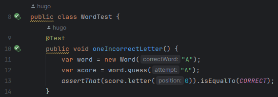
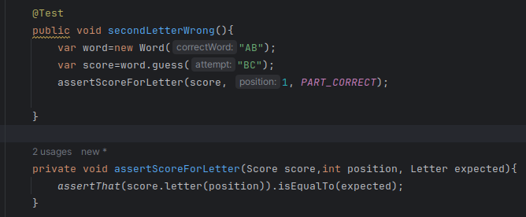
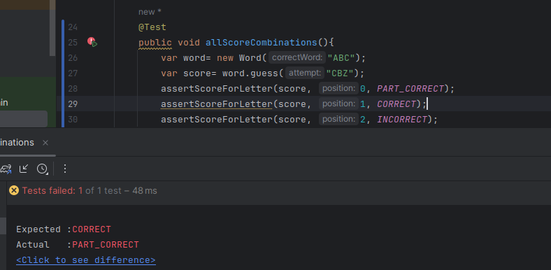

# Actividad: El ritmo RGR del TDD

## ESCRIBIENDO LAS PRÓXIMAS PRUEBAS PARA WORDZ

Se agrega una prueba para una sola letra correcta.
### 1. Se escribe una prueba fallida para una sola letra correcta

```
    @Test
    public void oneCorrectLetter() {
        var word = new Word("A");
        var score = word.guess("A");
        assertThat(score.letter(0)).isEqualTo(CORRECT);
    }
```

Lo que hace la prueba es crear un objeto Word inicializándolo con A, que representa la palabra a adivinar.

Luego, se usa el método guess para crear un objeto Score, el cual se usará para verificar si una letra coincide en determinada posición con la palabra a adivinar (uso del método assess de la clase Score). 

Por último, se comprueba que, en efecto, la primera letra de word es la adivinada (A).


### 2. Se realizan las modificaciones al código para que la prueba pase.

Se agrega una constructor público para inicializar Word. Se agrega un método guess para crear un nuevo objeto Score. Se agrega un método a la clase Score llamado assess, el cual evalua lo que debe puntuar la adivinación. 

```
public class Word {
    private final String word;
    public Word(String correctWord) {
        this.word = correctWord;
    }

    public Score guess(String attempt) {
        var score = new Score(word);
        score.assess(0, attempt);

        return score;
    }
}
```
```
public class Score {
    private final String correct;
    private Letter resultado = Letter.INCORRECT ;
    public Score(String correct) {
        this.correct = correct;
    }
    public Letter letter(int position) {
        return resultado;
    }

    public void assess(int position, String attempt) {
        if (correct.charAt(position) == attempt.
                charAt(position)) {
            resultado = Letter.CORRECT;
        }
    }
}
```
Luego de hacer estas modificaciones, el código pasa el test.



Ahora que el código pasó el test, se debe realizar una refactorización para mejorar continuamente el código. 

### 3. Se buscan los olores de código. 

El método assess() contiene demasiado código, por lo que se usará un método auxiliar para agregar claridad.

```
private boolean isCorrectLetter(int position, String attempt){
        return correct.charAt(position)==attempt.charAt(position);
    }
```
Esta función limpia lo que sería el método assess(), es decir, lo vuelve más claro para leer. 
```
public void assess(int position, String attempt) {
    if (isCorrectLetter(position,attempt)) {
        resultado = Letter.CORRECT;
    }
}
```
Además, se refactorizan los tests con el objetivo de mejorar la legibilidad de la prueba.

El cambio realizado en el test proporciona una descripción más directa de lo que está haciendo la prueba al tiempo que reduce el código duplicado. 

```
@Test
public void oneCorrectLetter() {
    var word = new Word("A");
    var score = word.guess("A");
    assertScoreForLetter(score,0, CORRECT);
}

private void assertScoreForLetter(Score score,int position, Letter expected){
        assertThat(score.letter(position)).isEqualTo(expected);
    }
```

### 4.Se cambia cómo se especifica la posición de la letra para verificar en el método assess()

Se agrega a la clase un campo llamado position para que ya no sea necesario indicar qué posición se está evaluando. 

```
public class Score {
    private final String correct;
    private Letter resultado = Letter.INCORRECT ;
    private int position; //Línea agregada
    public Score(String correct) {
        this.correct = correct;
    }
    public Letter letter(int position) {
        return resultado;
    }

    public void assess(String attempt) {
        if (isCorrectLetter(attempt)) {
            resultado = Letter.CORRECT;
        }
    }

    private boolean isCorrectLetter(String attempt){
        return correct.charAt(position)==attempt.charAt(position);
    }

}

```

### Se avanza en el diseño con combinaciones de 2 letras:
Se agrega el concepto: una letra puede estar presente en la palabra pero no en la posición que adivinamos.

Se inicia creando una prueba unitaria para una segunda letra que está en la posición incorrecta.

```
    @Test
    public void secondLetterWrong(){
        var word=new Word("AB");
        var score=word.guess("BC");
        assertScoreForLetter(score, 1, PART_CORRECT);

    }
```
Se modifica assess para validar que todas las letras en nuestra adivinación
```
    //Evalua lo que debe de puntuar la adivinacion.
    //parámetro: letra supuesta
    public void assess(String attempt) {
        
        //Itera sobre cada letra del intento. Si una coincide, se cambia el valor de resultado
        for(char current:attempt.toCharArray()){
            if(isCorrectLetter(current)){
                resultado=Letter.CORRECT;
            }
        }
    }

    private boolean isCorrectLetter(char currentLetter){
        return correct.charAt(position)==currentLetter;
    }
```

Se agrega código para detectar cuándo una letra correcta está en una posición incorrecta.

```
public void assess(String attempt) {
        //Itera sobre cada letra del intento. Si una coincide, se cambia el valor de resultado
        for(char current:attempt.toCharArray()){
            if(isCorrectLetter(current)){
                resultado=Letter.CORRECT;
            }
            //Si no coincide exactamente, valida si esta pertenece a la palabra
            else if(occursInWord(current)){
                resultado=Letter.PART_CORRECT;
            }
        }
    }
    //Método auxiliar para saber la ocurrencia de una letra en una palabra, sin importar la posición.
    private boolean occursInWord(char currentLetter){
        return correct.contains(String.valueOf(currentLetter));
    }
```
Se observa que la 2da prueba es aceptada, lo cual no debería suceder

;

Entonces esto implica que la 2da prueba es débil. Se agregará otra prueba para ejercitar el comportamiento en torno a la 2da letra en la posición incorrecta.


Agrega una nueva prueba ejercitando las tres posibilidades de puntuación

### ¿La prueba falla?

Se observa que la prueba falla. Debido a que no se ha aumentado por cada iteración el valor de position.

;


Se agrega una lista de resultados para almacenar el resultado de cada posición de letra por separado:

```
public class Score {
    private final String correct;
    private final List<Letter> results=new ArrayList<>();
    private int position;
    public Score(String correct) {
        this.correct = correct;
    }
    public Letter letter(int position) {
        return results.get(position);
    }

    public void assess(String attempt) {
        //Itera sobre cada letra del intento.
        for(char current:attempt.toCharArray()){
            if(isCorrectLetter(current)){
                results.add(Letter.CORRECT);
            }
            else if(occursInWord(current)){
                results.add(Letter.PART_CORRECT);
            }
            else{
                results.add(Letter.INCORRECT);
            }
            position++;
        }
    }
}
```

Se extrae la lógica dentro del cuerpo del ciclo en un método scoreFor()

```
    public void assess(String attempt) {
        //Itera sobre cada letra del intento. Si una coincide, se cambia el valor de resultado
        for(char current:attempt.toCharArray()){
            //Añade cada score para cada letra
            results.add(scoreFor(current));
            position++;
        }
    }

    private Letter scoreFor(char current){
        //Retorna un valor según la letra. Puede estar en la posición correcta, puede estar
        //incluida o no puede estar en la palabra a adivinar.
        if(isCorrectLetter(current)){return Letter.CORRECT;}
        else if(occursInWord(current)){return Letter.PART_CORRECT;}
        else {return Letter.INCORRECT;}
    }
```

Una vez se ha refactorizado el código de producción, se limpia el código de prueba, debido a que en TDD ambos tienen la misma prioridad.

Dentro de allScoreCombinations se agrega una función para iterar la prueba sobre cada letra de la palabra. Se crea una forma de comprobar las puntucaciones de un número variable de letras.

```
    @Test
    public void allScoreCombinations(){
        var word= new Word("ABC");
        var score= word.guess("CBZ");

        assertScoreForGuess(score, PART_CORRECT, CORRECT, INCORRECT);
    }

    private void assertScoreForGuess(Score score, Letter... expectedScores){
        for(int i=0; i<expectedScores.length; i++){
            Letter expected= expectedScores[i];
            assertScoreForLetter(score, i, expected);
        }
    }
```


