# ACTIVIDAD 6: RGR+TDD

## Etapas del TDD

Escribir una prueba que falle (Red)
Hacer que la prueba pase (Green)
Mejorar el código sin cambiar su comportamiento (Refactorización)

## El problema

Se implementará una clase Football Team, para que se pueda comparar diferentes equipos y ver quién ocupa el primer lugar en la liga. Cada equipo lleva un registro del núumero de juegos ganados

### ROJO - Escribe una prueba que falle

Para poder comparar 2 equipos, cada uno de ellos debe recordar su número de victorias. Por simplicidad, diseñamos una clase FootBallTeam con el número de juegos para el constructor. 

Además, con el IDE se construye el constructor y el método getGamesWon().

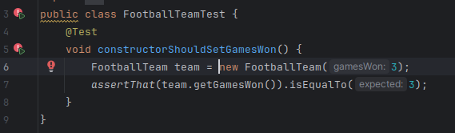

### VERDE - Arregla el código

La prueba falla, por lo que ahora se debe agregar o modificar código para que la prueba pase.
En la clase FootballTeam:
```
    public int getGamesWon() {
        //Se cambia el valor de 0 por 3. 
        return 3;
    }
```

Luego de este cambio se observa que la prueba es aceptada

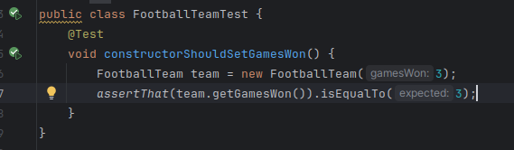


### REFACTORIZAR - Aunque sea un poco

Se busca refactorizar tanto en el código de producción y como en el de prueba. En el código de producción no se refactoriza nada debido a su simpleza. En el código de prueba, se debe eliminar el número mágico 3, introduciendo una variable THREE_GAMES_WON:

```
    private static final int THREE_GAMES_WON=3;

    @Test
    void constructorShouldSetGamesWon() {
        FootballTeam team = new FootballTeam(THREE_GAMES_WON);
        assertThat(team.getGamesWon()).as("number of game won").isEqualTo(THREE_GAMES_WON);
    }
```

### FALLA, PASA, REFACTORIZA, ...

Se realizan pruebas para el constructor usando más valores, y también implementar excepciones si se pasa un número de victorias inapropiado al constructor. Para esto se usarán pruebas parametrizadas.

```
    @ParameterizedTest
    @ValueSource(ints={0,1,2,3})
    void constructorShouldSetGamesWonTest(int nbOfGamesWon) {
        FootballTeam team = new FootballTeam(nbOfGamesWon);
        assertThat(team.getGamesWon()).as("number of game won").isEqualTo(nbOfGamesWon);
    }
```

Ahora se está en fase roja de nuevo. Vemos que se fallan 3 de 4 casos debido al retorno de getGamesWon().
La solución es sencilla: se almacena el número de victorias en una variable. 

```
public class FootballTeam {

    int gamesWon;

    public FootballTeam(int gamesWon) {
        this.gamesWon=gamesWon;
    }
    public int getGamesWon() {
        return gamesWon;
    }
}
```

Luego de esta modificación, el test pasa.

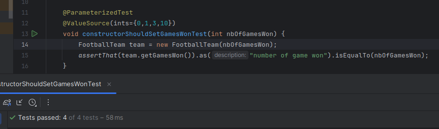


¡Ahora se refactoriza!
La clase FootballTeam sigue siendo simple y no se refactoriza. En cambio, la prueba se puede limpiar. Ya no es necesario que el primer test esté ahí pues el 2do lo está cubriendo.

### Se sigue creando pruebas

Se debe probar que no admita valores ilegales, tales como números negativos.

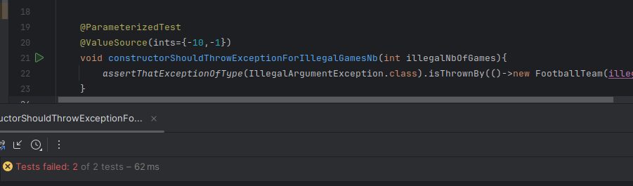

La prueba falla debido a que el constructor admite todo tipo de valores. Se corrige el constructor.

```
    public FootballTeam(int gamesWon) {
        if(gamesWon<0){
            throw new IllegalArgumentException("No es posible tener menos de 0 juegos ganados");
        }
        this.gamesWon=gamesWon;
    }
```

Una vez modificada la clase, se comprueba que la prueba es aceptada

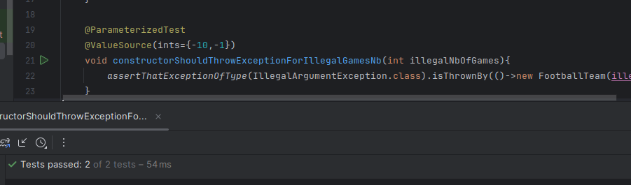


### ¿Pero es comparable?

El constructor funciona bien. Ahora pasemos al problema principal: comparar equipos de fútbol. 
Se decidió que se usará la interfaz java.lang.Comparable. Si FootballTeam es comparable, entonces el cliente puede esperar que una vez que haya puesto unos cuantos equipos en una colección, podrá usar el método Collections.sort() para ordenarlos.


Se escribe el test para comprobar si los equipos son comparables. La prueba falla

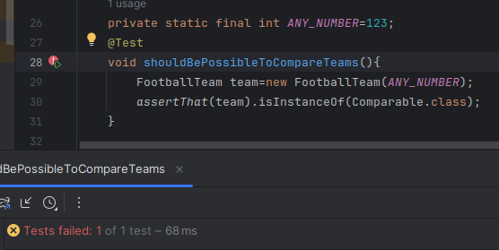


Ahora se escribe el código para que la prueba sea aceptada. 

```
public class FootballTeam implements Comparable<FootballTeam> {

    private int gamesWon;

    public FootballTeam(int gamesWon) {
        if(gamesWon<0){
            throw new IllegalArgumentException("No es posible tener menos de 0 juegos ganados");
        }
        this.gamesWon=gamesWon;
    }

    public int getGamesWon() {
        return gamesWon;
    }
    
    @Override
    public int compareTo(FootballTeam otherTeam){
        return 1;
    }
}
```

La prueba pasa.

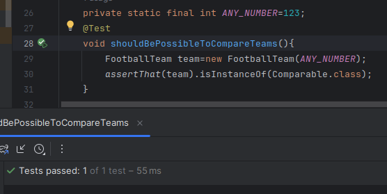


### Pruebas de Comparación

Se escribe la primera prueba de comparación: se toman 2 equipos con diferentes números de victorias y compararlos.
Se crea la primera prueba de comparación. La idea es tomar 2 equipos con diferentes números de victorias y compararlos.

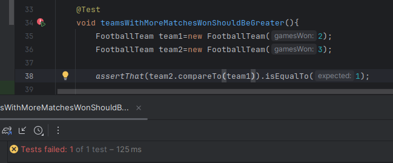

Se hace una modificación al método compareTo para lograr que las pruebas pasen.

```
    @Override
    public int compareTo(FootballTeam otherTeam){

        if(gamesWon> otherTeam.gamesWon){
            return 1;
        }
        return 0;
    }
```

Realizada la modificación, la prueba pasará correctamente

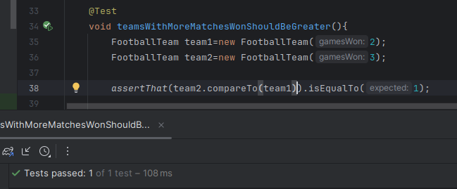


A continuación se sigue el ciclo TDD, iniciando con una prueba fallida, se escribe código para satisfacerla y luego se refactoriza. 


Se crea otra prueba para hacer el test de comparar 2 equipos y que te devuelva si es menor. 

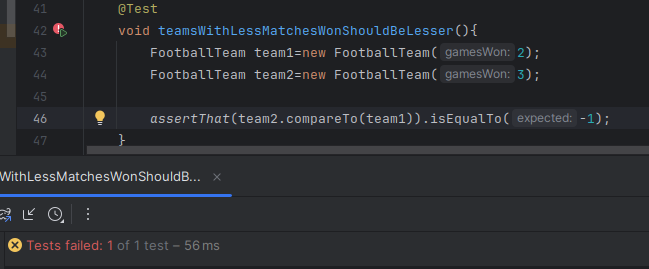

Otra vez tenemos una prueba fallida. Se escribe código para satisfacerla

```
    @Override
    public int compareTo(FootballTeam otherTeam){

        if(gamesWon> otherTeam.gamesWon){
            return 1;
        }
        else if(gamesWon<otherTeam.gamesWon){
            return -1;
        }
        return 0;
    }
```

Una vez implementado, la prueba pasa. 

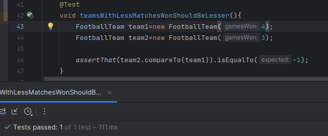

A continuación se realiza una prueba de igualdad

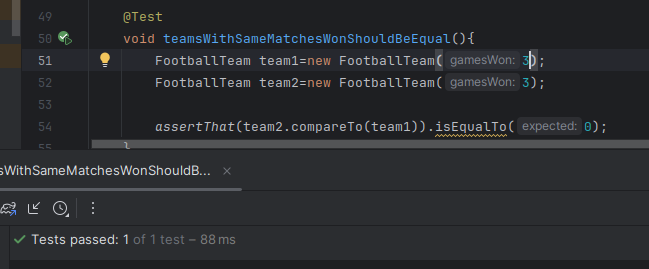

La prueba pasa automáticamente porque la implementación devuelve 0 en caso de igualdad.

Debido a que no se ha visto que la prueba de igualdad falle, no podemos asegurar de que esta prueba efectivamente evalúe el escenario dado. Por lo tanto, se modificará un valor en el código para comprobar que la prueba está validando correctamente. 

Por ejemplo, si se cambia el valor de retorno en compareTo()

```
    @Override
    public int compareTo(FootballTeam otherTeam){

        if(gamesWon> otherTeam.gamesWon){
            return 1;
        }
        else if(gamesWon<otherTeam.gamesWon){
            return -1;
        }
        return 12345;
    }
```

Observamos que la prueba falla debido a que el valor que esta esperaba es 0.

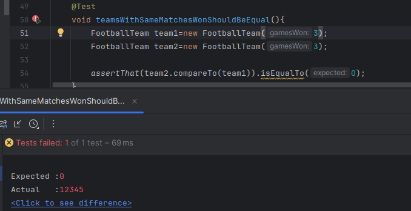


Por lo tanto, se comprueba que efectivamente la prueba de igualdad hace lo que debe de hacer.

Ahora se continua con la refactorización. Luego de pensarlo un rato, se termina con una implementación más simple del método compareTo().

```
    @Override
    public int compareTo(FootballTeam otherTeam){
        return gamesWon - otherTeam.getGamesWon();
    }
```

Se comprueba que todas las pruebas pasan

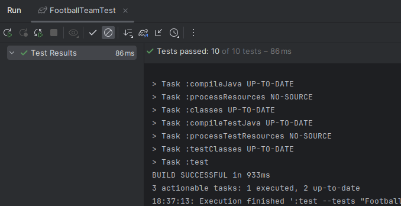


