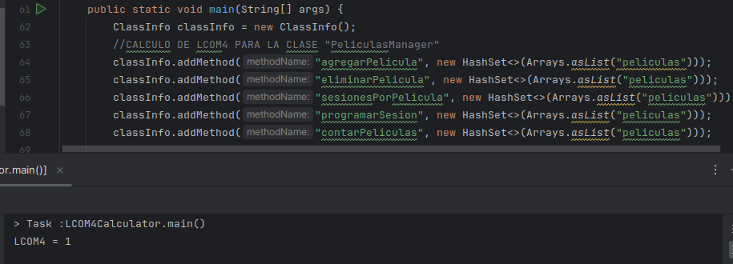

# Métricas de calidad
## Hugo Rivas Galindo

A continuación se realizarán las siguientes actividades según el código del proyecto Cine_LCOM4.

- Analizar el nivel de cohesión de una clase proporcionada mediante la métrica LCOM4
- Identifica problemas de diseño basados en la métrica calculada
- Refactoriza la clase para mejorar su cohesión y reducir el valor del LCOM4 

### Analizar el nivel de cohesión de una clase proporcionada mediante la métrica LCOM

Veamos la clase Cine Manager cuyo código es el siguiente:

```
public class CineManager {
    private List<Pelicula> peliculas;
    private Map<Integer, Sala> salas;

    public CineManager() {
        peliculas = new ArrayList<>();
        salas = new HashMap<>();
    }
    public void agregarPelicula(Pelicula pelicula) {
        peliculas.add(pelicula);
    }
    public boolean eliminarPelicula(String titulo) {
        return peliculas.removeIf(p -> p.getTitulo().equals(titulo));
    }
    public void agregarSala(Sala sala) {
        salas.put(sala.getId(), sala);
    }
    public boolean eliminarSala(int id) {
        return salas.remove(id) != null;
    }
    public List<Sesion> sesionesPorPelicula(String titulo) {
        return peliculas.stream()
                .filter(p -> p.getTitulo().equals(titulo))
                .flatMap(p -> p.getSesiones().stream())
                .collect(Collectors.toList());
    }
    public void programarSesion(String titulo, Sesion sesion) {
        peliculas.stream()
                .filter(p -> p.getTitulo().equals(titulo))
                .findFirst()
                .ifPresent(p -> p.agregarSesion(sesion));
    }
    public int contarPeliculas() {
        return peliculas.size();
    }
    public int contarSalas() {
        return salas.size();
    }
}
```

Se observa que posee 8 métodos y 2 atributos. Se calculará el número de conjuntos de métodos que son mutuamente no accesibles (LCOM4). 

- agregarPelicula, eliminarPelicula, sesionesPorPelicula, programarSesion, contar Peliculas: comparten el campo peliculas. 
- agregarSala, eliminarSala, contarSalas: comparten el campo salas.

Se observa que tenemos 2 conjuntos que son mutuamente no accesibles, por lo que el LCOM4 es igual a 2.

Un conjunto de clases solo comparte el atributo peliculas y otro conjunto de clases comparte salas.

Debido a que tenemos un valor mayor que uno en la métrica LCOM4, se refactoriza la clase para que el valor sea uno adecuado. ¿Y cómo logramos esto? Pues creando 2 clases con responsabilidades más definidas.

Se crea una clase para la gestión de películas y otra clase para la gestión de salas.

PeliculasManager: Clase creada para la gestión de películas

```
public class PeliculasManager {
    private List<Pelicula> peliculas;

    public PeliculasManager() {
        peliculas = new ArrayList<>();
    }
    public void agregarPelicula(Pelicula pelicula) {
        peliculas.add(pelicula);
    }
    public boolean eliminarPelicula(String titulo) {
        return peliculas.removeIf(p -> p.getTitulo().equals(titulo));
    }
    public List<Sesion> sesionesPorPelicula(String titulo) {
        return peliculas.stream()
                .filter(p -> p.getTitulo().equals(titulo))
                .flatMap(p -> p.getSesiones().stream())
                .collect(Collectors.toList());
    }
    public void programarSesion(String titulo, Sesion sesion) {
        peliculas.stream()
                .filter(p -> p.getTitulo().equals(titulo))
                .findFirst()
                .ifPresent(p -> p.agregarSesion(sesion));
    }
    public int contarPeliculas() {
        return peliculas.size();
    }
}
```

SalaManager: Clase creada para la gestión de salas

```
public class SalasManager {
    private Map<Integer, Sala> salas;

    public SalasManager() {
        salas = new HashMap<>();
    }
    public void agregarSala(Sala sala) {
        salas.put(sala.getId(), sala);
    }
    public boolean eliminarSala(int id) {
        return salas.remove(id) != null;
    }
    public int contarSalas() {
        return salas.size();
    }
}
```

### Comprobación de resultados obtenidos usando la calculadora de LCOM4

A continuación se muestra el cálculo del LCOM4 para la clase CineManager usando la calculadora dada en clase:

Para el código inicial (sin refactorizar)


Se muestra el resultado del cálculo del LCOM4


Se observa el valor de 2, el cual es coincide con nuestro análisis inicial.

Se separa la clase en CineManager en 2: PeliculasManager y SalasManager.

Se analiza la clase PeliculasManager:


Se muestra el resultado del cálculo del LCOM4



Se observa el valor de 1, por lo que la clase tiene una alta cohesión.

Se analiza la clase SalasManager:


Se muestra el resultado del cálculo del LCOM4


Se observa que el valor del LCOM4 es 1, por lo que la nueva clase tiene una alta cohesión.