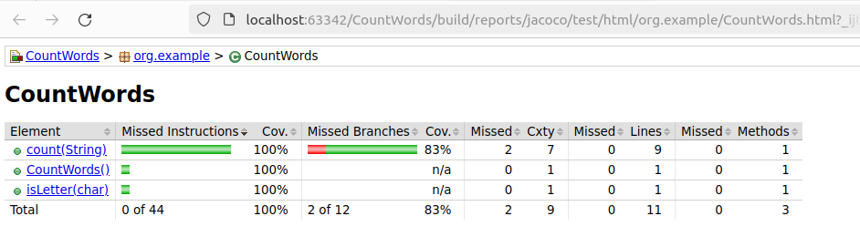
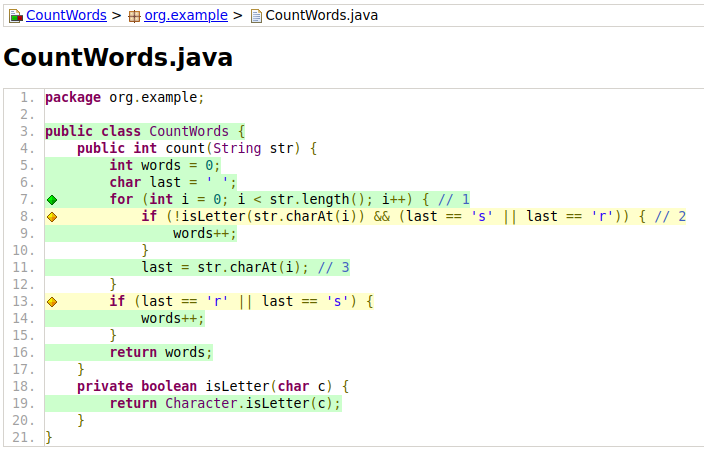
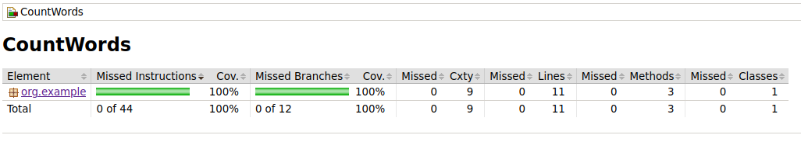

# Actividad: Pruebas Estructurales

## Hugo Rivas Galindo

En la actividad se analizará la cobertura de nuestro conjunto de pruebas para que el programa funcione como se espera

## Ejercicio 1

Explique qué hacen las líneas 1, 2 y 3 en el código. 
```
public class CountWords {
    public int count(String str) {
        int words = 0;
        char last = ' ';
        for (int i = 0; i < str.length(); i++) { // 1
            if (!isLetter(str.charAt(i)) && (last == 's' || last == 'r')) { // 2
                words++;
            }
            last = str.charAt(i); // 3
        }
        if (last == 'r' || last == 's') {
            words++;
        }
        return words;
    }
    private boolean isLetter(char c) {
        return Character.isLetter(c);
    }
}
```
El programa a realizar cuenta las palabras que terminen en "r" o "s". Se especifica que una palabra termina cuando aparece una no letra.

Entonces, para realizar dicha función, es necesario iterar sobre cada caracter del string (función de la línea 1) para analizar si es o no una no letra.
La línea 2 se encarga de comprobar que caracter actual sea una no letra y que además la última letra iterada sea s o r, para comprobar así el fin de una palabra y que esta termine en "s" o "r". 
La línea 3 se encarga de almacenar el último caracter iterado. Esto con el fin de que, cuando se alcance una no letra e indique el fin de una palabra, se evalúe si la palabra cumple con el requisito de que termina en "s" o "r" para que el valor del contador aumente en uno. 

## Ejercicio 2

Explique qué hacen las líneas 1 y 2 en el código

```
    @Test
    void twoWordsEndingWithS() { // 1
        int words = new CountWords().count("dogs cats");
        assertThat(words).isEqualTo(2);
    }

    @Test
    void noWordsAtAll(){
        int words=new CountWords().count("hola mundo");
        assertThat(words).isEqualTo(0);
    }
```

La línea 1 realiza un test para validar que, efectivamente, la cantidad de palabras que terminen en "s" sea igual a 2. En cambio, la línea 2 realiza el test para comprobar que el conteo de palabras que terminen en "r" o "s" sea igual a 0 cuando ninguna palabra cumple con el requisito anterior.

A continuación se genera un informe con JaCoCo para ver la cobertura de código


Se observa una cobertura del 83%. Se muestran las líneas que tuvieron cobertura con las pruebas



Las líneas resaltadas en verde significa que tuvieron una cobertura en las prueba. Las líneas de amarillo implican que fueron ejecutadas parcialmente. 

## Ejercicio 3

Explica la línea 1 y el caso de prueba recién agregado

Se contruye un caso de prueba para comprobar la partición de "palabras que terminan en r"

```
@Test
void wordsThatEndInR() { // 1
int words = new CountWords().count("car bar");
assertThat(words).isEqualTo(2);
}
```

Se ingresa como parámetro 2 palabras que terminan en "r", por lo que el resultado esperado es que la función CountWords retorne 2.

Se analiza nuevamente la cobertura de código con JaCoCo



Se observa una cobertura del 100%, lo cual indica que nuestros test cubren todo el código escrito.


