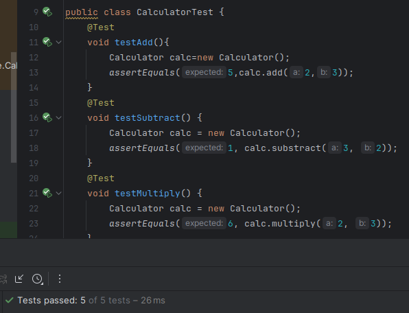
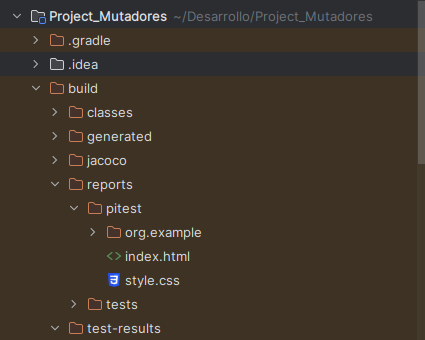
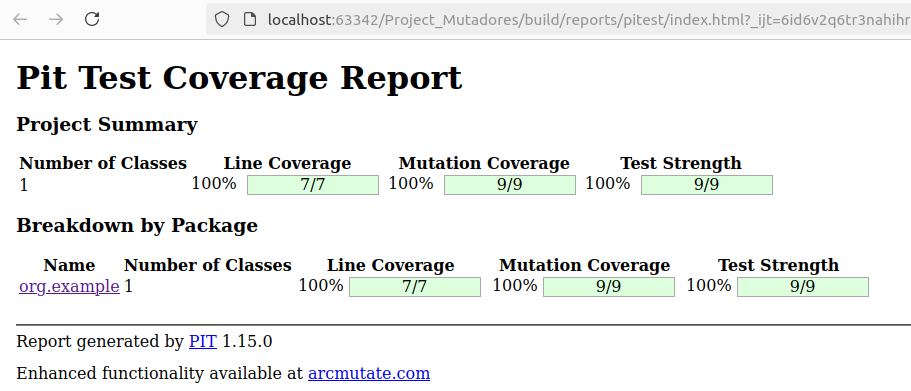
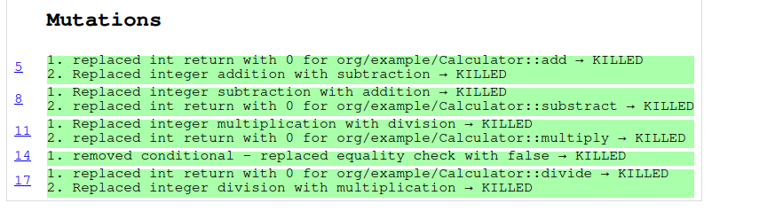
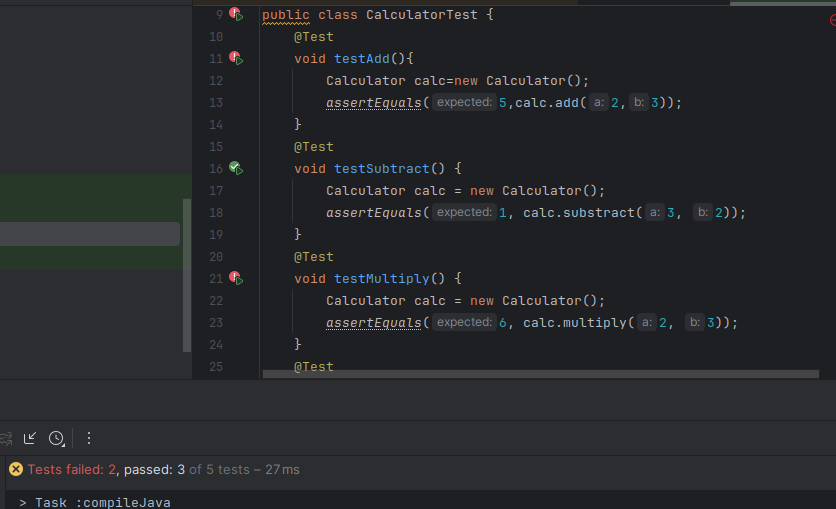
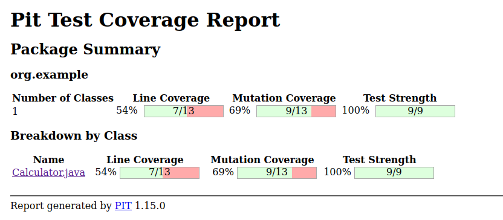
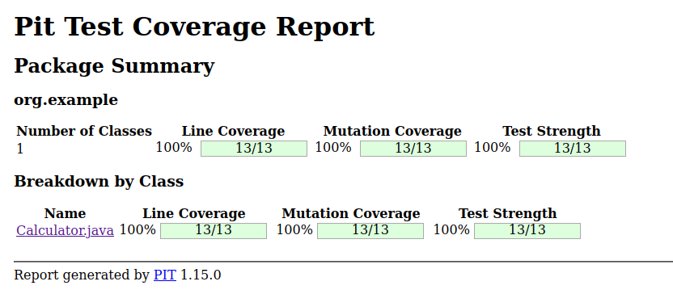

# Pruebas Mutantes
## Hugo Rivas Galindo

## Definiciones

- Mutantes: Un mutante es una versión modificada del código original en la que se introdujeron pequeños cambios o errores deliberados con el objetivo de evaluar la efectividad de los casos de prueba.
- Matar un mutante: Significa que un caso de prueba a detectado el cambio inducido en el mutante, lo que resulta en una falla del test. 
- Sobrevivir un mutante: Un mutante sobrevive cuando los casos de prueba no logran detectar el cambio o error introducido, lo cual significaría que los casos de prueba no son lo suficientemente robustos para detectar ciertos tipos de errores en el código. 
- Cobertura de mutación: Métrica que mide la efectividad de un conjunto de casos de prueba en matar mutantes. 


## Ejercicio: Introducción a PIT (Pitest)

Se crea la clase calculator con sus respectiva clase de prueba.
```
public class Calculator{
    public int add(int a, int b){
        return a+b;
    }
    public int subtract(int a, int b) {
        return a - b;
    }
    public int multiply(int a, int b) {
        return a * b;
    }
    public int divide(int a, int b) {
        if (b == 0) {
        throw new IllegalArgumentException("Divisor cannot be zero");
        }
        return a / b;
    }
}
```
```
public class CalculatorTest {
    @Test
    void testAdd() {
        Calculator calc = new Calculator();
        assertEquals(5, calc.add(2, 3));
    }
    @Test
    void testSubtract() {
        Calculator calc = new Calculator();
        assertEquals(1, calc.subtract(3, 2));
    }
    @Test
    void testMultiply() {
        Calculator calc = new Calculator();
        assertEquals(6, calc.multiply(2, 3));
    }
    @Test
    void testDivide() {
        Calculator calc = new Calculator();
        assertEquals(2, calc.divide(6, 3));
    }
    @Test
    void testDivideByZero() {
        Calculator calc = new Calculator();
        Exception exception = assertThrows(IllegalArgumentException.class, () -> calc.divide(1, 0));
        assertEquals("Divisor cannot be zero", exception.getMessage());
    }
}
```
Los test pasan satisfactoriamente



Sabemos que los test pasan satisfactoriamente, por lo que generaremos el reporte con pitest para verificar la cobertura.

Previamente se debe de configurar Pitest en nuestro proyecto
```
plugins {
    id 'java'
    id 'info.solidsoft.pitest' version '1.15.0'
}

group = 'org.example'
version = '1.0-SNAPSHOT'

repositories {
    mavenCentral()
}

dependencies {
    testImplementation 'org.junit.jupiter:junit-jupiter-api:5.7.0'
    testRuntimeOnly 'org.junit.jupiter:junit-jupiter-engine:5.7.0'
    testImplementation 'org.junit.jupiter:junit-jupiter'
    testImplementation 'org.assertj:assertj-core:3.25.3'
    pitest 'org.pitest:pitest-junit5-plugin:1.1.0'
}

test {
    useJUnitPlatform()
}

pitest {
    targetClasses = ['org.example.*'] // Paquete de clases a mutar
    mutators = ['DEFAULTS'] // Conjunto de mutadores [OLD_DEFAULTS, DEFAULTS, STRONGER, ALL]
    outputFormats = ['HTML'] // Formato de salida del informe
    timestampedReports = false // Deshabilitar informes con marca de tiempo para facilitar la navegación
    verbose = true
}
```

Una vez configurado, se realizan las pruebas mutantes. Se genera el reporte usando el siguiente comando en la terminal

```
./gradlew pitest
```

Se observa el reporte generado y lo abrimos desde el navegador





Se observa una alta cobertura de mutación. Se observa una creación de 9 mutantes y todos ellos fueron matados, por lo que la fortaleza de los test es del 100%



Incluso con esta alta cobertura de mutación, se puede mejorar el conjunto de pruebas.

## Ejercicio: Crear mutantes manualmente

Se modifica manualmente el código de la clase Calculator.

**Mutante 1:** Cambiar el operador de adición a sustracción
```
public int add(int a, int b){
    return a-b; //Error intencional
}
```

**Mutante 2:** Cambiar el operador de multiplicación a división
```
public int multiply(int a, int b){
    return a/b; //Error intencional
}
```

Se testean las pruebas



Las pruebas fallan, por lo que se manualmente se ha demuestrado la robutez de las pruebas.


## Ejercicio: Análisis 

Se agrega un método calculate a la clase Calculator

```
public int calculate(String operation, int a, int b){
        switch (operation){
            case "add":
                return add(a,b);
            case "subtract":
                return substract(a,b);
            case "multiply":
                return multiply(a,b);
            case "divide":
                return divide(a,b);
            default:
                throw new IllegalArgumentException("Invalid operation");
        }
    }
```

Se genera el reporte para validar la cobertura sobre este método



Se observa que la cobertura no es suficiente al incluir este nuevo método, por lo que se crean pruebas unitarias para cubrirlo.



Se observa que con los nuevos tests se obtiene una mayor cobertura para los mutantes.


