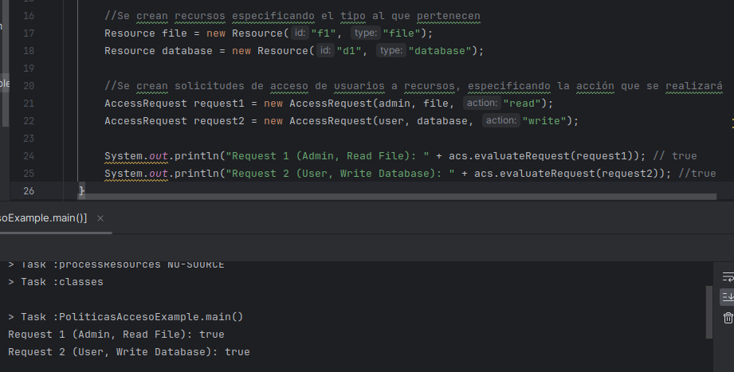

# Ejercicio 4: Políticas de control de Acceso

## Hugo Rivas Galindo

Implementar un sistema de control de acceso basado en políticas (Policy Based Acces Control - PBAC) que permita definir y evaluar políticas de acceso a recursos específicos

---

## Análisis de la clase Policy 

El ejercicio nos ofrece una clase Policy, la cual define la política de acceso que se evaluará cada vez que un usuario quiera acceder a un recurso.

```
class Policy {
    private String resourceType;
    private String requiredRole;
    private String action;
    public Policy(String resourceType, String requiredRole, String action) {
        this.resourceType = resourceType;
        this.requiredRole = requiredRole;
        this.action = action;
    }
    public boolean evaluate(AccessRequest request) {
        return request.getResource().getType().equals(resourceType)
                && request.getUser().getRole().equals(requiredRole)
                && request.getAction().equals(action);
    }
}
```

Se observa que se tienen 3 atributos: el tipo de recurso, el rol requerido y la acción. Además, se tiene un método que sirve para evaluar la solicitud de acceso. Se debe de comprobar que el cada campo de la solicitud coincida con la política establecida para permitir la autorización de acceso al recurso.


## Análisis de la clase AccessRequest

Se muestra la clase AccessRequest. Esta clase define una petición de acceso por parte de un usuario a un recurso específico. 

```
class AccessRequest {
    private User user;
    private Resource resource;
    private String action;
    public AccessRequest(User user, Resource resource, String action) {
        this.user = user;
        this.resource = resource;
        this.action = action;
    }
    public User getUser() {
        return user;
    }
    public Resource getResource() {
        return resource;
    }
    public String getAction() {
        return action;
    }
}
```

La clase posee 3 atributos: el usuario quien realizó la petición, el recurso el cual se quiere acceder y la acción que se quiere realizar sobre el recurso. 

## Análisis de la clase AccessControlSystem

Se muestra la clase AccessControlSystem. Esta clase contiene la lógica del control de acceso del sistema.

```
class AccessControlSystem {
    private List<Policy> policies;
    public AccessControlSystem() {
        policies = new ArrayList<>();
    }
    public void addPolicy(Policy policy) {
        policies.add(policy);
    }
    public boolean evaluateRequest(AccessRequest request) {
        for (Policy policy : policies) {
            if (policy.evaluate(request)) {
                return true;
            }
        }
        return false;
    }
}
```

La clase contiene como único atributo a una lista de políticas. Esta lista puede crecer gracias al método addPolicy(). Además, la clase contiene un método para evualr las solicitud de acceso y devolver true o false dependiendo de si está acorde o no a la política de acceso al recurso.


## Análisis del ejemplo

Vemos que se inician creando las políticas de Acceso.
La primera política es creada para acceder al tipo de recurso file, con "admin" como rol requerido y con permisos de lectura. La segunda política es para acceder a recusos database, con "user" como rol requerido y con permisos de escritura.

```
    acs.addPolicy(new Policy("file", "admin", "read"));
    acs.addPolicy(new Policy("database", "user", "write"));
```

Se crean usuario especificando el id y el rol al que pertenecen.

```
    User admin = new User("1", "admin");
    User user = new User("2", "user");
```

Se crean recursos de tipo archivo, especificando el id (f1) y el tipo de recurso al que pertenece.
También se crea un recurso de tipo database, especificando el (d1) y el tipo de recurso database.
```
    Resource file = new Resource("f1", "file");
    Resource database = new Resource("d1", "database");
```

Se crean peticiones de acceso con un usuario con rol admin, a un tipo de recurso file con permiso de lectura. Dado que previamente se creó una política que permite el acceso a dicho tipo de recurso con el rol y permiso especificados, se espera que la evaluación del request sea válida. 

```
    AccessRequest request1 = new AccessRequest(admin, file, "read");
    AccessRequest request2 = new AccessRequest(user, database, "write");
```

Comprobamos que la evaluación del acceso es válida debido a que los roles y permisos están acordes con la política establecida


