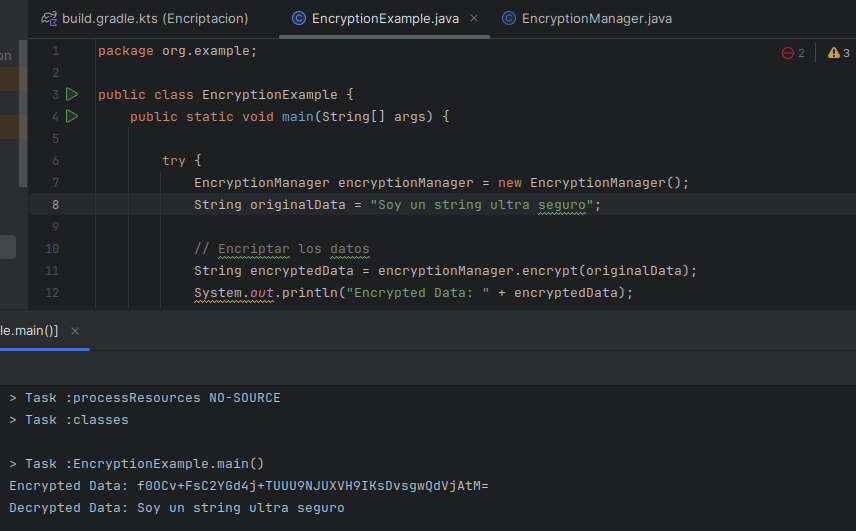

# Ejercicio 6: Encriptación y protección de datos

## Hugo Rivas Galindo

Implementar un sistema que use encriptación para proteger datos sensibles durate su almacenamiento y transmisión. 

Se usa la clase Cipher de javax.crypto para la encriptación y desencriptación.

Se usaron las siguientes referencias para el desarrollo del ejercicio:
- https://docs.oracle.com/javase/8/docs/api/javax/crypto/Cipher.html
- https://docs.oracle.com/javase/8/docs/technotes/guides/security/StandardNames.html#KeyGenerator

----
## Análisis de la clase Encryption Manager

El ejercicio nos ofrece una clase Encryption Manager que posee como único atributo un tipo de dato SecretKey, el cual se puede importar desde javax.crypto.SecretKey.

La clase posee un manejo de excepciones para el constructor. Esto también se realiza para el resto de métodos.

####  Se observa el método generateKey(). 

```
    private SecretKey generateKey() throws Exception {
        KeyGenerator keyGen = KeyGenerator.getInstance("AES");
        keyGen.init(256);
        return keyGen.generateKey();
    }
```
Se observa la clase KeyGenerator. Esta clase ofrece la funcionalidad de generar una llave secreta (cifrado simétrico).
Se genera un KeyGenerator usando el método getInstance de la propia clase. Este método retorna un KeyGenerator que genera llaves secretas para el algoritmo especificado.


En nuestro ejercicio, se usa el cifrado simétrico AES. También podríamos usar otros cifrados simétricos como DES, pero se prefiere AES por ser el más seguro debido a su tamaño de llave.

Se genera un cifrado AES con un tamaño de llave igual a 256 bytes.

#### Se observa el método encrypt().

```
public String encrypt(String data) throws Exception {
        Cipher cipher = Cipher.getInstance("AES");
        cipher.init(Cipher.ENCRYPT_MODE, secretKey);
        byte[] encryptedData = cipher.doFinal(data.getBytes());
        return Base64.getEncoder().encodeToString(encryptedData);
    }
```

Se observa la clase Cipher. Esta clase ofrece la funcionalidad de cifrar o descifrar datos. Se genera un Cipher utilizando el método getInstance y pasando como parámetros el nombre de la transformación a realizar. La transformación describe la operación (o conjunto de operaciones) que se realizarán en el input para producir el output. La transformación siempre incluye el nombre del algoritmo criptográfico y podría ser seguida del modo y el padding. Por ejemplo:

```Cipher c = Cipher.getInstance("AES/CBC/PKCS5Padding");```

Lo que significa una transformación de algoritmo AES, modo CBC aplicando el padding PKCS5Padding. 

En nuestro ejemplo, solo se especifica que el algoritmo a utilizar en el cifrado es AES.
Luego, se inicializa cipher en el modo de cifrado utilizando la llave creada previamente.

Mediante el método doFinal() se cifra o descifran los datos. Estos datos deben estar en bytes, por lo que se usa el método getBytes() para realizar la conversión del string a bytes.

Por último, se codifica el array de bytes (resultado del cifrado) a un formato de Base64.  

#### Se observa el método decrypt()

```
public String decrypt(String encryptedData) throws Exception {
        Cipher cipher = Cipher.getInstance("AES");
        cipher.init(Cipher.DECRYPT_MODE, secretKey);
        byte[] decodedData = Base64.getDecoder().decode(encryptedData);
        byte[] originalData = cipher.doFinal(decodedData);
        return new String(originalData);
    }
```

Una vez entendido el método encrypt, se obseva que el método decrypt es bastante similiar.
La diferencia inicia cuando se inicializar el objeto en modo de descifrado, luego se procede decodeando el string pasado como argumento, debido a que el cifrado se realiza a un array de bytes. Por último, se realiza la operación de descifrado utilizando el método doFinal. 


Una vez entendido estos conceptos, se realiza un ejemplo de cifrado y descifrado de una cadena de texto:




