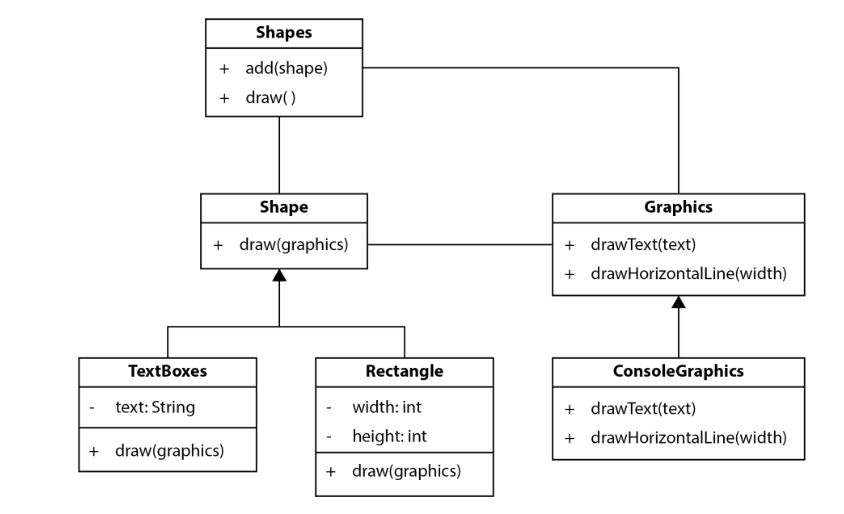
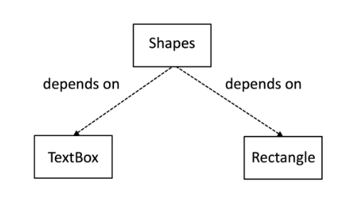
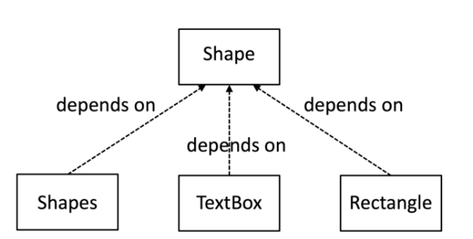

# Principios SOLID
## Hugo Rivas Galindo

Se aplicarán los principios SOLID a un diseño



## SRP: Principio de responsabilidad única

Es una guía para dividir el código en partes que encapsulen un solo aspecto de la solución, como un aspecto técnico o un regla comercial. 
Un error común es combinar demasiadas responsabilidades en una sola pieza de código (Alto acoplamiento)

Algunos de los beneficios de aplicar SRP son los siguientes:
- Mejor organización visual del código
- Capacidad de reutilizar el código
- Facilidad de mantenimiento en el futuro

Cuanto menor sea el alcance del componente, más probable es que se pueda reutilizar sin modificarlo.

### Código

Inicialmente tenemos un fragmento de código que no usa SRP:

```
public class Shapes {
    private final List<Shape> allShapes = new ArrayList<>();

    public void add(Shape s) {
        allShapes.add(s);
    }

    public void draw(Graphics g) {
        for (Shape s : allShapes) {
            switch (s.getType()) {
                case "textbox":
                    var t = (TextBox) s;
                    g.drawText(t.getText());
                    break;
                case "rectangle":
                    var r = (Rectangle) s;
                    for (int row = 0;
                         row < r.getHeight();
                         row++) {
                        g.drawLine(0, r.getWidth());
                    }
            }
        }
    }
}
```
Se observa que el código no cumple con SRP, ya que tiene 4 responsabilidades:
- Almacenar las formas con el método add()
- Dibujar las formas con el método draw()
- Conocer cada tipo de forma en la declaración de switch.
- Tener detalles de implementación para dibujar cada tipo de forma en las declaraciones case.

En este caso, hay un problema cuando se trata de agregar un nuevo tipo de forma, debido a que se tienen que agregar los detalles del tipo de forma en una declaración case.

### Se aplica SRP para simplificar el mantenimiento futuro del código

Se traslada el conocimiento de cómo dibujar cada tipo de forma fuera de la clase.

```
    public void draw(Graphics g) {
        for (Shape s : allShapes) {
            switch (s.getType()) {
                case "textbox":
                    var t = (TextBox) s;
                    t.draw(g);
                    break;
                case "rectangle":
                    var r = (Rectangle) s;
                    r.draw(g);
                    break;
            }
        }
    }
```
Se observa que se implementa una clase para cada tipo de figura. Cada una de estas implementa un método draw, el cual se encargará de dibujar la figura. 

```
public class Rectangle{

    int height;
    int width;

    public Rectangle(int height, int width){
        this.height=height;
        this.width=width;
    }

    public void draw(Graphics g){
        for(int i=0; i<height; i++){
            g.drawHorizontalLine(width);
        }
    }

}
```
Se observa que la clase rectángulo tiene la única responsabilidad de saber dibujar un rectángulo. 
Asimismo, la clase shapes ha mejorado en la implementación de su método draw, pues se ha vuelto más fácil de leer y la responsabilidad de dibujar queda trasladada a cada clase.


## DIP: Principio de inversion de dependencias

El principio de inversión de dependencias nos permite dividir el código en componentes separados que pueden cambiar independientemente unos de otros.

Lo que este principio dice es que debemos depender de abstracciones, no de detalles. 

Analizamos el método draw de la clase Shapes
```
public void draw(Graphics g) {
        for (Shape s : allShapes) {
            switch (s.getType()) {
                case "textbox":
                    var t = (TextBox) s;
                    t.draw(g);
                    break;
                case "rectangle":
                    var r = (Rectangle) s;
                    r.draw(g);
                    break;
            }
        }
    }
```
Se observa que este método solo está definido para esos 2 objetos. Y si queremos agregar nuevas formas, se tendrá que cambiar el método draw y el código de prueba asociado.

Se concluye que la clase Shapes depende de TextBox y de Rectangle. Que la clase Shape sea dependiente hace que trabajar con la clase Shape sea más complicado. 

Para eliminar esa dependencia de detalles de clases, se hace que la clase Shape dependa de interfaces,

### Se aplica DIP

Se agrega un método draw a la interfaz Shape.
```
public interface Shape {
    public void draw(Graphics g);
}
```
La interfaz es la abstracción de la única responsabilidad que tiene cada forma. 
Luego se implementa esta interfaz en las clases Rectangle y TextBox. 

```
public class Rectangle implements Shape{

    int height;
    int width;

    public Rectangle(int height, int width){
        this.height=height;
        this.width=width;
    }

    @Override
    public void draw(Graphics g){
        for(int i=0; i<height; i++){
            g.drawHorizontalLine(width);
        }
    }

}
```
Ahora la dependencia de la clase Shapes hacia las clases Rectangle y TextBox se reduce a una sola dependencia hacia una interfaz Shape.

Por lo tanto, se refactoriza la clase Shapes, específicamente el método draw
```
public class Shapes {

    private final List<Shape> allShapes = new ArrayList<>();
    private final Graphics g;

    Shapes(Graphics g){
        this.g=g;
    }

    public void add(Shape s) {
        allShapes.add(s);
    }

    public void draw(Graphics g) {
        for (Shape s : allShapes) {
            s.draw(g);
        }
    }
}
```

Si agregamos un nuevo tipo de forma, la clase Shape igual no tiene por qué cambiar. Se rompió la dependencia de saber los detalles de cada clase de formas.

Se implentó DIP: Se creó una abstracción en la interfaz Shape. La clase Shapes es un consumidor de esta abstracción. Las clases que implementan esta interfaz son los proveedores. Ambos conjuntos de clases dependen solo de la Abstracción, no dependen de los detalles. 

Inicialmente teníamos que la clase shapes dependía de TextBox y de Rectangle



Luego de invertir las dependencias, las clases TextBox y Rectangle dependen de la abstracción.



Se observa que se cambia la dirección de las flechas.


## LSP: Principio de sustitución de Liskov

En el anterior principio, de observa que se puede usar cualquier clase que implemente una interfaz en lugar de la interfaz misma. La interfaz en sí misma no muestra la implementación del método, por lo que podría generar algunos problemas.

Las clases que implementan interfaces deben tener un comportamiento esperado y no agregar comportamientos extras.

En nuestro proyecto, todas las clases que implementan Shape se ajustan a LSP

Se muestra la clase TextBox

```
public class TextBox implements Shape{

    private final String text;
    TextBox(String text){
        this.text=text;
    }
    @Override
    public void draw(Graphics g){
        g.drawText(text);
    }

}
```
Se observa que la clase puede dibujar cualquier texto válido proporcionado a su constructor..

## OCP: Principio de abierto y cerrado

Este principio hace referencia a un diseño extensible, es decir, agregar nuevas funcionalidades sin necesidad de modificarlo.
En nuestro ejemplo, la clase Shape está abierta a la definición de nuevos tipos de formas, pero está cerrada a la necesidad de modificaciones cuando se agrega esa nueva forma. 

Se agrega un nuevo tipo de forma llamado RightArrow.

```
public class RightArrow implements Shape {
    @Override
    public void draw(Graphics g) {
        g.drawText( " \\ " );
        g.drawText( "-----" );
        g.drawText( " / " );
    }
}
```

La clase RightArrow implementa la interfaz Shape y define un método Draw. Incluso cuando se agrega un figura más, no es necesario cambiar nada en la clase Shapes para usarlo.

```
public class Main {
    public static void main(String[] args) {

        Graphics console=new Graphics();

        //DIP: Se inyectan las dependencias
        var shapes=new Shapes(console);
        //A la clase Shapes se le pueden agregar diferentes tipos de Shape
        //SRP: Cada tipo de Shape sabe como dibujar su forma
        //LSP: Cada subclase se puede usar donde se necesite una interfaz de forma
        shapes.add(new TextBox("Hello!"));
        shapes.add(new Rectangle(2,8));
        shapes.add(new RightArrow());
    }
}
```

## ISP: Principio de segregación de interfaz

ISP nos aconseja mantener las interfaces pequeñas (pocos métodos) y dedicadas a lograr una sola responsabilidad. Es similar al principio SRP.

Por ejemplo, la interfaz Shape solo se encarga de dibujar. Tiene un único enfoque.

```
interface Shape {
    void draw(Graphics g);
}
```
Lo mismo ocurre con la interfaz Graphics. Solo contiene 2 métodos de dibujo.

```
public interface Graphics {
    void drawText(String text);
    void drawHorizontalLine(int width);
}
```

