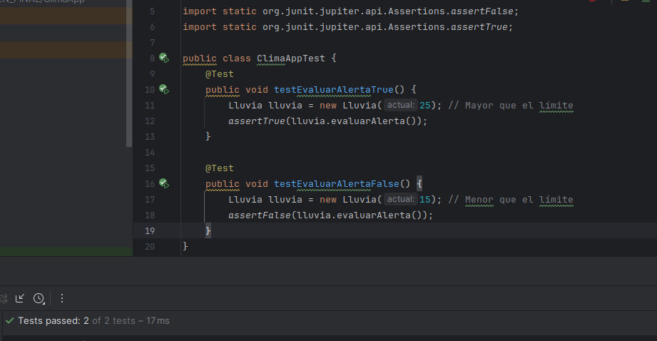
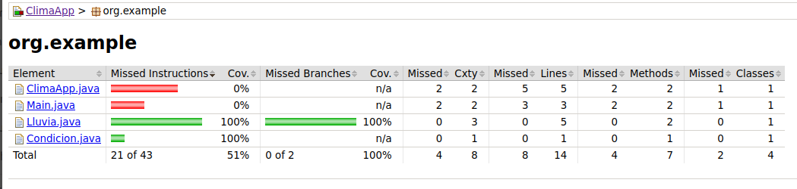
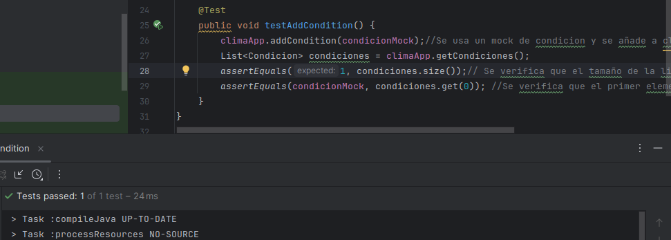
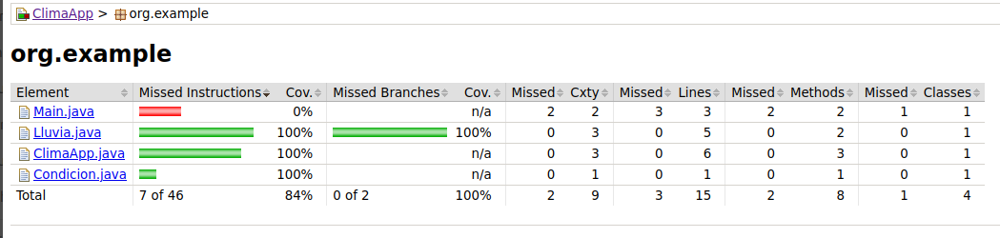
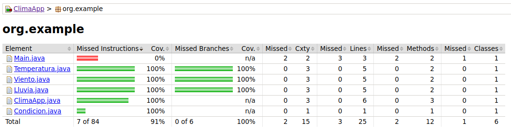
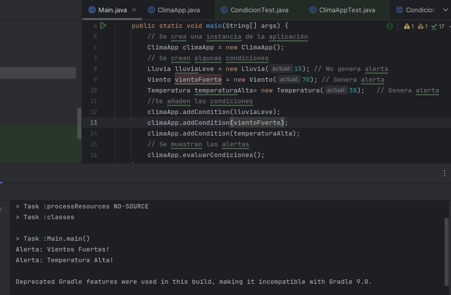
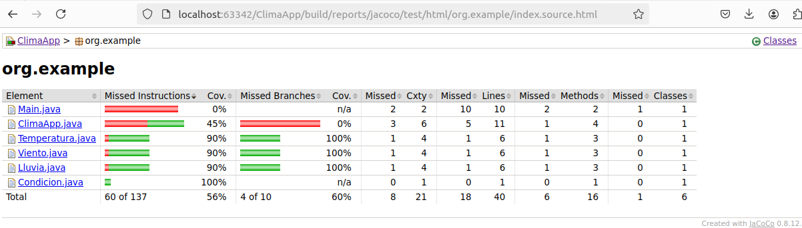
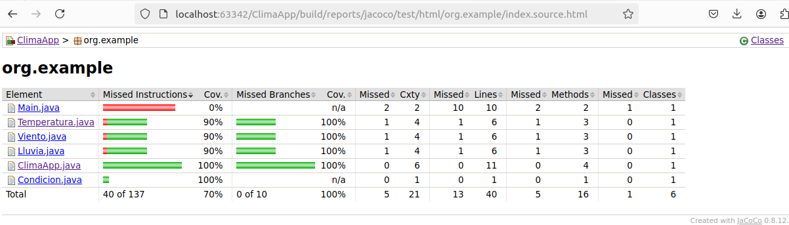

# EXAMEN FINAL
## Hugo Rivas Galindo

## SPRINT 1: ClimaApp

Se desarrolla un sistema que desencadena eventos avanzados basados en
combinaciones complejas de condiciones booleanas externas relacionadas con el clima.

Dado que se deben de especificar un conjunto de condiciones, haremos que ClimaApp tenga diversas condiciones como lluvia, temperatura, velocidad de viento, etc. Por lo tanto, se crea una clase Condicion la cual va a ser heredada por las condiciones que se van a especificar.

Se crean las clases ClimaApp, Condicion y Lluvia
```
public class ClimaApp {
    private List<Condicion> condiciones; //Lista de condiciones a evaluar
    public ClimaApp() {
        this.condiciones = new ArrayList<>();
    }
    public void addCondition(Condicion condicion) { //Añadir condiciones
        this.condiciones.add(condicion);
    }
}

```
Se implementa la clase abstracta Condicion que será usada para las condiciones que se van a especificar.
```
public abstract class Condicion {
    public abstract boolean evaluarAlerta();
}
```
La clase lluvia extiene a condición y se establece en 20 el límite para que una alerta se pueda lanzar.
```
public class Lluvia extends Condicion{

    private  double actual;//Lluvia actual
    private double limite=20; //Límite para que salte una alerta
    Lluvia(double actual){
        this.actual=actual;
    }
    @Override
    public boolean evaluarAlerta() {
        return actual > limite;
    }

}
```

Se observa que la clase lluvia extiende a condición. Se establece en 20 el límite para que salte una alerta. A continuación se crean los tests para el método evaluar alerta
```
@Test
    public void testEvaluarAlertaTrue() {
        Lluvia lluvia = new Lluvia(25); // Mayor que el límite
        assertTrue(lluvia.evaluarAlerta());
    }

    @Test
    public void testEvaluarAlertaFalse() {
        Lluvia lluvia = new Lluvia(15); // Menor que el límite
        assertFalse(lluvia.evaluarAlerta());
    }
```
Se observa que los tests pasan



Se realiza un reporte de jacoco para analizar la cobertura



Se observa que no se ha testeado la clase ClimaApp. Se procede a realizar los tests

Se realiza el test de añadir una condición. Se usan mocks debido a que el método depende de la clase externa Condicion. 

```
@Test
    public void testAddCondition() {
        climaApp.addCondition(condicionMock);//Se usa un mock de condicion y se añade a clima app
        List<Condicion> condiciones = climaApp.getCondiciones();
        assertEquals(1, condiciones.size());// Se verifica que el tamaño de la lista de  condiciones aumente
        assertEquals(condicionMock, condiciones.get(0)); //Se verifica que el primer elemento de la lista es el mock creado
    }
```

Se observa que la prueba pasa


Se observa una cobertura del 100% (sin contar a la clase main) luego de implementar esta prueba con mocks



Se procede de la misma manera con una clase Viento y temperatura
Clase temperatura con límite de temperatura en 35
```
public class Temperatura extends Condicion{
    private  double actual;//Temperatura actual
    private double limite=35; //Límite para que salte una alerta
    Temperatura(double actual){
        this.actual=actual;
    }
    @Override
    public boolean evaluarAlerta() {
        return actual > limite;
    }
}
```
Clase viento con límite de alerta en 50km/h
```
public class Viento extends Condicion{
    private  double actual;//velocidad viento actual
    private double limite=50; //Límite para que salte una alerta
    Viento(double actual){
        this.actual=actual;
    }
    @Override
    public boolean evaluarAlerta() {
        return actual > limite;
    }
}
```

Se realiza el reporte con jacoco y se observa que la cobertura es de 100%



Ahora podemos agregar un mensaje de alerta a cada condicion para que sea mostrado en consola cuando la condicion sea mayor al límite.

Se agrega un método a condición
```
public abstract class Condicion {
    public abstract boolean evaluarAlerta();
    public abstract String getMensajeAlerta();
}
```
Se agrega el mensaje de alerta a cada condición. Se muestra el mensaje de alerta de Temperatura.
```
public class Temperatura extends Condicion{
    private  double actual;//Temperatura actual
    private double limite=35; //Límite para que salte una alerta
    Temperatura(double actual){
        this.actual=actual;
    }
    @Override
    public boolean evaluarAlerta() {
        return actual > limite;
    }
    @Override
    public String getMensajeAlerta() {
        return "Alerta: Temperatura Alta!";
    }
}
```

Además, se agrega el método evaluarCondiciones a la clase ClimaApp, el cual nos retornará los mensajes de alerta cuando una condición sea mayor al límite

```
public void evaluarCondiciones() {
        for (Condicion condicion : condiciones) { //Se itera a través de todas las condiciones agregadas
            if (condicion.evaluarAlerta()) { //Se evalua cada condición y se muestra el mensaje de alerta cuando el valor excede al límite
                System.out.println(condicion.getMensajeAlerta()); 
            }
        }
    }
```

Se muestra la salida en consola


Sin embargo, el reporte de jacoco indica que la cobertura ha bajado



Se realizarán las pruebas para el método evaluarCondiciones. Es necesario usar mocks porque se usan dependencias externas de la clase Condicion, por lo que se deben de simular dichas dependencias.

```
    @Test
    public void testEvaluarCondiciones() {
        //Se crean los mocks para las distintas condiciones
        Condicion lluviaMock = mock(Lluvia.class);
        Condicion vientoMock = mock(Viento.class);
        //Se declaran las salidas de los métodos llamados
        when(lluviaMock.evaluarAlerta()).thenReturn(true);
        when(lluviaMock.getMensajeAlerta()).thenReturn("Alerta: Lluvia Intensa!");
        when(vientoMock.evaluarAlerta()).thenReturn(false);
        //Se añaden las condiciones creadas
        climaApp.addCondition(lluviaMock);
        climaApp.addCondition(vientoMock);
        //Se llama a la función para evaluar las condiciones y mandar el mensaje de alerta si el valor es mayor que el límite
        climaApp.evaluarCondiciones();
        //Se verifica que se ha interactuado con los mocks
        verify(lluviaMock, times(1)).evaluarAlerta();
        verify(vientoMock, times(1)).evaluarAlerta();
        //Se debe de haber llamado al método mensaje alerta porque la alerta es verdadera
        verify(lluviaMock, times(1)).getMensajeAlerta();
    }
```

Se observa la alta cobertura


