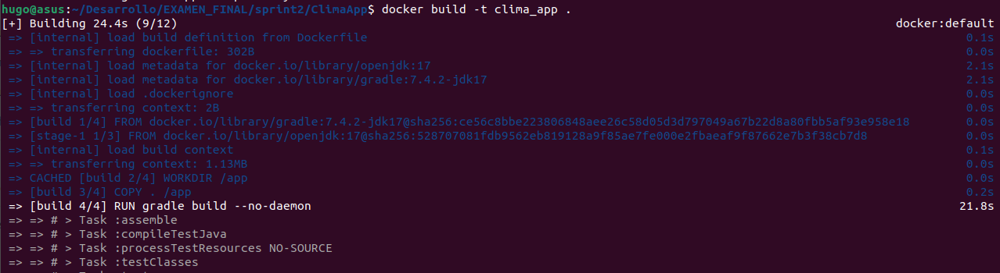
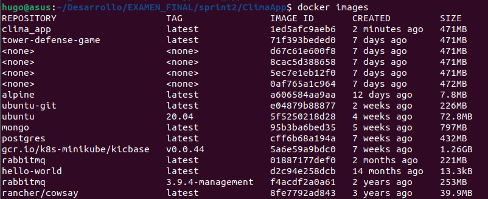
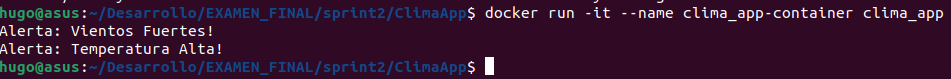

# EXAMEN FINAL
## Hugo Rivas Galindo

## SPRINT 2: ClimaApp

Se crea un dockerfile para contenerizar la aplicación. Usaremos un dockerfile parecido al que usé en la pc5, el cual consta de 2 etapas: la de construcción y la de ejecución. La etapa de construcción se encarga de generar los archivos ejecutables que luego serán utilizados en la etapa de ejecución. 
```
# Etapa de construcción
FROM gradle:7.4.2-jdk17 AS build
WORKDIR /app
COPY . /app
# Ejecuta el comando gradle build para compilar la aplicación
RUN gradle build --no-daemon

# Etapa de ejecución
FROM openjdk:17
WORKDIR /app
# Copia los archivos necesarios desde la etapa "build" (en la ruta /app/build/libs) a la imagen actual. 
COPY --from=build /app/build/libs /app/libs
# org.example.Main -> Especifica el punto de entrada a la aplicación
CMD ["java", "-cp", "/app/libs/*", "org.example.Main"]
```

Se construye la imagen de docker con el siguiente comando
```
docker build -t clima_app .
```


Podemos listar las imágenes para comprobar que se creó la imagen de nuestra aplicación
```
docker images
```


Se observa que se creó la imagen clima_app. A continuación se ejecutará el contenedor para mostrar la salida de alertas.

```
docker run -it --name clima_app-container clima_app
```



Se observa que la salida es la esperada. Por lo que se creó correctamente el dockerfile.