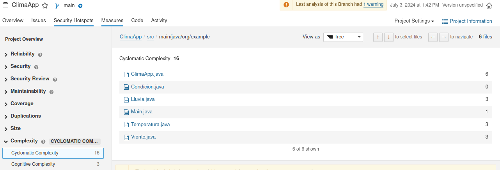
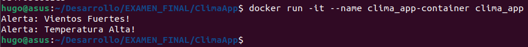
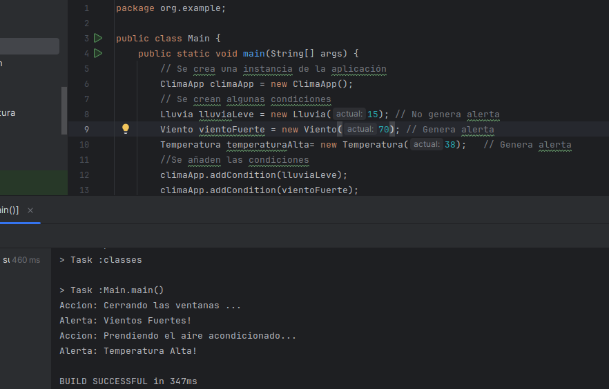
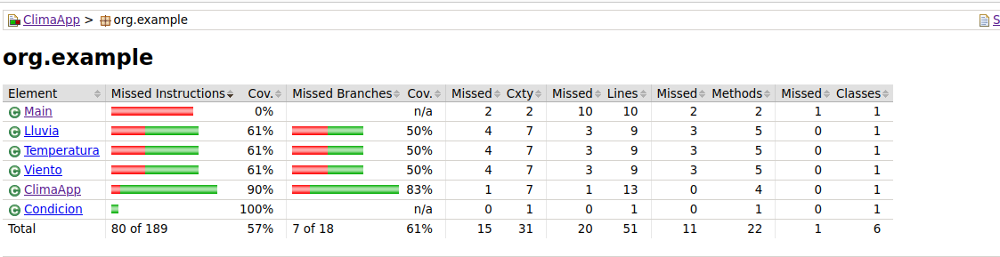
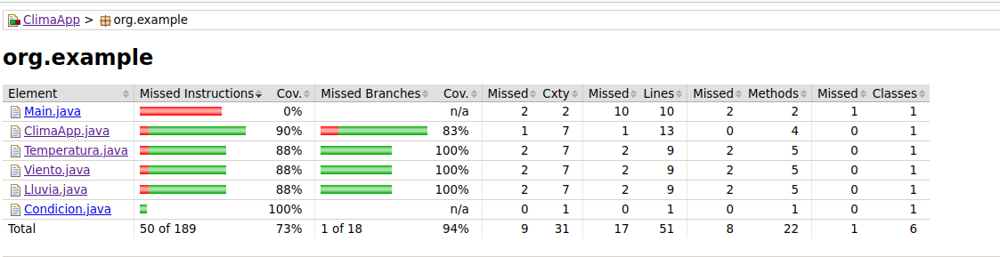

# Pregunta 2: Diseño del videojuego: Juego basado en consola en java
## Hugo Rivas Galindo

# SPRINT 2 (CONTINUACIÓN)

## Cálculo de métricas

Se realiza el calculo de métricas de nuestra aplicación.

Se hace el cálculo de la complejidad ciclomática de nuestra aplicación haciendo uso de la herramienta SonarQ. 



Se observa que todas las clases tienen una complejidad ciclomática menor a 10, lo cual es un buen indicador de que la clase es fácil de leer. 

Se calculan las métricas de acoplamiento para cada clase
- Acoplamiento eferente: Número de clases externas que un módulo particular utiliza
- Acoplamiento aferente: Número de clases externas que dependen de un módulo en particular

Además, se calcula la métrica de cohesión LCOM4
- LCOM4: Número de conjuntos de métodos diferentes en una clase que son mutuamente no accesible

1. Clase ClimaApp
- Acoplamiento eferente (CE): Módulos de Condicion => CE = 1
- Acoplamiento aferente (CA): No hay clases que dependan de algún módulo de ClimaApp => CA =0
- Inestabilidad: 1/(1+0) = 1
- LCOM4: 1

2. Clase Condicion:
- Acoplamiento eferente (CE): No depende de ningún módulo externo => CE = 0
- Acoplamiento aferente (CA):  => ClimaApp, Lluvia, Temperatura, Viento =4
- Inestabilidad: 0/(4+0) = 0
- LCOM4: 2

3. Clase Lluvia:
- Acoplamiento eferente (CE): Módulos de condición => CE=1
- Acoplamiento aferente (CA): Módulos de ClimaApp => CA=1
- Inestabilidad: 1/(1+1)=0.5
- LCOM4: 1

4. Clase Temperatura:
- Acoplamiento eferente (CE): Módulos de Condición => CE =1
- Acoplamiento aferente (CA): Módulos de ClimaApp => CA=1
- Inestabilidad: 1/(1+1)=0.5
- LCOM4: 1

5. Clase Viento:
- Acoplamiento eferente (CE): Módulos de Condición => CE = 1
- Acoplamiento aferente (CA): Módulos de ClimaApp => CA =1 
- Inestabilidad: 1/(1+1)=0.5
- LCOM4: 1


Nuestras métricas indican que tenemos clases con baja cohesión y que son estables.

## Creación de Dockerfile

En el examen se presentó una forma de crear el dockerfile usando 2 etapas: de construcción y de ejecución. También se puede realizar el dockerfile utilizando como modelo el usado por el profesor.

```
# Utilizar la imagen oficial de OpenJDK como base
FROM openjdk:17

# Crear y cambiar al directorio /app
WORKDIR /app

# Copiar los archivos del proyecto al contenedor
COPY . /app

# Compilar el proyecto
RUN chmod +x ./gradlew build

# Establecer el comando predeterminado para ejecutar la aplicación
CMD ["java", "-cp", "build/classes/java/main", "org.example.Main"]
```

Se ejecuta el contenedor de nuevo y se comprueba que no hay errores



## Implementación de nuevas funcionalidades

Podemos implementar nuevas funcionalidades a nuestras condiciones climáticas. Por ejemplo, podemos agregar la funcionalidad de generar acciones automáticas cuando el valor de una condición sobrepasa un límite. Por ejemplo, si la temperatura pasa los 30°, que se active la acción de "Activar aire acondicionado" incluso cuando la alerta no se active.

Por tal motivo, agregamos 2 métodos a la clase Condicion. Uno para evaluar si el valor actual es el adecuado para realizar una acción y el otro método para mostrar que se está realizando la acción.

```
public abstract class Condicion {
    public abstract boolean evaluarAlerta();
    public abstract String getMensajeAlerta();
    public abstract boolean evaluarAccion();
    public abstract String getMensajeAccion();
}
```

Se refactoriza la clase Temperatura según los cmabios realizados en la clase Condicion
```
public class Temperatura extends Condicion{
    private  double actual;//Temperatura actual
    private double limiteAlerta=35; //Límite para que salte una alerta
    private double limiteAccion=30; //Límite para realizar una acción

    Temperatura(double actual){
        this.actual=actual;
    }
    @Override
    public boolean evaluarAlerta() {
        return actual > limiteAlerta;
    }
    @Override
    public String getMensajeAlerta() {
        return "Alerta: Temperatura Alta!";
    }
    @Override
    public String getMensajeAccion(){
        return "Accion: Prendiendo el aire acondicionado...";
    }
    @Override
    public boolean evaluarAccion(){
        return actual>limiteAccion;
    }
}
```

Se establece un límite para que se active la alerta y otro límite para que se realice una acción. Además, se crean los métodos evaluarAccion() que se encarga de evaluar si la temperatura actual es mayor que el límiteAccion, y también se crea el método getMensajeAccion() que se encarga de informar que se está realizando una acción.

Del mismo modo, se realizan los cambios en las demás clases Lluvia y Viento.

Para la clase lluvia se establece la acción de activar el sistema de riego cuando la cantidad de lluvia sea mayor que 18 mm. 
Para la clase viento se establece la acción de cerrar las ventanas cuando la velocidad del viento sea mayor que 40 km/h. 

Además, se refactoriza el método evaluarCondiciones de la clase ClimaApp de tal forma que se muestre la acción realizada.

```
public void evaluarCondiciones() {
        for (Condicion condicion : condiciones) { //Se itera a través de todas las condiciones agregadas

            if(condicion.evaluarAccion()){// Se evalua si se cumple la condicion para realizar la acción.
                System.out.println(condicion.getMensajeAccion()); // Realiza la accion cuando se cumple la condicion
            }
            if (condicion.evaluarAlerta()) { //Se evalua cada condición y se muestra el mensaje de alerta cuando el valor excede al límite
                System.out.println(condicion.getMensajeAlerta());
            }
        }
    }
```
Se muestra la salida en consola




Se genera el reporte de jacoco para verificar la cobertura de pruebas



Se observa que no hay una buena cobertura, por lo que se procede a realizar pruebas para comprobar que el código funcione como lo esperamos.

```
    @Test
    public void testEvaluarAccionFalse(){
        Temperatura temperatura=new Temperatura(30);
        Viento viento=new Viento(35);
        Lluvia lluvia=new Lluvia(15);

        assertFalse(temperatura.evaluarAccion());
        assertFalse(viento.evaluarAccion());
        assertFalse(lluvia.evaluarAccion());
    }
```

Se realizan los test para mejorar la cobertura de nuestras pruebas



Se observa una cobertura elevada.