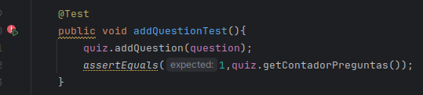
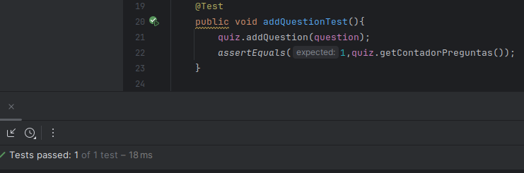
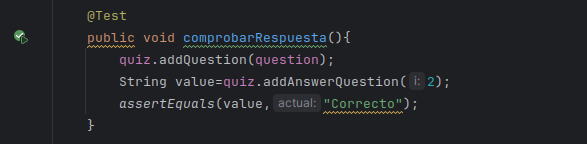

# Hugo Rivas Galindo


# SPRINT 1

Se desarrolla la clase Question con atributos descripción de la pregunta, las opciones
disponibles y la respuesta correcta.

Se usa un string para el enunciado de la pregunta, una lista de strings para las opciones y un entero para indicar la respuesta correcta.

```
public class Question {

    String enunciado;
    String options[];
    int correcta;

    public Question(String enunciado, String[] options, int correcta){
        this.enunciado=enunciado;
        this.options=options;
        this.correcta=correcta;
    }
}

```


Se desarrolla la clase Quiz que manejará el flujo de juego

Se maneja una lista de objetos de clase Question y un contador de preguntas

```
public class Quiz {

    //Se realiza una lista de preguntas que serán mostradas secuencialmente
    Question[] ListaPreguntas=new Question[10];
    //La cantidad de preguntas por Quizz
    int contadorPreguntas;

    void Quizz(){
        contadorPreguntas=0;
    }
    public void addQuestion(Question question){
        ListaPreguntas[contadorPreguntas]=question;

    }
    public void showQuiz(){
    }
    public void addAnswer(){
    }
    public Question[] getListaPreguntas(){
        return ListaPreguntas;
    }
    public int getContadorPreguntas(){
        return contadorPreguntas;
    }

}

```


Se realiza la prueba inicial para verificar que se agreguen las preguntas



La prueba inicial falla debido a que no se está aumentado el valor de contadorPreguntas cada vez que se llama a addQuestion.
Se realiza la modificación

```
public void addQuestion(Question question){
        ListaPreguntas[contadorPreguntas]=question;
        contadorPreguntas++;
    }
```
En ese caso, la prueba será aceptada.



Se realiza una prueba para comprobar que se comprueben las pruebas correctas

```
    @Test
    public void comprobarRespuesta(){
        quiz.addQuestion(question);
        String value=quiz.addAnswerQuestion(2);
        assertEquals(value,"Correcto");
    }
```
Se implementa la función addAnswerQuestion para comprobar de que la opción elegida sea igual a la respuesta correcta

```
    public String addAnswerQuestion(int i){
        if(i==ListaPreguntas[0].correcta){
            return "Correcto";
        }
        return "Incorrecto";
    }
```

Se pasa la prueba

