# Hugo Rivas Galindo


# SPRINT 1

Se inicia creando el proyecto desde 0


A continuación se realiza el enfoque TDD para la realizaión de pruebas y refactorización.
Se inicia con la primera prueba que comprobará que la letra es diferente.

```
    @Test
    public void oneIncorrectLetter(){
        var word = new Word("A");
        var score = word.guess("Z");

        assertScoreForGuess(score, INCORRECT);
    }
```
El código dado en el examen pasa dicha prueba. 

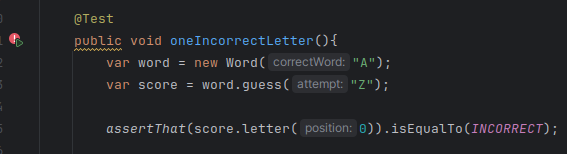

Se hace una variación en la prueba para comprobar que efectivamente el código está comprobando lo que debe comprobar.
Comprobamos que ahora la prueba falla.


Se actúa de forma similar en la siguiente prueba. El código dado en el enunciado es suficiente para para pasar la segunda prueba.

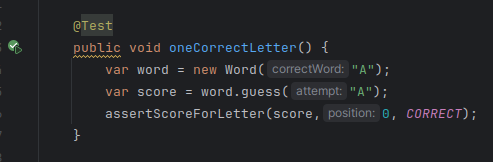

Se debe de hacer una variación para comprobar que efectivamente el código está probando la funcionalidad que se quiere.
Luego de cambiar los parámetros, se observa que la prueba falla.

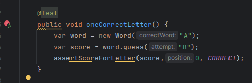

Por lo tanto, el código está validando lo que debe validar.

Se realiza el análisis estático con sonarQ. Se realiza la configuración

```
sonar {
    properties {
        property "sonar.projectKey", "WORDZ"
        property "sonar.login", "sqp_83bddeac802c9f8001509ab31e90f0c557065a9a"
        property "sonar.host.url", "http://localhost:9000"
    }
}
```

Se observa que hay solo 7 olores de código

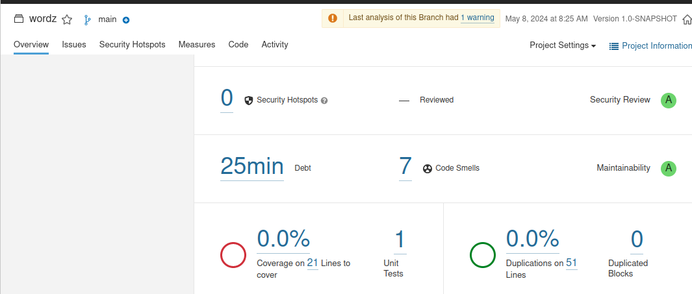

Se realiza la refactorización según lo establecido por SonarQ:

Se debe de quitar la etiqueta de public en la clase de test:

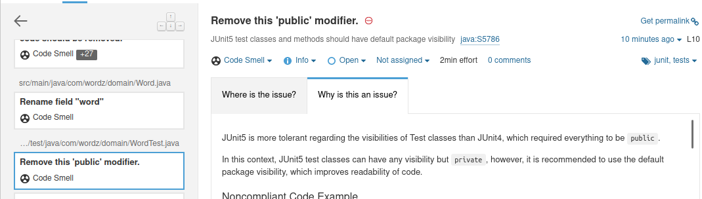

Se cambia

```
public class WordTest {...}
```
por
```
class WordTest {...}
```


Se debe realizar el mismo cambio para todas las clases de prueba realizadas.

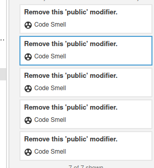

```

    @Test
    void oneIncorrectLetter(){
        var word = new Word("A");
        var score = word.guess("Z");

        assertScoreForGuess(score, INCORRECT);
    }

    @Test
    void oneCorrectLetter() {
        var word = new Word("A");
        var score = word.guess("A");
        assertScoreForLetter(score,0, CORRECT);
    }  


```


¡Listo! Se tiene la primera parte del sprint completada


# SPRINT 2

Se continúa con los test proporcionados SecondLetterWrongPosition y allScoreCombinations.

Se puede observar que ambos test pasaron las pruebas

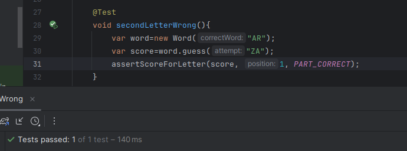

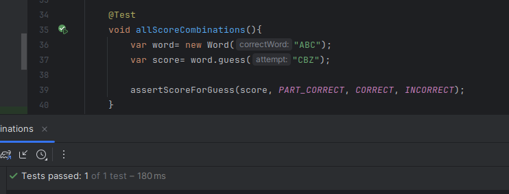

De igual manera, se debe verificar que ambos validen lo que se está esperando, por lo que se realizarán pruebas incorrectas a propósito. 

Se realiza un cambio en el método assess de la clase Score. El cambio realizado es agregar resultados correctos a cada letra sin importar si es parcialmente correcta o incorrecta:

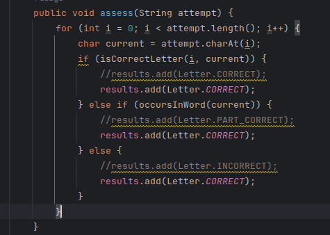

Se ejecutan las pruebas con dicho cambio:

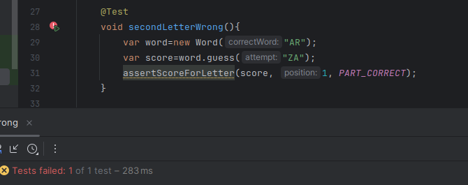

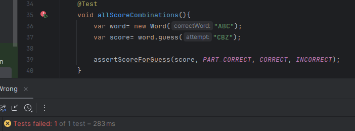

Se observan que son incorrectas, lo cual es el resultado esperado. Con esto se concluye que las pruebas están validando lo que deben de validar. 


A continuación se vuelve a realizar el análisis con SonarQ

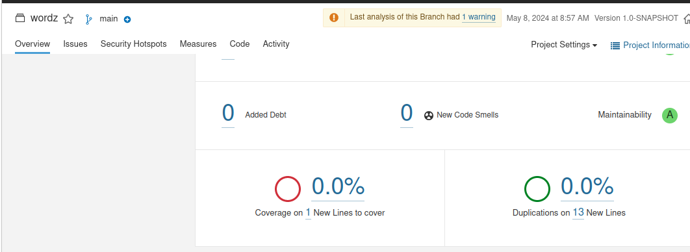

Se observa que hay 0 olores de código nuevos. Por lo que el código está correctamente implementado.


# SPRINT 3


# PREGUNTAS RELACIONADAS AL JUEGO WORDZ

1. ¿Cuáles son los elementos clave que se deben considerar al diseñar un juego de adivinanza
de palabras como "Wordz"? ¿Cómo influyen los sistemas de retroalimentación en la
experiencia del jugador en juegos de trivia o adivinanzas?

Uno de los elementos clave a considerar es la puntuación en cada adivinación, es decir, mostrar qué tan cerca estuviste de la palabra. Este elemento es implementado a través de un enum en el código de Wordz, usando INCORRECT, PART_CORRECT y CORRECT.
Otro elemento clave es aceptar palabras de longitud variable, puesto que mejorará la experiencia del usuario al no repetir la monotonía.
Con respecto a los sistemas de retroalimentación, son necesarios puesto que en un juego de adivinar, el usuario necesita saber qué tan lejos estuvo su respuesta de la correcta, por ende, una solución a dicho problema mejorará la experiencia del usuario. 


2. Describe cómo el principio de "feedback continuo" en las metodologías ágiles podría
aplicarse en el desarrollo del juego "Wordz".

El principio de feedback continuo sirve para retroalimentar y saber cómo va el avance del proyecto. En el caso del juego Wordz, se podría aplicar para agregar o corregir funcionalidades que no fueron tan precisas durante el desarrollo de las historias de usuario. Un posible feedback podría realizarse en la implementación de la interfaz de usuario, debido a que se pueden encontrar muchos detalles que son difíciles de precisar.


3. ¿Cuáles son algunas características nuevas de JUnit 5 que lo hacen adecuado para pruebas
unitarias en proyectos Java modernos? ¿Cómo se podría diseñar una suite de pruebas
unitarias para validar la lógica de puntuación en "Wordz"?

JUnit5 es una herramienta potente que usamos para las pruebas unitarias. En el caso de la lógica de puntuación en Wordz, se podría diseñar una prueba unitaria para validar cada método en la clase Score, debido a que es en esta clase donde se realiza la lógica de puntuación.


4. ¿Por qué es importante la refactorización en el desarrollo continuo de un juego y cómo
puede afectar la mantenibilidad del código? Proporciona un ejemplo de cómo podrías
refactorizar un método complejo en el juego "Wordz" para mejorar la claridad y eficiencia.

La refactorización es una parte crucial del RGR. Es necesario para lograr una correcta implementación de código desde el inicio, puesto que a medida que el proyecto crece, los olores de código se hacen más notorios y hacen que el proyecto sea más complicado de mantener. En el caso del juego de Wordz, las clases y métodos implementados se realizaron de forma simple. Posiblemente se deba refactorizar más adelante, cuando el proyecto implemente funciones multijugador, con un tiempo límite, etc. En ese caso, se continuará utilizando el método RGR para evitar tener olores de código críticos en dichas funcionalidades.


