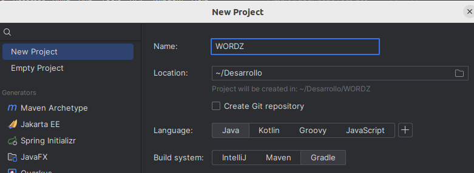
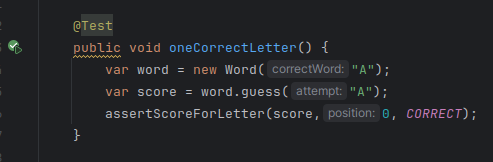
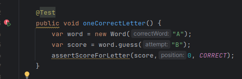
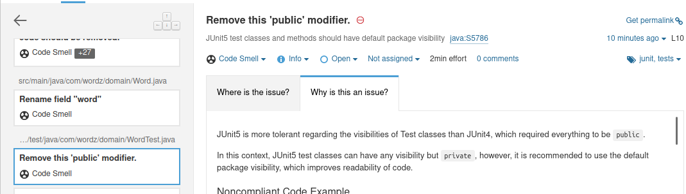
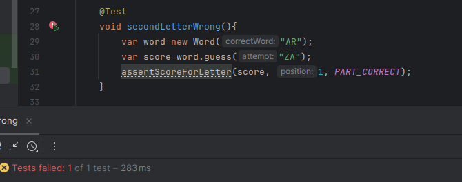
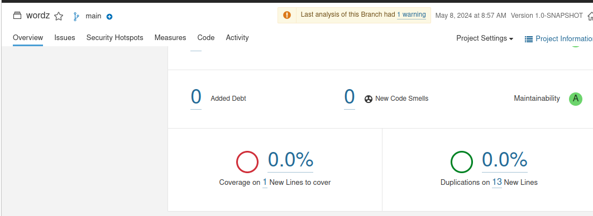

# Hugo Rivas Galindo


# SPRINT 1

Se inicia creando el proyecto desde 0



A continuación se realiza el enfoque TDD para la realizaión de pruebas y refactorización.
Se inicia con la primera prueba que comprobará que la letra es diferente.

```
    @Test
    public void oneIncorrectLetter(){
        var word = new Word("A");
        var score = word.guess("Z");

        assertScoreForGuess(score, INCORRECT);
    }
```
El código dado en el examen pasa dicha prueba. 


Se hace una variación en la prueba para comprobar que efectivamente el código está comprobando lo que debe comprobar.
Comprobamos que ahora la prueba falla.


Se actúa de forma similar en la siguiente prueba. El código dado en el enunciado es suficiente para para pasar la segunda prueba.



Se debe de hacer una variación para comprobar que efectivamente el código está probando la funcionalidad que se quiere.
Luego de cambiar los parámetros, se observa que la prueba falla.



Por lo tanto, el código está validando lo que debe validar.

Se realiza el análisis estático con sonarQ. Se realiza la configuración

```
sonar {
    properties {
        property "sonar.projectKey", "WORDZ"
        property "sonar.login", "sqp_83bddeac802c9f8001509ab31e90f0c557065a9a"
        property "sonar.host.url", "http://localhost:9000"
    }
}
```

Se observa que hay solo 7 olores de código


Se realiza la refactorización según lo establecido por SonarQ:

Se debe de quitar la etiqueta de public en la clase de test:



Se cambia

```
public class WordTest {...}
```
por
```
class WordTest {...}
```


Se debe realizar el mismo cambio para todas las clases de prueba realizadas.


```

    @Test
    void oneIncorrectLetter(){
        var word = new Word("A");
        var score = word.guess("Z");

        assertScoreForGuess(score, INCORRECT);
    }

    @Test
    void oneCorrectLetter() {
        var word = new Word("A");
        var score = word.guess("A");
        assertScoreForLetter(score,0, CORRECT);
    }  


```


¡Listo! Se tiene la primera parte del sprint completada


# SPRINT 2

Se continúa con los test proporcionados SecondLetterWrongPosition y allScoreCombinations.

Se puede observar que ambos test pasaron las pruebas


De igual manera, se debe verificar que ambos validen lo que se está esperando, por lo que se realizarán pruebas incorrectas a propósito. 

Se realiza un cambio en el método assess de la clase Score. El cambio realizado es agregar resultados correctos a cada letra sin importar si es parcialmente correcta o incorrecta:


Se ejecutan las pruebas con dicho cambio:




Se observan que son incorrectas, lo cual es el resultado esperado. Con esto se concluye que las pruebas están validando lo que deben de validar. 


A continuación se vuelve a realizar el análisis con SonarQ



Se observa que hay 0 olores de código nuevos. Por lo que el código está correctamente implementado.

¡Listo! Se ha completado el Sprint 2


