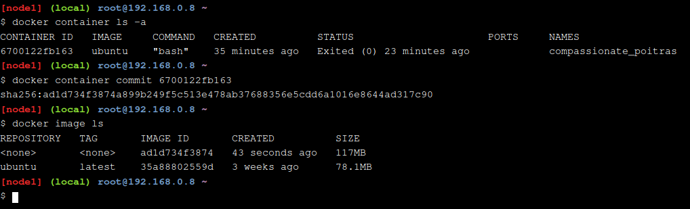
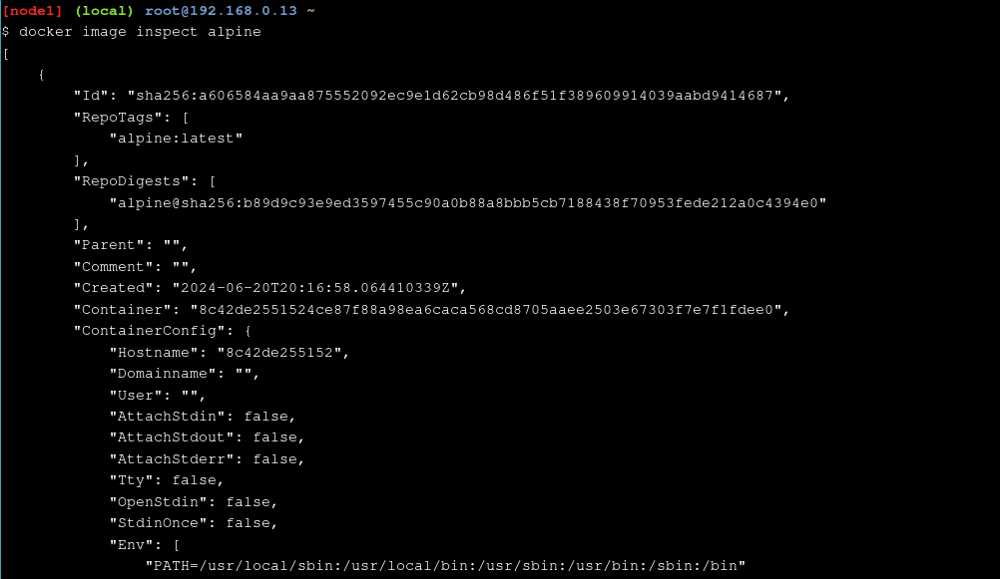

# Play With Docker - Stage 1: The Basics
## Hugo Rivas Galindo

## Doing More With Docker Images

## Image Creation From a Container

Se inicia el laboratorio usando una shell interactiva en un contenedor creado a partir de una imagen de ubuntu
```
docker container run -ti ubuntu bash
```
Se instala un paquete llamado figlet en el contenedor creado. 
```
apt-get update
apt-get install -y figlet
figlet "hello docker"
```


Vamos a intentar crear una imagen a partir de este contenedor que tiene instalado figlet. 

Primero se debe obtener el ID del contenedor, el cual se obtiene fácilmente listando los contenedores.
```
docker container ls -a
```


Obtenemos el id de nuestro contenedor. Además, podemos ver los cambios realizados en el contenedor. Para esto, se usa el siguiente comando
```
docker container diff 6700122fb163
```
En nuestro caso, se realizó la instalación de figlet, por lo que se muestra una lista de los archivos que fueron añadidos o cambiados en el contenedor cuando se instaló figlet. Docker mantiene un registro de toda esta información.

Para crear una imagen se necesita hacer un commit al contenedor. El Commit crea una imagen local en el sistema ejecutando Docker. Se ejecuta el comando siguiente para crear una imagen de ese contenedor
```
docker container commit 6700122fb163
```



Se observa que se creó un nuevo contenedor pero no tiene un nombre ni una etiqueta asociada. Se añade un nombre
```
docker image tag ad1d734f3874 ourfiglet
```
Se observa que ahora nuestro contenedor tiene un nombre asociado que podemos usar para identificar nuestra imagen.


Ahora ejecutamos el contenedor basado en la nueva imagen ourfiglet creada
```
docker container run ourfiglet figlet hugo
```


Se muestra que se puede crear un contenedor y luego crear una imagen a partir de este usando commit. 

## Image Creaton Using a Dockerfile

Se muestra otra forma de generar imágenes, usando dockerfiles. Los dockerfiles son poderosos porque permiten especificar cómo una imagen es construida, en vez de manejar solo binarios.

Se generará un "Hello World" en una aplicación Node.js.


La aplicación solo escribirá un Hello World. Vamos a dockerizar esta aplicación creando un dockerfile. Se usa Alpine como la imagen base, se añade node.js runtime y se copiará el código fuente en el contenedor. Además se especificará el comando para que se ejecute luego de la creación.


```
FROM alpine
RUN apk update && apk add --no-cache nodejs npm
COPY . /app
WORKDIR /app
CMD ["node","index.js"]
```
Se construye la imagen a partir del dockerfile y lo llamamos hello:v0.1.

```
docker image build -t hello:v0.1 .
```


Se inicia el contenedor para verificar que nuestra aplicación funciona correctamente


Se comprueba la creación de un contenedor a partir de una imagen. Se muestra la explicación del dockerfile
- FROM: Especifica la imagen base a descargar
- RUN: Ejecuta los comandos dentro del contenedor
- COPY: Añade archivos desde nuestro directorio actual del host dentro del contenedor.
- WORKDIR: Especifica el directorio que el contenedor debe usar cuando se inicie
- CMD: Ejecuta comandos a nivel del contenedor.

## Image Layers

Se explorará el concepto de las capas de las imágenes en docker. Se revisa el historial de comandos de docker del contenedor
```
docker image history 
```


Se observa una lista de contenedores intermediarios que fueron construidos cuando creábamos la imagen final. Algunas de estas imágenes intermediarias se convertirán en capas en nuestro contenedor final. En la salida del comando history, la imagen Alpine original está al fondo de la lista y cada personalización que añadimos en nuestro dockerfile está un paso arriba. 

Agregamos una línea nueva a nuestro archivo index.js y construimos la imagen hello:v0.2
```
echo "console.log(\"this is v0.2\");" >> index.js
docker image build -t hello:v0.2 .
```


Se observa que en la ejecución de la línea 2 del dockerfile, aparece *CACHED*, lo que demuestra que se está creando una imagen a partir de esa capa. Docker reconoce que habíamos construido algunas de estas capas antes y como nada ha cambiado en dichas capas, solo se usa una versión en cache de dichas capas, en lugar de descargar una segunda imagen y realizar los mismos pasos. 


## Image Inspection

Docker tiene un comando **inspect** que retorna los detalles de una imagen de un contenedor.
```
docker image inspect alpine
```


Se muestra mucha información en formato JSON, como las capas por la que la imagen está compuesta, la arquitectura del SO que se ha creado, metadata de la imagen.

Si queremos obtener la lista de capas, podemos usar el siguiente comando.


Se muestra que para la imagen de alpine solo se tiene una capa y para la imagen hello:v0.2 se tienen 3 capas, pues se muestran 3 hashes.

## Terminología

Se hace un repaso de la terminología

- Layer: Una imagen de docker es construida a partir de una serie de capas. Cada capa representa una instrucción en la imagen dockerfile. 
- Dockerfile: Es un archivo de texto que contiene todos los comandos necesarios para construir una nueva imagen.
- Volumes: Un contenedor docker que permite la persistencia de data y puede ser separado del contenedor

