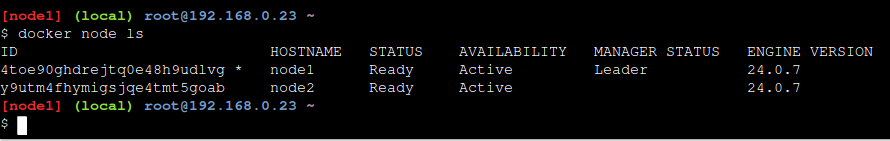

# Play With Docker - Stage 1: The Basics
## Hugo Rivas Galindo

## Swarm Mode Introduction for IT Pros

Para la gestión de varios contenedores, Docker ofrece 2 soluciones:
- Docker Compose: Es usado para controlar múltiples contenedores en un solo sistema. 
- Swarm Mode: 


## Initialize Your Swarm

Primero se debe de declarar que queremos usar el Docker en modo Swarm. Swarm puede ser solo un simple nodo, pero esto no permitiría una capacidad de alta disponibilidad y limitaría bastante la escalabilidad. Los swarms en producción suelen tener al menos 3 nodos manager y muchos nodos worker. 
Se inicia el modo Docker Swarm escribiendo el siguiente comando
```
docker swarm init --advertise-addr $(hostname -i)
``` 


El comando inicializa el nodo actual como manager. Para unir nodos workers al swarm ,podemos usar el comando mostrado en el output.

```
docker swarm join --token <token> <host>
```


Con esto hemos unido nuestro nodo 2 a nuestro Swarm

## Show Swarm Members

Podemos listar el número de nodos en el swarm ejecutando el siguiente comando en el nodo manager.
```
docker node ls
```


Se observa que hay 2 nodos y el primero es un manager y el segundo es un worker. El manager node es también el lider, porque solo tenemos un nodo manager. El nodo lider tiene control de todos los manager. En caso el lider se cae por alguna razón, los demás nodos manager elegirán a un nuevo lider.

## Clone the Voting App

Se ejecuta el siguiente comando en la primera terminal para recuperar el código de ejemplo de la aplicación de votación.
```
git clone https://github.com/docker/example-voting-app
cd example-voting-app
```


## Deploy a Stack

Un Stack es un grupo de servicios que se han desplegado juntos. Cada servicio individual puede estar formado por uno o más contenedores, llamados task, y todos los tasks y servicios forman un stack.

Los stacks se definen en un archivo de texto plano. Dentro del repositorio clonado, hay un archivo llamado docker-stack.yml que se usará para desplegar la aplicación de votación.

Podemos ver que al inicio del archivo docker-stack se listan algunos servicios, como redis, db, vote, result y worker.


Se ejecuta el stack usando el archivo de configuración docker-stack.yml y llamamos al stack generado "voting_stack"

```
docker stack deploy --compose-file=docker-stack.yml voting_stack
```

Se listan los servicios y redes creadas. Podemos listar los servicios del stack usando el siguiente comando

```
docker stack ls
```


Se observa que tenemos 5 servicios en el stack de la aplicación de votación. Podemos obtener el detalle de cada servicio dentro del stack usando

```
docker stack services voting_stack
```


Se observa que algunos servicios contienen 2 replicas: voting_stack_vote y voting_stack_worker.

Podemos listar los tasks del servicio vote

```
docker service ps voting_stack_vote
```


Se observa que tenemos 2 réplicas del stack que se está listando. Podemos ver que un task se está ejecutando en cada nodo. A continuación se muestra la aplicación en ejecución.


La aplicación nos permite votar entre perros o gatos, y el resultado se muestra en la página de resultados. 


## Scaling an Application

Supongamos que la aplicación no puede manejar toda la carga. En ese caso, debemos añadir réplicas a nuestro servicio. Ejecutamos el siguiente comando

```
docker service scale voting_stack_vote=5
```


El comando hará que el número de réplicas del servicio vote aumente a 5. Podemos comprobar que nuestra aplicación sigue funcionando luego de añadir las réplicas.


