# Play With Docker - Stage 1: The Basics
## Hugo Rivas Galindo

## Your First Linux Containers

## 1.0 Running your first container

Se ejecuta el contenedor de prueba hello-world.

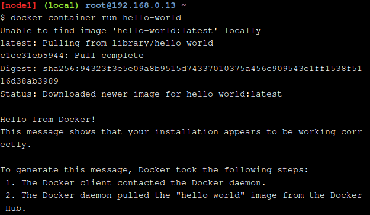

Cuando se ejecuta el comando, lo que ocurre es que Docker busca una imagen almacenada en local llamada "hello-world", y como no los encuentra, Docker se va a su registro por default (Docker Hub) para buscar una imagen llamada "hello-world". En el caso de que exista, la descarga y la ejecuta en el contenedor.

## 1.1 Docker Images

Se descarga la imagen de alpine (Distribución ligera de LInux)
```
docker image pull alpine
```
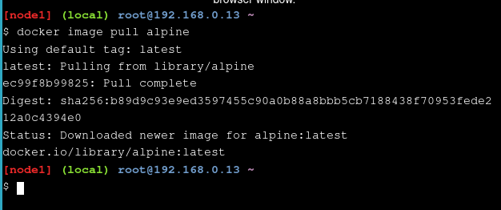

Se descarga la imagen en nuestro sistema. Podemos comprobarlo usando el siguiente comando
```
docker images ls
```

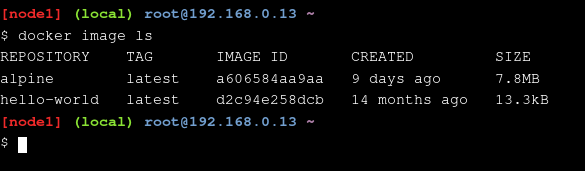

### Docker Container Run

Se ejecuta el contenedor basado en la imagen descagada
```
docker container run alpine ls -l
```

Cuando se ejecuta dicho comando, Docker ejecuta "ls -l" dentro del contenedor. Luego de que el comando ls termine, el contenedor se apaga.

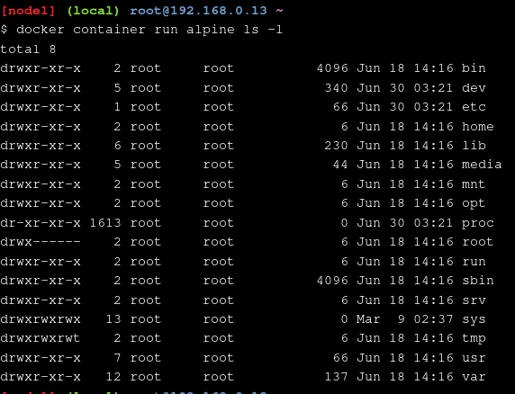

Del mismo modo, se puede probar con otro comando para generar una shell. Como queremos que sea una shell interactiva en la que podamos colocar algunos comandos, debeos agregar una flag.

```
docker container run -it alpine /bin/sh
```

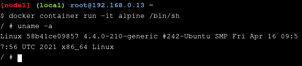

Podemos listar los contenedores en ejecución usando ```docker container ls ``` pero si queremos listar todos los contenedores estén o no en ejecución, debemos agregar la flag -a

```
docker container ls -a
```

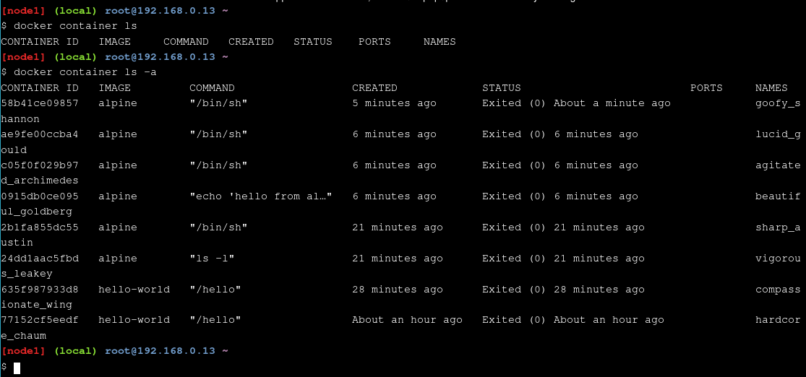

Se observan todos los contenedores creados. Se comprueba se creó un contenedor nuevo por cada comando ejecutado.

## 1.2 Container Isolation

De la sección anterior, se observa que se crearon múltiples contenedores a partir de la imagen alpine. Cada ejecución fue separada en contenedores aislados. Cada contenedor tiene sistemas de archivos separados y corren en diferentes espacios de nombre. Por defecto, un contenedor no tiene forma de interactuar con otro contenedor, incluso si se generaron a partir de la misma imagen.

Se crea una shell interactiva de tipo /bin/ash para guardar un archivo con nombre hello.txt

```
docker container run -it alpine /bin/ash
```

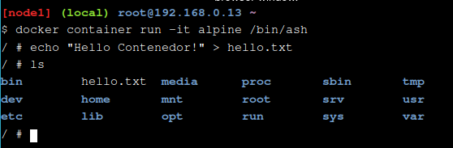

Se verifica el aislamiento cuando se listan los archivos de un contenedor ejecutado usando la misma imagen de alpine

```
docker container run alpine ls
```

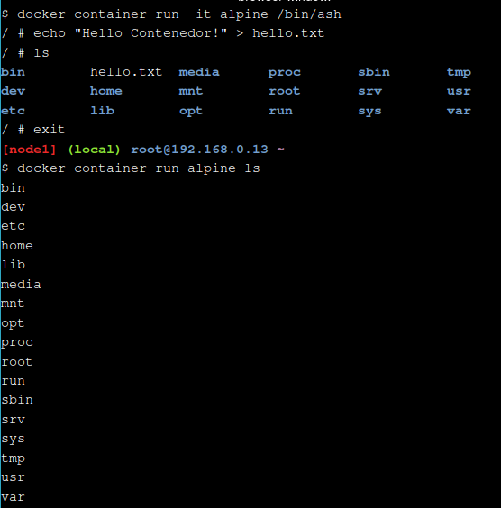

Se observa que no hay ningún archivo hello.txt creado.

Si queremos regresar al contenedor en el que creamos el archivo, debemos conocer su id. Lo podemos listar

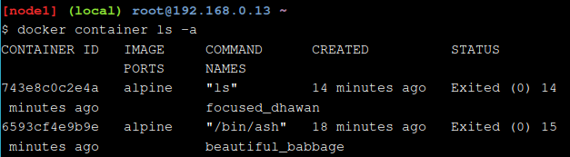

El contenedor en el que se creó el archivo es el que se ejecutó /bin/ash y tiene como id 6593cf4e9b9e. Ahora iniciamos el contenedor.
```
docker start 6593cf4e9b9e
```
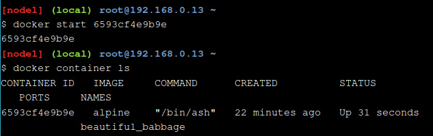

Se observa que el estado del contenedor es Up, lo que significa que está en ejecución. Podemos usar el comando exec para ejecutar comandos sobre el contenedor activo. Lo que haremos será listar los archivos para comprobar que el archivo hello.txt está en dicho contenedor

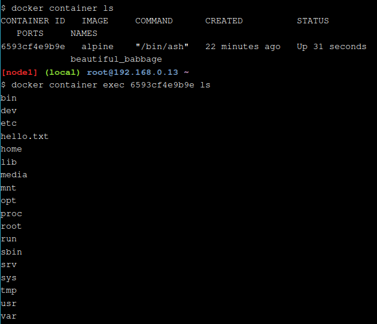

Se observa que el archivo hello.txt está presente en dicho contenedor. Esto demuestra que, incluso cuando se crean contenedores a partir de la misma imagen, cada contenedor tiene un sistema de archivos aislado.

## 1.3 Terminología

Se hace un repaso de la terminología usada en este laboratorio

- Imagen: El sistema de archivos y configuración de nuestra aplicación que se usa para crear contenedores.
- Contenedor: Instancia en ejecución de una imagen.
- Docker Daemon: Un servicio en segundo plano en el host que gestiona a los contenedores
- Docker Client: Línea de comandos que permite al usuario interactuar con contenedores docker
- Docker Hub: Registro de imágenes de docker. 


