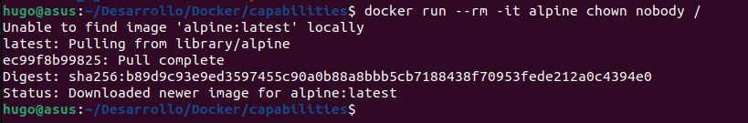
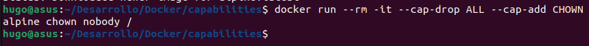
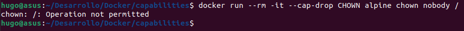
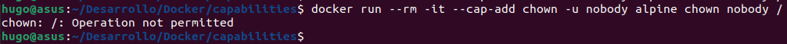
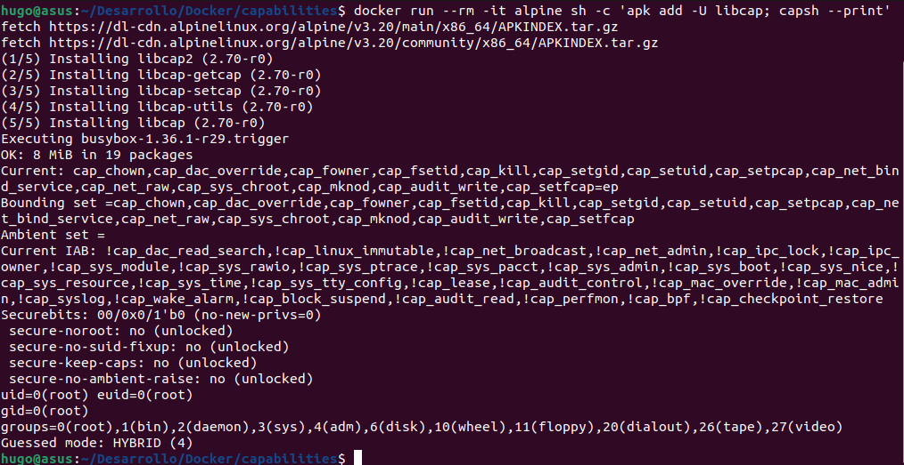
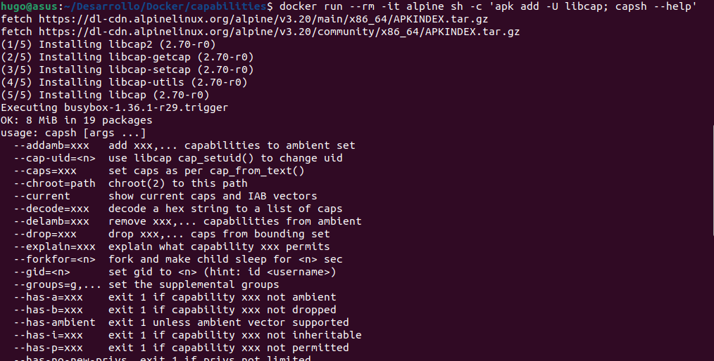

# # Play With Docker - Stage 2: Digging Deeper
## Hugo Rivas Galindo

## Step 1: Introduction to capabilities

El kernel de linux puede descomponer los privilegios del usuario root en unidades llamadas capabilities. Por ejemplo, CAP_CHOWN permite al usuario realizar cambios arbitrarios a los UID (User ID) y GUID (Group ID) de los archivos. La decomposición de los privilegios en capabilities permite ser más granular a la hora de delegar permisos.
Las capabilities se aplican tanto a archivos como a hilos. Docker impone ciertas limitaciones que hace que trabajar con capabilities sea más simple. Por ejemplo, las capabilities de los archivos se almacenan dentro de los atributos extendidos de un archivo y los atributos extendidos se eliminan cuando se construyen imágenes de docker.
Se pueden agregar archivos de capabilities en contenederos en tiempo de ejecución, pero no se recomienda. Docker establece el conjunto límite de capabilities antes de iniciar un contenedor, por lo que no es posible que las aplicaciones escalen más privilegios de lo establecido inicialemnte.

## Step 2: Working with Docker and capabilities

Se aprenderán los comandos para gestionar capabilities en un contenedor de usuario root. Para esta parte, solo se listarán los comandos indicando con $CAP el nombre de una o más capabilities. 

Para eliminar capabilities del usuario root en un contenedor
```
docker run --rm -it --cap-drop $CAP alpine sh
```
Para añadir capabilities al usuario root de un contenedor
```
docker run --rm -it --cap-add $CAP alpine sh
```
Para eliminar todas las capabilities y añadir algunas otras
```
docker run --rm -it --cap-drop ALL --cap-add $CAP alpine.sh
```

El kernel de linux usa el prefijo CAP_ con todas las constantes capabilities, tales como CAP_CHOWN, CAP_NET, CAP_SETUID, etc. Las constantes capabilities en docker no usan el prefijo CAP, pero coinciden con las constantes del kernel.


## Step 3: Testing Docker Capabilities

(Se usa el entorno local debido a un error con la plataforma)

Se inicia un nuevo contenedor y se comprueba que la cuenta root del contenedor puede cambiar el propietario de los archivos
```
docker run --rm -it alpine chown nobody /
```


El comando no retorna ningún código de error, por lo que que la operación fue exitosa. El comando es exitoso porque el comportamiento predeterminado es que los nuevos contenedores se inicien con un usuario root con la capability CAP_CHOWN. 

A continuación se elminan todas las capabilities excepto CHOWN
```
docker run --rm -it --cap-drop ALL --cap-add CHOWN alpine chown nobody /
```


El comando se ejecuta exitosamente, debido a que luego de eliminar todas las capabilities, se añadió nuevamente CHOWN, la cual es la única capability que se llama  en nuestra ejecución.

Luego se inicia otro contenedor y se elimina la capability CHOWN desde su cuenta root.

```
docker run --rm -it --cap-drop CHOWN alpine chown nobody /
```


Se observa que nos retorna un error. Esto se debe a que la cuenta root no tiene la capability CHOWN, por lo que no puede cambiar de propietario a los archivos o directorios. 

Se crea otra instancia y se trata de añadir CHOWN como capability al usuario nobody. 
```
docker run --rm -it --cap-add chown -u nobody alpine chown nobody /
```

El comando falla debido a que docker no puede añadir capabilities a usuarios no root. 

## Step 4: Extra for Experts

Hay 2 conjuntos de herramientas que se usan para gestionar capabilities:
- libcap se enfoca en manipular capabilities
    - capsh: permite testear capabilities
    - setcap: establece los bits de capabilities en un archivo
    - getcap: retorna el bit capability de un archivo
- libcap-ng tiene algunas herramientas útiles de auditoría
    - pscap: lista las capabilities de un proceso en ejecución
    - filecap: lista los capabilities de los archivos
    - captest: Testea capabilities y lista las capabilities del proceso actual

Podemos iniciar un nuevo contenedor usando la imagen de Alpine Linux, instalando el paquete libcap y luego listar sus capacidades.

```
docker run --rm -it alpine sh -c 'apk add -U libcap; capsh --print'
```


Se instaló el paquete libcap y luego se listaron las capabilities usando ```capsh --print```. 
Se observa la sección de Current, la cual lista las capabilities actuales del proceso. Al final de cada conjunto de capabilities, se observan letras, las cuales pueden ser
- e: capabilities efectivas
- i: capabilities heredables
- p: capabilities permitidas

También observa una sección de bounding set, la cual indica el conjunto de capabilities que no pueden ser excedidas.
Además se observan securebits, los cuales controlan cómo se mantienen las capabilities en ciertos escenarios.

Podemos probar con el comando capsh para seguir experimentando con capabilities.
```
docker run --rm -it alpine sh -c 'apk add -U libcap; capsh --help'
```



Se inicializa el contenedor con la imagen alpine, se ejecuta el comando para la instalación de libcap y luego se muestran las opciones del comando capsh.

**Comandos para modificar capabilities**

Para modificar las capabilities se usan libcap y libcap-ng. 

- Se usa libcap para modificar los capabilities en un archivo
```
setcap cap_net_raw=ep $file
```
El comando muestra cómo establecer el capability CAP_NET_RAW como efectivo y permitido en el archivo representado con $file. 

- Se usa libcap-ng para establecer los capabilities de un archivo
```
filecap /absolute/path net_raw
```

**Auditing**
Se listan las formas de leer capabilities de un archivo
- Usando libcap
```
getcap $file
$file= cap_net_raw+ep
```

- Usando libcap-ng
```
filecap /absolute/path/to/file
```

- Usando atributos extendidos
```
getfattr -n security.capability $file
```
