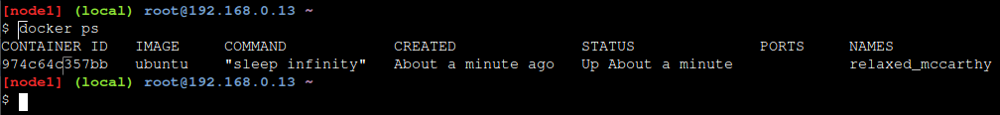
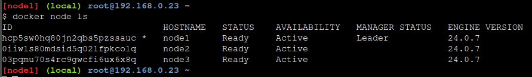

# # Play With Docker - Stage 2: Digging Deeper
## Hugo Rivas Galindo

## Section 1: What is Orchestration

La orquestación permite la gesitón automatizada de aplicaciones en múltiples servidores o máquinas.
Si se quiere gestionar un despliegue sin orquestación, sería más laborioso pues tendrías que conectarte por SSH a cada máquina, iniciar una por una y estar vigilándolas para asegurarte de que funcione como se espera.
Con la orquestación, simplificas el trabajo. Puedes hacer un deploy de una aplicación en múltiples hosts con un solo comando (usando docker swarm). Además, si un nodo muere, otro nodo automáticamente recibe su carga de trabajo, consiguiendo así una alta disponibilidad. 

## Section 2: COnfigure Swarm Mode

Se creará un host en un contenedor en el nodo 1
```
docker run -dt ubuntu sleep infinity
```


El comando crea un contenedor basado en una imagen de ubuntu y ejecuta el comando sleep mientras el contenedor se ejecuta en 2do plano (por eso se usa la flag -d). Podemos comprobar que el contenedor está levantado usando el siguiente comando
```
docker ps
```


Se observa que el nodo está activo ejecutando el comando sleep infinity.
Ahora, dado que es un solo nodo, si este nodo muere, la aplicación se cae y para reiniciar el servicio, se debe de iniciar sesión a esa máquina y realizar ajustes para que vuelva a funcionar. Por eso, se busca una manera de configurar un sistema que permita ejecutar esta aplicación a través de muchas máquinas.

Con tal objetivo, se configurará Docker Swarm, un modo de docker en el que múltiples hosts docker forman un grupo auto orquestado llamado swarm.

### Step 2.1 - Create a Manager Node

Se inicializa un nodo manager en node1
```
docker swarm init --advertise-addr $(hostname -i)
```


Se observa que el nodo1 ahora es un nodo manager. Podemos comprobar dicha configuración usando el siguiente comando en el nodo1
```
docker info
```


Se observa que en la sección de Swarm se muestra el atributo "Is Manager: active".

### Step 2.2 - Join Worker nodes to the Swarm

A continuación se unirán los nodos workers. Para esto usaremos hosts llamados node2 y node3. Usamos el siguiente comando para que nos muestre el token para añadir nodos worker
```
docker swarm join-token worker
```


Se usa el comando mostrado en los nodos 2 y 3.

```
docker swarm join --token SWMTKN-1-0cvy4nfckk852m786nh31iyoob56sdiukyozxf5uwy4yjvah4w-c7euq294opqyfon3kavsfnoig 192.168.0.13:2377
```


Luego de agregar los nodos, se comprueba que fueron agregados listando los nodos que son parte del swarm desde en el nodo 1, puesto que solo los nodos manager tienen dicho permiso.

```
docker node ls
```


Se observa que hay 3 nodos activos y un solo nodo manager, el cual es el lider. 

## Section 3: Deploy applications across multiple hosts

### Step 3.1 - Deploy the application components as Docker services

Si queremos escalar nuestra aplicación y manejar múltiples contenedores como una sola entidad, se usará el concepto de servicios. Los servicios funcionan con Swarms y están diseñados para contenedores de larga duración. 

Se despliega sleep como un Servicio en el docker swarm. 
```
docker service create --name sleep-app ubuntu sleep infinity
```


Podemos verificar que el servicio está siendo gestionado por el Swarm manager. Usamos el siguiente comando para listar todos los servicios actualmente gestionados por el Swarm Manager.
```
docker service ls
```


Hasta el momento solo se ha desplegado una aplicación en un solo contenedor de un host, con la diferencia de que el contenedor está unido en un docker Swam. 

## Section 4: Scale the application

Podemos escalar los servicios cuando tienen mucha demanda así como escalar hacia abajo cuando la demanda es baja. 
Se escala el número de contenedores en el servicio sleep-app hasta 7 usando el siguiente comando.
- Replica es el término usado para describir contenedores idénticos ofreciendo el mismo servicio.
- sleep-app es el nombre del servicio que se desea escalar
```
docker service update --replicas 7 sleep-app
```


Podemos verificar la escalada
```
docker service ps sleep-app
```


Se observa que el swarm manager se encarga de inicializar los contenedores. Hay 7 contenedores en ejecución.

Ahora vamos a escalar hacia abajo, es decir, reducir el número de contenedores en el servicio sleep-app. Reducimos hasta tener 4 contenedores.
```
docker service update --replicas 4 sleep-app
```


Se observa que ahora hay 4 contenedores en ejecución, por lo que se escaló hacia abajo nuestra aplicación.


## Section 5: Drain a node and reschedule the containers

Supongamos que el caso de que quieras hacerle un mantenimiento a uno de los servidores del swarm sin interrumpir el servicio a tus clientes. Para realizarlo debes dar de baja un nodo.

Se revisa el estado actual de los nodos
```
docker node ls
```


Supongamos que daremos de baja el nodo 2 para mantenimiento. Se muestran los contenedores que se están ejecutando en el nodo2
```
docker ps
```


Volvemos a la consola del nodo 1 para dar de baja al nodo 2 del servicio. Ejecutamos de nuevo el comando para listar los nodos
```
docker node ls
```


Tomamos el ID del nodo2 y ejecutamos el siguiente comando. Se usa el id del nodo 2 como input en el comando drain.
```
docker node update --availability drain 0iiw1s80mdsid5q021fpkco1q
```
Se muestra el estado de los nodos
```
docker node ls
```


Se observa que el nodo 2 está en estado Drain. Esto significa que se eliminan las tareas actuales del nodo para ubicarlas en otros nodos disponibles y no aceptará nuevas tareas. Se suele usar este estado para el mantenimiento y actualización del nodo sin interrupción del servicio.

Cuando tratamos de listar qué contenedores están en ejecución en el nodo2, recibiremos una lista vacía

```
docker ps
```


Se observa que el nodo 2 no tiene ningún contenedor en ejecución. 

Por último, se revisa el servicio de nuevo en el nodo1 para asegurarse de que el contenedor fue reestructurado. Se observan los contenedores ejecutándose en el resto de nodos.
```
docker service ps sleep-app
```


Se observa que solo están en ejecución los contenedores que están en el nodo 1 y el nodo 3.

## Cleaning Up

Se ejecuta el comando en el nodo 1 para remover al servicio llamado sleep-app
```
docker service rm sleep-app
```


Se listan los contenedores en ejecución en el nodo1
```
docker ps
```


Podemos matar al contenedor dormido que ejecutamos al inicio
```
docker kill containerid
```


Observamos que ya no hay más contenedores activos en el nodo1.

Por último, se eliminan los nodos del swarm. Podemos usar el comando docker swarm leave --force.
Se ejecuta el comando en cada nodo
```
docker swarm leave --force
```


