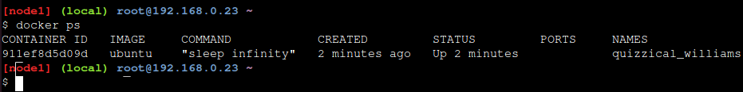
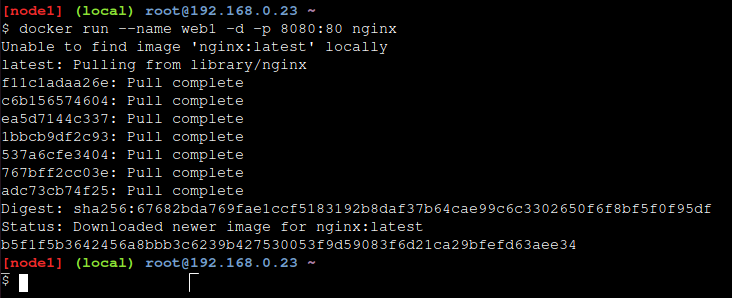
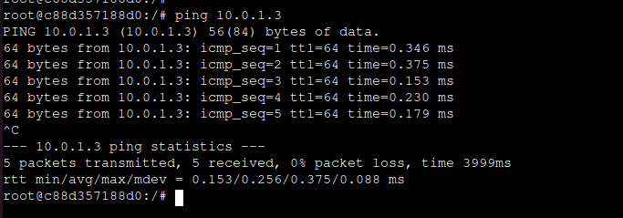

# Play With Docker - Stage 2: Digging Deeper
## Hugo Rivas Galindo

## Docker Network

## Section 1: Networking Basics

### Step 1: The Docker Network Command

El comando docker network es el principal comando para configurar y gestionar las redes de los contenedores
```
docker network
```


El comando muestra las diferentes funcionalidades que puede tener. Permite crear redes, conectarte, listar redes existentes y eliminar redes.

### Step 2: List Networks

Se ejecuta el comando para listar las redes existentes en nuestro host de docker
```
docker network ls
```


Se observa que hay redes que son creadas como parte de la instalación estándar de docker. Se observa que cada red tiene un ID y un nombre. Además, cada red está asociada a un solo driver.

### Step 3: Inspect a Network

Para ver los  detalles de las configuraciones de la red usamos el siguiente comando. Estos detalles incluyen el nombre, el ID, el driver,contenedores conectados, etc.
Se lista el detalle de la red llamada bridge.
```
docker network inspect bridge
```


Además del nombre de la red, otra información relevante es que se puede ver a qué subred pertenece, así como el gateway de dicha subred.

### Step 4: List network driver plugins

El comando docker info muestra información interesante acerca de la instalación de docker. Podemos usar dicho comando para ver la lista de los plugins de red.
```
docker info
```


Se muestra que están presentes los drivers de bridge, host, macvian, null y overlay.

## Section 2: Bridge Networking

### Step 1: The Basics

Cada instalación de network tiene una red predefinida llamada bride. Se verifica esto listando las redes
```
docker network ls
```


La red bridge está asociada con el driver bridge. El output muestra el alcance de la red, en este caso, dice que es local, por lo que solo existe en este host de docker. Esto se cumple para todas las redes que usan el driver bridge. 

Se instala el comando brctl para listar las redes bridge en nuestro Docker host


A continuación se listan las redes bridge usando el comando
```
brctl show
```


Se observa que solo existe un bridge el cual es creado para la red bridge. Además, no tiene ninguna interfaz asociada.

### Step 2: Connect a container 

La red bridge es la red por defecto para nuevos contenedores. Se crea un nuevo contenedor con el siguiente comando
```
docker run -dt ubuntu sleep infinity
```


Se crea un contenedor basado en una imagen de ubuntu y se usa el comando sleep para ejecutar el contenedor en 2do plano. Podemos comprobar que está en ejecución usando:
```
docker ps 
```



Dado que en su creación no se especificó alguna red, se añadió por defecto a la red bridge.

Se ejecuta nuevamente el comando brctl show


Se observa que la red bridge docker0 ahora tiene una interfaz conectada.

```
docker network inspect bridge
```


Se observa que ahora hay un contenedor adjunto a dicha red.

### Step 3: Test network connectivity

Se observa que la red en el contenedor es 172.17.0.0/16 y la ip del contenedor es 172.17.0.2. Usaremos ping para comprobar la conectividad con el contenedor
```
ping -c5 172.17.0.2
```


Dado que el host pudo hacerle ping al contenedor, se puede decir que hay conectividad entre el host y el contenedor. Ahora se comprobará que se puede hacer ping desde el contenedor hacia la red del host.
Se obtiene el id del contenedor para conectarnos
```
docker ps
docker exec -it 911ef8d5d09d /bin/bash
```


AHora se instala ping en el contenedor
```
apt-get update && apt-get install -y iputils-ping
```
Se hace un ping a los servidores de google (8.8.8.8) para verificar la conectividad desde el contenedor hacia internet
```
ping -c5 8.8.8.8
```


Esto demuestra que el nuevo contenedor puede hacer ping a internet por lo que tiene una configuración de red válida.

### Step 4: Configure NAT for external connectivity

Se ejecutará un contenedor NGINX y un mapero de puertos desde el 8080 en el dockerhost hasta el puerto 80 dentro del contenedor. Esto significa que el tráfico que alcance el puerto 8080 del dockerhost llegará al puerto 80 dentro del contenedor.

Se inicia un nuevo contenedor basado en una imagen de NGINX
```
docker run --name web1 -d -p 8080:80 nginx 
```



Se revisa el estado del contenedor y el mapeo de puertos usando docker ps
```
docker ps
```


Se observa que el contenedor está ejecutando NGINX y se observa el mapeo de puertos 0.0.0.0:8080 -> 80/tcp tal y como lo habíamos esperado. 

Podemos comprobar que nos podemos conectar al docker host usando el comando curl, el cual se encarga de enviar una solicitud http a la ip pasada como argumento
```
curl 127.0.0.1:8080
```


## Section 3: Overlay Networking
### Step 1: The Basics

Se inicializa un swarm y agregamos un nodo worker

```
docker swarm init --advertise-addr $(hostname -i)
```


Se agrega un nodo2 como worker

```
docker swarm join --token SWMTKN-1-0fuv0iyzabo9w4syxveviu3nyqts1jxnn1yyaulrrivre8bl50-0w8b0iqk2ty5syoc7sdpq7icy 192.168.0.23:2377
```


Se ejecuta el siguiente comando para verificar que los nodos son parte del swarm
```
docker node ls
```


Se observa que ambos nodos están activos y disponibles. 

### Step 2: Create an overlay network

Se crea una red overlay y se le asigna el nombre overnet
```
docker network create -d overlay overnet
```
Se usa el comando docker network para verificar que la red se creó satisfactoriamente
```
docker network ls
```


Se observa la presencia del driver overlay y el scope es el swarm.

Se ejecuta el mismo comando desde la segunda terminal

```
docker network ls
```


Se observa que la red overnet no se encuentra en la lista. Esto se debe a que docker solo extiene la red overlay a hosts cuando estas la necesitan. Es decir, si un servicio se despliega en un nodo, Docker creará la red overlay en ese nodo solo cuando el servicio comience a ejecutarse allí.

Se usa el comando para ver más detalles acerca de la red overlay
```
docker network inspect overlay
```


### Step 3: Create a Service

Se creará un servicio que usa la red overlay.
Se crea un servicio con nombre myservice sobre la red overnet con 2 réplicas

```
docker service create --name myservice \
--network overnet \
--replicas 2 \
ubuntu sleep infinity
```


Se observa que el servicio tiene un 2/2 en réplicas, lo que indica que ambas están funcionando.
Se comprueba que la ejecución de cada réplica se dé en nodos diferentes

```
docker service ps myservice
```


Ahora que se está ejecutando un servicio en el nodo 2, podemos verificar que la red overnet existe

```
docker network ls
```


Comprobamos que la red overlay está disponible mientras se esté ejecutando el servicio en el nodo2

Podemos ver el detalle de la red overnet
```
dcoekr network inspect overnet
```


Se observa que solo muestra un contenedor ejecutándose en la red, cuando en realidad debería de haber 2. Esto se debe a que el comando docker network inspect solo muestra los contenedores que se están ejecutnado en dicho nodo.

### Step 4: Test the network

Se ejecuta el siguiente comando en la primera terminal
```
docker network inspect overnet
```
Se muestra la dirección ip del contenedor en el nodo1


Nos conectamos mediante una shell al contenedor usando su ID. 

```
docker exec -it c88d357188d0 /bin/bash
```
Una vez conectados, procedemos a descargar el comando para hacer ping


Ahora tratamos de establecer una conexión desde el nodo 1 al nodo2, por lo que se enviarán paquetes en la red overnet. En el paso 3 se observa que la dirección ip del nodo 2 en la red overlay es 10.0.1.3. 

```
ping -c5 10.0.1.3
```



Se comprueba que hay conexión entre nodos en la misma red overlay, por lo que ellos pueden usar esta red para comunicarse.

### Step 5: Test service discovery

Se analiza el archivo ubicado en /etc/resolv.conf, el cual es usado para la resolución DNS

```
cat /etc/resolv.conf
```


Se hace un ping a myservice dentro del contenedor usando el comando ping -c5 myservice


Se observa que el contenedor puede realizar un ping a myservice, dado que ese nombre se traduce a una dirección ip 10.0.1.2.
Salimos del contenedor

Verificamos la configuración del servicio myservice ejecutando 
```
docker service inspect myservice
```


En la sección de VirtualIPs, se observa que la dirección ip es la misma a la que se enviaron los paquetes. Se comprueba que el DNS tradujo el nombre de dominio a la dirección ip.


## Cleaning up
Se eliminan los servicios creados (my service)
```
docker service rm myservice
```

Se eliminan los contenedores en ejecución


Se observa que ya no hay más contenedores en ejecución. 

Se elminan los nodos del swarm

```
docker swarm leave --force
```

