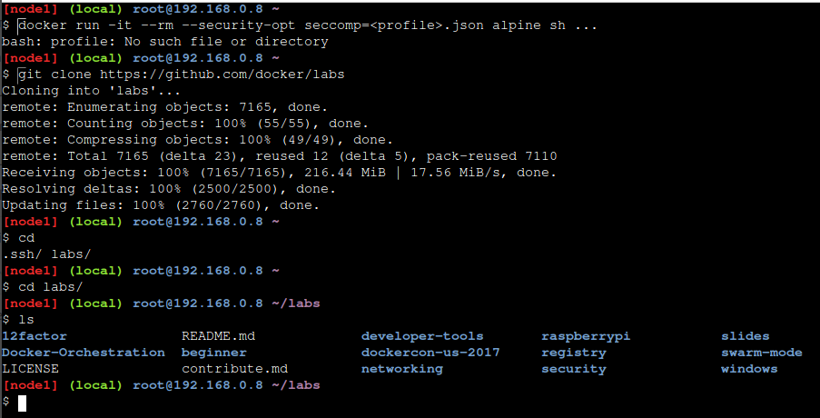
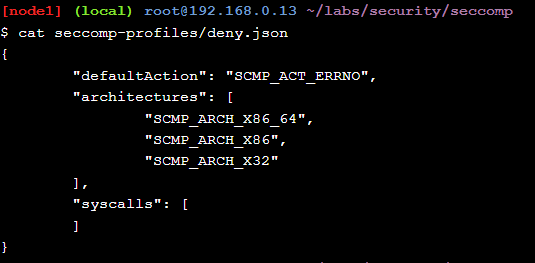
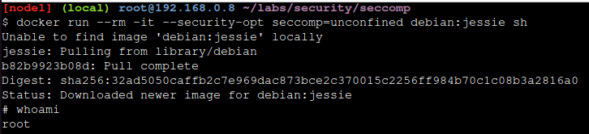
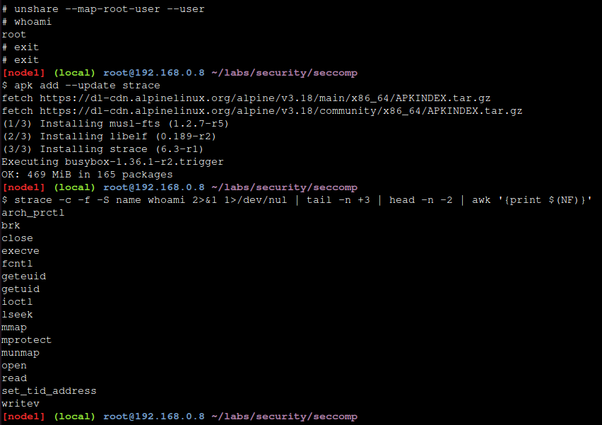
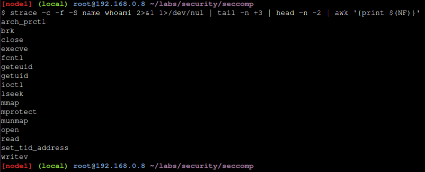
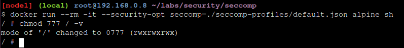
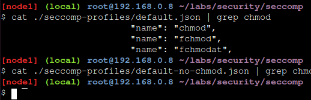
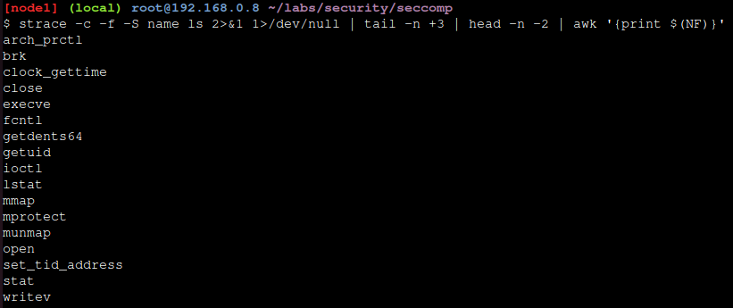

# # Play With Docker - Stage 2: Digging Deeper
## Hugo Rivas Galindo

## Seccomp and Docker

Seccomp es una característica del kernel que restringe las llamadas al sistema (Syscalls) que pueden hacer los procesos.
Docker usa seccomp en el modo de filtro (Capacidad de actuar como filtro de llamadas al sistema) y tiene su propio DSL (Domain-Specific Language) basado en json que permite definir perfiles de seccomp. Estos perfiles se compilan en filtros seccomp cuando se ejecutan en un contenedor.

Cuando ejecutas un contenedor, este toma el perfile seccomp por defecto a menos que se especifique usando la flag --security-opt. Por ejemplo, usamod el siguiente comando para iniciar un contenedor interactivo basado en una imagen de Alpine que inicie un proceso shell. Además, este aplicará el perfil seccomp descrito por <profile.json>. 
```
docker run -it --rm --security-opt seccomp=<profile>.json alpine sh ...
```

El comando envía el archivo JSON desde el cliente al demonio donde se compila en un programa BPF (Berkeley Packet Filter).
Los perfiles de docker seccomp operan usando una lista blanca en la que se especifican las llamadas al sistema que son permitidas.
Docker soporta muchas tecnologías relacionadas a la tecnología, y algunas de estas pueden interferir con los test de los perfiles seccomp. Por tal razón, la mejor forma de testear los perfiles seccomp es añadiendo todas las capabilities y desactivando apparmor. Esto garantiza que el comportamiento que se observa es debido a los cambios en seccomp.
Para añadir dichas flags: ``` --cap-add ALL --security-opt apparmor=unconfined```

## Step 1: Clone the labs GitHuh repo

Se clonan los repositorios que contienen los perfiles de seccomp que se usarán en el laboratorio. 
```
git clone https://github.com/docker/labs
```


## Step 2: Test a seccomp profile

Se usa el seccomp profile "deny.json", el cual bloqueará todos los syscalls.
Se crea un nuevo contenedor con todas las capabilities añadidas, desactivando el apparmor y aplicando el seccomp profile deny.json

```
docker run --rm -it --cap-add ALL --security-opt apparmor=unconfined --security-opt seccomp=seccomp-profiles/deny.json alpine.sh
```

Docker no tiene suficientes syscalls para iniciar el contenedor. Se lee el contenido del seccomp profile utilizado. 
```
cat seccomp-profiles/deny.json
```


Se observa que no hay ninguna syscall, lo que significa que no hay syscalls permitidas para iniciar los contenedores con dicho perfil. 

## Step 3: Run a container with no seccomp profile

Cuando no se especifica un perfil de Docker, este usará el perfil por defecto. Se observará cómo forzar a un nuevo contenedor para que se ejecute sin algún seccomp profile. 

```
docker run --rm -it --security-opt seccomp=unconfined debian:jessie sh
```



Se inicia el contenedor sin sseccomp profiles y se ejecuta un whoami para confirmar que el contenedor corre y que se pueden hacer syscalls en el docker host. 
Para validar que no se está ejecutando con el perfil seccomp por defecto, se ejecutará el comando unshare el cual ejecuta un proceso shell en un nuevo espacio de nombre

```
unshare --map-root-user --user
whoami
```



Luego de esto, se ejecuta el comando strace desde el host docker para ver una lista de los syscalls usadas por el programa whoami, por lo que primero se instala strace y luego se ejecuta el siguiente comando.
```
apk add --update strace
strace -c -f -S name whoami 2>&1 1>/dev/null | tail -n +3 | head -n -2 | awk '{print $(NF)}'
```




## Step 4: Selectively remove syscalls

El perfil default-no-chmod.json es una modificación del perfil default.json con las chmod(), fchmod() y chmodat() retiradas de la whitelist.

Se inicia un nuevo contenedor con el perfil default-no-chmod.json y se intenta ejecutar el comando chmod 777 / -v.
```
docker run --rm -it --security-opt seccomp=./seccomp-profiles/default-no-chmod.json alpine sh
```
Y desde dentro del contenedor
```
chmod 777 / -v
```


Se observa que el comando falla porque el ```chmod 777 / -v``` usa algunas syscalls que fueron removidas de la whitelist del perfil default-no-chmod.json.

Se creará un nuevo contenedor con el perfil deafult.json y se comprueba que esta vez se puede ejecutar el mismo comando



Podemos comrpbar la presencia de los syscalls en los archivos .json
```
cat ./seccomp-profiles/default.json | grep chmod
cat ./seccomp-profiles/default-no-chmod.json | grep chmod
```


Se observa que el perfil default-no-chmod.json no contiene las syscalls chmod en la whitelist. 

## Step 5: Write a seccomp profile

Se mostrará la sintaxis y el comportamiendo de los perfiles docker seccomp. Se listan las posibles acciones en orden: Las acciones que estén más arriba sobreescriben a las que estén por debajo

- SCMP_ACT_KILL: Mata un proceso con un código de estao de 0x80+31 (SIGSYS) = 159
- SCMP_ACT_TRAP: Envía una señal SIGSYS sin ejecutar la llamada al sistema
- SCMP_ACT_ERRNO: Establece errno sin ejecutar la llamada al sistema
- SCMP_ACT_TRACE: INvoca un ptracer para realizar una decisión o establecer errno a -ENOSYS
- SCMP_ACT_ALLOW: Habilita.

Los más importantes acciones para los usuarios de docker son SCMP_ACT_ERRNO y SCMP_ACT_ALLOW.
Se muestra un ejemplo de un seccomp profile

```
{
    "defaultAction": "SCMP_ACT_ERRNO",
    "architectures": [
        "SCMP_ARCH_X86_64",
        "SCMP_ARCH_X86",
        "SCMP_ARCH_X32"
    ],
    "syscalls": [
        {
            "name": "accept",
            "action": "SCMP_ACT_ALLOW",
            "args": []
        },
        {
            "name": "accept4",
            "action": "SCMP_ACT_ALLOW",
            "args": []
        },
        ...
    ]
}
```
Además, se pueden tener filtros más granulares usando los valores de los argumentos al system call

- index: Es el índice del argumento de la llamada al sistema que se evalúa, pues la llamada al sistema puede tener varios argumentos.
- op: Es la operación que se realizará sobre el argumento especificado. Pueden ser
    - SCMP_CMP_NE : Not Equal
    - SCMP_CMP_LE : Less than or equal to
    - SCMP_CMP_GT : Greater than
    - SCMP_CMP_MASKED_EQ: Es verdadero si (valor & argumento == 2);

La regla solo coincide si todos los argumentos coinciden. Se pueden añadir múltiples reglas para conseguir el efecto de un or. 

```
{
    ...
    "syscalls": [
        {
            "name": "accept",
            "action": "SCMP_ACT_ALLOW",
            "args": [
                {
                    "index": 0,
                    "op": "SCMP_CMP_MASKED_EQ",
                    "value": 2080505856,
                    "valueTwo": 0
                }
            ]
        }
    ]
}
```

Se usa strace para listar los syscalls realizados por un programa. Se muestra un ejemplo de ejecución.
```
strace -c -f -S name ls 2>&1 1>/dev/null | tail -n +3 | head -n -2 | awk '{print ${NF}}'
```


La salida muestra los syscalls que el contenedor debe de llamar para iniciarse. 
