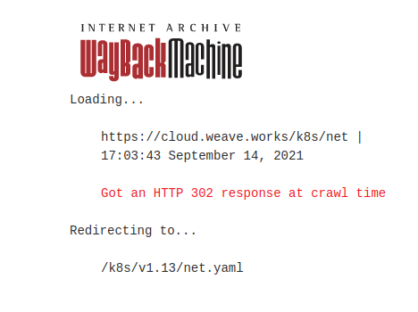

# Play With Kubernetes
## Hugo Rivas Galindo

## Kubernetes for Beginners

## Start the cluster

Se inicia el cluster
```
kubeadm init --apiserver-advertise-address $(hostname -i)
```
Luego de ejecutar el comando, podemos ver lo siguiente al final


Copiamos el comando para unir el nodo2 al cluster
```
kubeadm join 192.168.0.8:6443 --token xaehdg.srk6durb6gf6ndup \
        --discovery-token-ca-cert-hash sha256:0ece1ef1850a2b5bba04603e1cbf2bfbe8198b30bebc80b2741a996d0e1fe2de
```


Se observa que el nodo se unió exitosamente. Se comprueba usando el comando
```
kubectl get nodes
```


El manual de play with kubernetes indica que debemos seguir inicializando la red del clúster con el comando:
```
kubectl apply -n kube-system -f \
    "https://cloud.weave.works/k8s/net?k8s-version=$(kubectl version | base64 |tr -d '\n')"
```
Lo que hace el comando es aplicar las configuraciones de recursos en el cluster. La flag "-n" especifica el namespace donde se ejecutan los componentes del sistema y los complementos en Kubernetes. La flag "-f" indica que se aplicará un archivo de configuración desde una URL o desde un archivo local.

El comando dado por el manual extrae el archivo de configuración desde una dominio que probablemente ya no existe. Por ende sale un error cuando se ejecuta el comando proporcionado en el manual.


Se trata de buscar ese archivo desde Wayback Machine, para ver si existió ese recurso 




Se obtiene un archivo net.yaml, el cual lo usaremos para el resto del laboratorio.


Observamos que con el archivo encontrado se puede iniciar nuestro cluster.


## Getting the application source code

Se clona el repositorio de la aplicación llamada dockercoins. 
```
git clone https://github.com/dockersamples/dockercoins
```


## Running the application
Nos dirigimos al directorio dockercoins, y usamos docker compose para construir y ejecutar todos los contenedores
```
docker-compose up
```
Aunque al inicio se esté ejecutando correctamente


Más adelante sale un error.


Según el error mostrado en consola, no se puede resolver el host con nombre "hasher". 
No se logró encontrar la solución al error. De igual forma, se desarrollará el laboratorio según lo que esté disponible.


## Conceptos de Kubernetes

Kubernetes es un sistema de gestión de contenedores que se utiliza para automatizar la implementación, el escalado y la administración de aplicaciones en contenedores. Es decir, kubernetes se encarga de la arquitectura para que las aplicaciones sean escalables y seguras.

### Basic things we can ask kubernetes to do

Kubernetes permite iniciar contenedores, además de colocar balanceadores de carga internos para distribuir el tráfico dentro del clúster. También se pueden colocar balanceadores de carga públicos (distribuyen el tráfico que proviene de internet) frente a estos contenedores. Además, se puede realizar un escalado cuando hay mucho tráfico en la aplicación, así como seguir procesando solicitudes durante el upgrade.

### Other things that Kubernetes can do for us

Además de las funcionalidades enunciadas, también hay funcionalidades más avanzadas, como  realizar un escalado automático, es decir, ajustar el número de réplicas de un pod según el uso de recursos como CPU o memoria.
También puede realizar blue/green deployments, que es implementar 2 entornos: uno en producción (blue) y el otro en espera (green), así como implementar un canary deployment, que es desplegar una nueva versión a un pequeño grupo antes de realizar un despliegue completo. 
Asismismo, se puede implementar un control de acceso granular definiendo políticas que indican lo que se puede hacer en el cluster mediante roles. Este control de acceso basado en roles ayuda a mantener la seguridad y la organización en entornos de producción.

## Kubernetes Architecture

La arquitectura de Kubernetes se basa en 2 componentes principales: El master y los nodos

### Kubernetes Architecture: The master

El master se encarga de la gestión del clúster. Contiene varios servicios como 
- Api Server: Es el punto de entrada principal para todas las operaciones de kubernetes. Se encarga de manejar las solicitudes REST.
- Core services:
    - Scheduler: Se encarga de asignar contenedores a los nodos que están disponibles en el cluster.
    - Controller Manager: Se encarga de gestionar las tareas de control y mantenimiento en el clúster.
- Etcd: Es la base de datos de kubernetes. Esta almacena datos como configuraciones de pods, servicios y otros recursos usando una estructura de clave-valor.

Se necesita al menos un master, pero se recomienda tener más de uno para asegurar una alta disponibilidad.

### Kubernetes Architecture: The nodes

Los nodos ejecutan los contenedores y proporcionan los recursos necesarios para las aplicaciones. Contiene servicios como
- Container Engine: Se encarga de ejecutar los contenedores. Usualmente se usa Docker como container Engine.
- Kubelet: Es el agente del nodo que se comunica con el API Server para recibir y ejecutar órdenes.
- Kube-proxy: Se encarga de gestionar las reglas de red en cada nodo, para asegurarse que los servicios se puedan comunicar entre sí.


## Kubernetes resources

Los recursos en kubernetes son definicos por la API de kubernetes. Los recursos están organizaos por tipo (También llamados kind en la API). Algunos tipos comunes de recursos son
- Node: Es una máquina física o virtual en el clúster de kubernetes. Pueden ejecutar contenedores y proporcionar recursos necesarios para las aplicaciones.
- Pod: Es la únidad básica de ejecución en kubernetesy representa a un conjunto de contenedores que se están ejecutando juntos en un nodo.
- Service: Es un recurso que proporciona un punto de acceso de red estable a uno o más pods. Permite la comunicación entre diferentes pods y también entre aplicaciones externas y el clúster.
- Namespace: Es un recurso que proporciona un entorno aislado dentro de un clúster en Kubernetes.
- Secret: Es un recurso que almacena datos sensibles prara los contenedores.

## Declarative vs Imperative

Kubernetes pone un gran énfasis en ser un sistema declarativo.

Declarativo: Yo quiero una taza de té -> Describes el estado final y el sistema se encarga de llegar
Imperativo: Hierve agua, vierte agua en una tetera, añade hojas de té, sirve el té -> Das instrucciones específicas para llegar al estado deseado. 

### Declarative vs Imperative in Kubernetes

En kubernetes, la mayoría de cosas se crean y gestionan de manera declarativa usando archivos YAML que describen el estado deseado del sistema.

Gran parte de lo creado en kubernetes se crea a partir de una especificación (spec). Estos specs describen el estado deseado de los recursos. Por ejemplo, para realizar un deployment se debe de especificar cuántas réplicas de un pod se estarán ejecutando y qué imagen de contenedor deben de usar.

Kubernetes usa a los controladores para comparar el estado actual con el spec y toman acciones para reconciliar las diferencias. Por ejemplo, si necesitamos 3 réplicas de pods y solo tenemos 2, se creará una réplica más.

## First contact with kubectl

Kubectl es la herramienta que nos sirve para comunicarnos con Kubernetes. Kubectl interactúa con la API de kubernetes. 

### Kubectl get
El comando se encarga de ver la composición de nuestro cluster
```
kubectl get node
```


También se puede obtener más detalle usando la flag -o wide
```
kubectl get nodes -o wide
```


El formato de salida también puede ser en JSON o YAML

Se muestra la salida en formato YAML


Se muestra la salida en formato JSON


Se puede ver que al final del output sale "kind": "List", lo cual indica que ese es el tipo de resource de nuestro resultado.


### (Ab)using kubectl and jq
Podemos construir reportes personalizados a partir de la salida generada en json. 

Se obtiene información de los nodos y luego se parsea con jq, que es una herramienta de procesamiento de JSON en línea de comandos. Se obtien cada elemento dentro del array items (obtener nodos) y a partir de cada nodo, se obtiene su nombre y su capacidad.

```
kubectl get nodes -o json |
      jq ".items[] | {name:.metadata.name} + .status.capacity"
```


### What's available?

Podemos listar todos los recursos posibles usando ```kubectl get```
POdemos ver detalles de un recurso usando
```
kubectl describe type/name
kubectl describe type name
```

Por ejemplo, usamos
```
kubectl describe node node1
```


Además, podemos ver la definición de un tipo de recurso usando 
```
kubectl explain type
```
En nuestro caso, veremos la definición de los recursos de tipo node
```
kubectl explain node
```


### Services
Un servicio es un endpoint para conectar aplicaciones a pods. Esto es importante porque los pods pueden cambiar sus direcciones ips pero el servicio proporciona una ip y puerto constantes.

Podemos listar los servicios en nuestro clúster

```
kubectl get services
```


Se observa que solo tenemos un servicio activo con nombre kubernetes. Este servicio es el API de kubernetes.

### Cluster IP services
Un servicio ClusterIP es un servicio interno de kubernetes que solo está disponible dentro del clúster. Es ideal para la comunicación interna entre pods porque permite la gestión interna de servicios sin necesidad de exponerlos externamente.

Nos tratamos de conectar al servicio de la API de kubernetes (Servicio ClusterIP). Usamos el siguiente comando con la flag -k para saltar la verificación de certificados y se especifica la dirección IP del clúster, la cual es obtenida usando ```kubectl get svc```

```
curl -k http://10.96.0.1
```


Se muestra un código de acceso 403, lo que indica que es forbidden, por lo que necesitamos autenticación para acceder al recurso.

### Listing running containers

En kubernetes, los contenedores no se manipulan directamente sino son manipulados a través de pods. Un pod es un conjunto de contenedores y la unidad básica de despliegue en kubernetes. Los contenedores dentro del pod se ejecutan en el mismo nodo y comparten recursos como RAM, CPU, volúmenes, red, etc.
Listamos los pods en nuestro clúster

```
kubectl get pods
```


Se observa que no tenemos pods. 

### Namespaces

Los namespaces en kubernetes permiten segregar y organizar recursos dentro del clúster. Proporcionan aislamiento de recursos y gestión de permisos.

Podemos listar los namespaces en nuestro cluster
```
kubectl get namespaces
```


Observamos los espacios de nombre de nuestro clúster. Se resalta el kube-system puesto que incluye los componentes críticos del sistema como el api server, controller manager, scheduler, etc.

Vamos a acceder al namespace kube-system usando el siguiente comando
```
kubectl -n kube-system get pods
```


Se observan los componentes críticos del sistema, como el etcd, kube-controller, kube-apiserver, etc.

## Running our first containers on Kubernetes

Recordemos que no se puede ejecutar un contenedor sino un pod. Por lo que ejecutaremos un pod y en ese pod estará contenido un solo contenedor. 

### Starting a simple pod with kubectl run
Debemos especificar al menos un nombre y la imagen que queremos usar. Haremos un ping al servidor DNS de google (8.8.8.8)
```
kubectl run pingpong --image alpine ping 8.8.8.8
```


Se observa que se crea un pod llamado pingpong usando la imagen alpine y dentro de esta se debe de ejecutar el comando ping 8.8.8.8.

### Behind the scenes of kubectl run

Veremos los recursos que fueron creados. Listamos los tipos de recursos

```
kubectl get all
```


Podemos observar que hay deployments, pods y conjutnos de réplicas creadas.

### What are these differente things?

- Deployment: Constructo de alto nivel que permite gestionar aplicaciones de manera avanzada, permitiendo escalado, actualizaciones continuas y reversiones. Los deployments delegan la gestión de pods a los replica sets.
- Replica set: Es un constructo de nivel inferior que garantiza que un número específico de pods idénticos esté siempre en ejecución. Aunque es fundamental, se gestiona generalmente a través de Deployments.
- Replication Controller: Es el predecesor de los Replica Sets y está deprecado. Garantiza que un número específico de pods esté en ejecución, pero con menos funcionalidades y flexibilidad que los Replica Sets.


## Our App on Kube

### What's on the menu?

Se construirán imágenes para nuestra app, se enviarán esas imágenes con un registro, se ejecutarán despliegues usando estas imágenes y se expondrán estos despliegues de tal manera que se puedan comunicar entre sí, además de exponer la interfaz de usuario web al exterior

### Setup

Se establece una variable de entorno para el username de dockerhub
```
export USERNAME=hugo2101
```
Además, comprobamos que estamos en el directorio dockercoins


Nos registramos en dockerhub e ingresamos nuestras credenciales por la terminal


Una vez registrados, construimos y hacemos push a las imágenes

### Building and pushing our images

Se construyen y se pushean las imágenes al repositorio
```
docker-compose -f dockercoins.yml build
docker-compose -f dockercoins.yml pus
```


### Deploy all the things

Se desplegará nuestro código. Se despliega redis
```
kubectl run redis --images=redis
```


Se despliegan los demás
```
for SERVICE in hasher rng webui worker; do
  kubectl run $SERVICE --image=$USERNAME/$SERVICE -l app=$SERVICE
done
```


### Is this working?
Ahora se verifica si se ha desplegado, para esto revisamos los logs
```
kubectl logs deploy -w
```


Nos sale que no hay deployments. Esto se debe a que previamente se crearon pods y no deployments, por lo que a continuación se crean deployments.

Podemos comprobar que no hay deployments usando el comando
```
kubectl get deployments --all-namespaces
```


Ahora se crea un deployment para redis
```
kubectl create deployment redis --image=redis
```


Se observa que no se llega a hacer un deploy. 


## Exposing Services

### Exposing services internally

Se hará que los deployments sean alcanzables por otros, y se debe de especificar el puerto por el que será expuesto
```
kubectl expose deployment redis --port 6379
kubectl expose deployment rng --port 80
kubectl expose deployment hasher --port 80
```


### Exposing services for external access

Se crea un servicio nodeport para acceder a la Web UI
```
kubectl create service nodeport webui --tcp=80 --node-port=30001
```
Se pueden observar los puertos a los que asignó cada servicio


## Security implications of Kubectl Apply

Podrían existir recursos maliciosos que se aplican desde una url maliciosa. Podrías hacer un deploy de un bitcoin miner en el cluster entero, encriptar data con un ransomware, insertar llaves ssh en la cuenta de usuario, etc.

### Kubectl apply is the new curl | sh

Curl | sh es una manera conveniente de descargar y ejecutar scripts directamente desde la web en la terminal. Esto es seguro siempre y cuando se utilicen urls HTTPS de fuentes confiables.

Kubectl apply -f es una manera conveniente de aplicar configuraciones de kubernetes directamente desde un archivo o URL. Esto es útil para configurar rápidamente recursos en un cluster

En ambos casos se recomienda validar que las fuentes de las URL utilizadas provengan de sitios confiables

## Scaling a Deployment

Se trata de crear más réplicas para algunos deployments. En este caso, se agrega hasta un límite de 10 réplicas para deployment hasher


## Daemon Sets

Un Daemon Set en Kubernetes asegura que se ejecute exactamente una instancia de un pod en cada nodo del clúster (o en un subconjunto específico de nodos). Esto es útil para desplegar aplicaciones que necesitan correr en cada nodo, como herramientas de monitoreo, agentes de red o herramientas de gestión de hardware.

### Create a daemon set

Desafortunadamente, no se puede crear un daemon set en la versión 1.9 de kubernetes, no hay un subcomando para crear daemon sets. Pero se puede ofrecer una descripción YAML
```
kubectl apply -f foo.yaml
```
### Creating the YAML file for our daemon set

Se crea un YAML file para nuestro recurso rng. Para esto se debe de volcar el despliegue existente en un archivo .yaml. Obtenemos la configuración usando el comando kubectl get y lo exportamos a un archivo YAML.

```
kubectl get deploy/rng -o yaml --export >rng.yml
```
El flag --export se utilizaba para eliminar la información específica del cluster, como el namespace, el estado, la marca de creación, etc.

## Updating a service through labels and selectors 

Actualizar un servicio en kubernetes mediante labels y selectors es una forma efectiva de gestionar qué pods están incluidos en un balanceador de carga. Si se desea quitar un despliegue específico del balanceador de carga sin destruirlo, se puede realizar utilizando etiquetas y selectores.

### Add an extra label to the daemon set

Para añadir una etiqueta adicional al daemon set se tienen 2 opciones:
- Opción 1: Editar el archivo rng.yml que se usó antes y luego aplicar la nueva definición usando kubectl apply
- Opcion 2: Usar kubectl edit.

### Adding our label

Se actualiza el daemon añadiendo isactive: "yes" al selector y al label
```
kubectl edit daemonset rng
```

Se añade el label isactive:yes al servicio rng

```
kubectl edit daemonset rng
```


## Daemon Sets

Un Daemon Set en Kubernetes asegura que se ejecute exactamente una instancia de un pod en cada nodo del clúster (o en un subconjunto específico de nodos). Esto es útil para desplegar aplicaciones que necesitan correr en cada nodo, como herramientas de monitoreo, agentes de red o herramientas de gestión de hardware.

### Create a daemon set

Desafortunadamente, no se puede crear un daemon set en la versión 1.9 de kubernetes, no hay un subcomando para crear daemon sets. Pero se puede ofrecer una descripción YAML
```
kubectl apply -f foo.yaml
```
### Creating the YAML file for our daemon set

Se crea un YAML file para nuestro recurso rng. Para esto se debe de volcar el despliegue existente en un archivo .yaml. Obtenemos la configuración usando el comando kubectl get y lo exportamos a un archivo YAML.

```
kubectl get deploy/rng -o yaml --export >rng.yml
```
El flag --export se utilizaba para eliminar la información específica del cluster, como el namespace, el estado, la marca de creación, etc.


## Updating a service through labels and selectors 

Actualizar un servicio en kubernetes mediante labels y selectors es una forma efectiva de gestionar qué pods están incluidos en un balanceador de carga. Si se desea quitar un despliegue específico del balanceador de carga sin destruirlo, se puede realizar utilizando etiquetas y selectores.

### Add an extra label to the daemon set

Para añadir una etiqueta adicional al daemon set se tienen 2 opciones:
- Opción 1: Editar el archivo rng.yml que se usó antes y luego aplicar la nueva definición usando kubectl apply
- Opcion 2: Usar kubectl edit.


## Rolling Updates

Los Rolling Updates (Actualizaciones Continuas) en kubernetes permiten actualizar los recursos de manera progresiva, minimizando el tiempo de inactividad y reduciendo el riesgo de fallos catastróficos.

Por defecto no se usan actualizaciones continuas. Cuando un recurso se actualiza
- Se crean nuevos pods
- Se eliminan los pods antiguos
- Todo al mismo tiempo y es difícil solucionarlo cuando algo sale mal.

Con los rolling updates, cuando un recurso se actualiza, este sucede progresivamente.
Hay 2 parámetros clave:
- MaxUnavailable: Número máximo de pods que pueden estar no disponibles durante la actualización. 
- maxSurge: Número máximo de pods adicionales que pueden crearse más allá del número de réplicas deseadas durante la actualización.

### Rolling updates in practice

Usando kubernetes 1.8, se pueden hacer rolling updates con deployments, daemonsets, statefulsets. 
Los rolling updates se pueden monitorear usando el comando kubectl rollout.

### Building a new version of the worker service

Se construye una nueva etiqueta y se hace un push al registro

```
export TAG=v0.2
docker-compose -f dockercoins.yml build
docker-compose -f dockercoins.yml push
```

Se intenta construir pero no hay espacio en el dispositivo. Se inició una nueva sesión y el error persiste.

