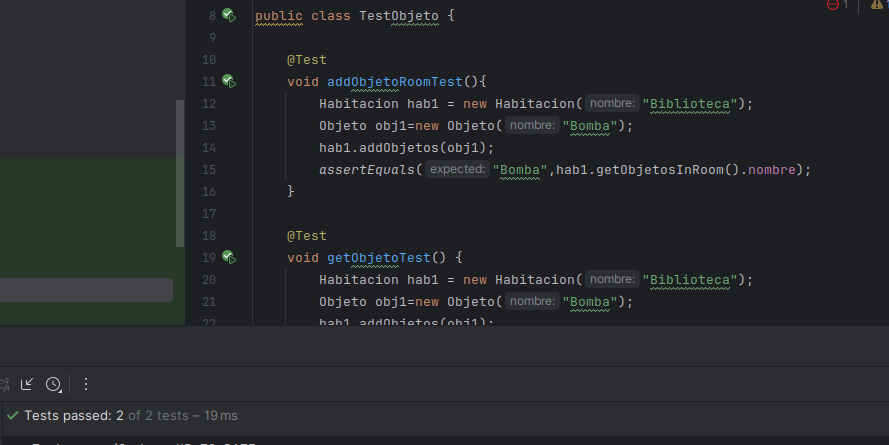

# Pregunta 2: Diseño del videojuego: Juego basado en consola en java
## Hugo Rivas Galindo

El juego será una aventura de texto en la que los jugadores navegan a través de una serie de
habitaciones, recogen objetos, resuelven acertijos y enfrentan desafíos. El juego enfatizará la
aplicación de métricas de acoplamiento (Ce, Ca, CF), TDD y refactorización.

## Sprint 1

Se tienen las clases a implementar:
- Juego: Clase principal a iniciar y controlar el flujo del juego
- Habitación: Representa una habitación en el juego
- Jugador: Representa al jugador y rastrea su inventario y ubicación actual

Dado que es un enfoque TDD, se inicia creando las pruebas para la creación de habitaciones, movimiento del jugador e inicialización del juego.

El juego tendrá una lista de habitaciones, por lo que se crean las pruebas para verificar si se puede o no agregar habitaciones.

```
public class TestHabitacion {

    @Test
    void addRoom(){
        Juego juego=new Juego();
        Habitacion hab1=new Habitacion();
        juego.addRoom(hab1);
        assertEquals(1,juego.getNumberRooms());
    }

}
```

El test falla inicialmente porque no se ha implementado nada

Ahora se implementa el código y la prueba pasará

```
public class Juego {
    public List<Habitacion> rooms=new ArrayList<>();
    public void addRoom(Habitacion habitacion){
        rooms.add(habitacion);
    }

    public int getNumberRooms(){
        return rooms.size();
    }
}
```


Se siguen planteando las pruebas. Se implementarán pruebas de movimiento de jugador. Esto implica que cada clase habitación tendrá una lista de habitaciones de salida a las que el jugador puede acceder.

Se construyen inicialmente las pruebas para añadir salidas a cada habitación

```
    @Test
    void addSalida(){
        Juego juego=new Juego();
        Habitacion hab1=new Habitacion();
        Habitacion hab2=new Habitacion();
        //Se añaden las habitaciones al juego
        juego.addRoom(hab1);
        juego.addRoom(hab2);
        //Se añade la habitación 2 como salida de la habitación 1
        hab1.addSalidas(hab2);

        assertEquals(1,hab1.countSalidas());
    }
```

La prueba falla porque no se ha implementado la función de añadir salidas


Luego de implementar el código para añadir salidas en la clase Habitacion, la prueba pasará

```
public class Habitacion {

    public List<Habitacion> salidas=new ArrayList<>();
    public String descripcion;

    public void addSalidas(Habitacion habitacion){
        salidas.add(habitacion);
    }
    public int countSalidas(){
        return salidas.size();
    }
}
```


Una vez se tiene listo la implementación del método para añadir salidas, se implementará el test para que un jugador se mueva de sala.

```
    void moveRoomTest(){
        Juego juego=new Juego();
        Habitacion hab1=new Habitacion();
        Habitacion hab2=new Habitacion();
        //Se añaden las habitaciones al juego
        juego.addRoom(hab1);
        juego.addRoom(hab2);
        //Se añade la habitación 2 como salida de la habitación 1
        hab1.addSalidas(hab2);
        //Se situa la ubicación inicial del jugador
        Jugador jugador=new Jugador(hab1);
        jugador.moveHabitacion(hab2);
        //Se hace la prueba para ver si la ubicación actual es la sala 2
        assertEquals(hab2,jugador.getHabitacionActual());
    }
```

Se implementan las funcionalidades para que el test pase

```
    public void moveHabitacion(Habitacion nextRoom){
        if(habitacionActual.getSalidas().contains(nextRoom)){
            System.out.println("Te mueves de habitacion ");
            setHabitacionActual(nextRoom);
        }
        else{
            System.out.println("No puedes ir a esa habitacion");
        }
    }
```


Se implementa la funcionalida de turno en la clase Juego

```
public void turno(){

        System.out.println("Estás en una habitación oscura. Las salidas son ");

        for(Habitacion hab: jugador.getHabitacionActual().getSalidas()){
            System.out.println(hab.nombre);
        }

        Scanner scanner = new Scanner(System.in);
        String inputString = scanner.nextLine();

        jugador.moveHabitacion(getHabitacionByName(inputString));
    }
```

Se muestra el juego 


## Sprint 2

Se tienen las clases a implementar:
- Acertijo: Representa un acertijo que necesita ser resuelto en el juego
- Objeto: Representa un objeto que puede ser recogido por el jugador

Se crea una prueba para un acertijo. Esta validará que el acertijo no esté resuelto al iniciarse

```
@Test
    void acertijoInitTest(){
        Acertijo acertijo=new Acertijo("Te la digo, Te la digo","Tela");
        assertFalse(acertijo.cumplido);
    }
```

Se crea una segunda prueba para acertijo. Esta prueba validará que el atributo "cumplido" se cambie a true cuando se resuelva el acertijo

```
    @Test
    void acertijoSolveTest(){
        Acertijo acertijo=new Acertijo("Te la digo, Te la digo","Tela");
        acertijo.responder("Tela");
        assertTrue(acertijo.cumplido);
    }
```

Se implementan dichas funcionalidades en la clase Acertijo

```
public class Acertijo {
    public String pregunta;
    public String respuesta;
    public Boolean cumplido;

    public Acertijo(String pregunta, String respuesta){
        this.pregunta=pregunta;
        this.respuesta=respuesta;
        cumplido=false;
    }

    public void responder(String ans){
        if(ans.equals(respuesta)){
            cumplido=true;
            System.out.println("Acertijo resuelto");
        }
        System.out.println("Mala respuesta ");
    }

    public boolean getCumplido(){
        return cumplido;
    }
}
```
Se comprueban que las pruebas pasan


Ahora se prosigue con la implementación de objetos:

Se plantean el test para agregar objetos a una habitación para que luego el jugador pueda recogerlos

```
    @Test
    void addObjetoRoomTest(){
        Habitacion hab1 = new Habitacion("Biblioteca");
        Objeto obj1=new Objeto("Bomba");
        hab1.addObjetos(obj1);
        assertEquals("Bomba",hab1.getObjetosInRoom().nombre);
    }
```
Se plantea el test de recolección de objetos por parte del jugador

```
    @Test
    void getObjetoTest() {
        Habitacion hab1 = new Habitacion("Biblioteca");
        Objeto obj1=new Objeto("Bomba");
        hab1.addObjetos(obj1);
        Jugador jugador = new Jugador(hab1);
        jugador.agarrarObjetoInRoom();
        assertEquals(1,jugador.countObjetos());
    }
```

Se implementa el código necesario para que ambas pruebas pasen




## CALCULO DE MÉTRICAS 

Antes de realizar la refactorización necesaria para el sprint 3, se calcularán la métrica LCOM4 de algunas clases con el objetivo de saber si estas deben dividirse o no

### Clase Jugador
La clase jugador posee los métodos
- moveHabitacion: contiene al atributo habitacionActual
- setHabitacionActual: contiene al atributo habitacionActual
- countObjetos: contiene al atributo objetos

Se observa que el LCOM4 de la clase jugador es 2, debido a que hay 2 grupos de métodos que no son accesibles entre sí. Por lo tanto, se creará una clase extra para la gestión de objetos

### Clase Habitación
La clase contiene los métodos:
- addSalidas: contiene al atributo salidas
- addObjetos: contiene al atributo objetoInRoom
- countSalidas: contiene al atributo salidas
- getSalidas: contiene al atributo salidas
- getObjetosInRoom: contiene al atributo objetoInRoom

Se observa que el LCOM4 de la clase Habitacion es 2, debido a que hay 2 grupos de métodos que no son accesibles entre sí. Por lo tanto, se creará una clase extra para la gestión de salidas.


## REPORTE DE JACOCO

Se genera un reporte inicial de Jacoco


Se muestra que se tiene una escasa cobertura con las pruebas, por lo que se producirán más con el objetivo de mejorar la cobertura de código

Se observa el método turno de la clase Juego


Se implementan los Tests

```
    void getSalidasTest(){

        Habitacion hab1=new Habitacion("Biblioteca");
        Habitacion hab2=new Habitacion("Bosque");
        Jugador jugador=new Jugador(hab1);
        //Se añaden las habitaciones al juego
        Juego juego=new Juego(jugador);
        juego.addRoom(hab1);
        juego.addRoom(hab2);
        //Se añade la habitación 2 como salida de la habitación 1
        hab1.addSalidas(hab2);
        //Se hace la prueba para ver si la salida es hab2
        assertEquals(hab2,jugador.getHabitacionActual().getSalidas().get(0));
    }
```

```
    @Test
    void getObjetoTest() {
        Habitacion hab1 = new Habitacion("Biblioteca");
        Objeto obj1=new Objeto("Bomba");
        hab1.addObjetos(obj1);
        Jugador jugador = new Jugador(hab1);
        jugador.agarrarObjetoInRoom();
        assertEquals(1,jugador.countObjetos());
    }
```

Se genera un nuevo reporte de Jacoco para ver los cambios. 


Se observa que se ha mejorado la cobertura.
Se aclara que la clase Main no está siendo testeada debido a que solo se está usando para mostrar la salida en consola


## EJERCICIOS

1. Refactoriza el código del juego para adherirse a los principios SOLID (5 puntos)


