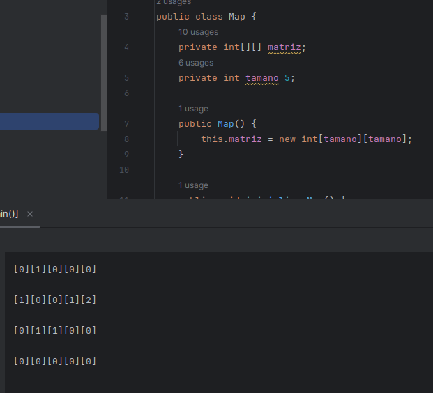
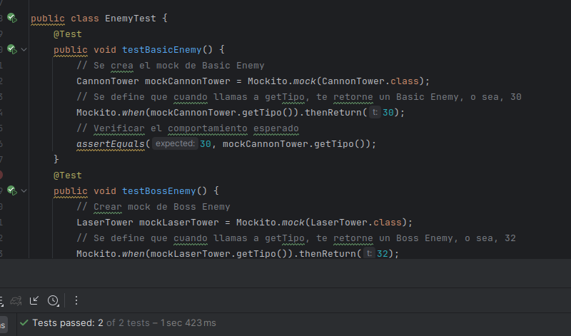
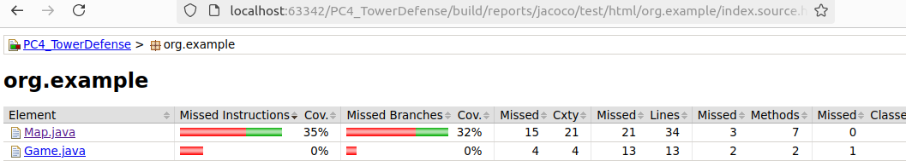

# PC4 - Tower Defense
## Hugo Rivas Galindo

Descripción: El juego es un juego de defensa de torres donde el jugador debe defender su base de
oleadas de enemigos colocando torres en lugares estratégicos del mapa

Clases principales:
• Game: Clase principal que maneja la lógica del juego.
• Map: Representa el mapa del juego.
• Enemy: Clase base para todos los enemigos.
• Tower: Clase base para todas las torres.
• Wave: Maneja las oleadas de enemigos.
• Player: Representa al jugador y sus estadísticas.

Interfaces y clases de Mocking:

• EnemyFactory: Interfaz para la creación de enemigos (concretas: BasicEnemyFactory,
BossEnemyFactory).
• TowerFactory: Interfaz para la creación de torres (concretas: CannonTowerFactory,
LaserTowerFactory).


## Desarrollo

## Creación del mapa

En el ejercicio nos indican que los enemigos se mueven a través de un camino con el objetivo de dirigirse a una base. Se implementa dicha clase usando una matriz de 5x5 en el que el camino es representado con "1" y la base con "2".



## Implementación del patrón de diseño Factory en Tower

En el ejercicio, se recomienda el uso del patrón de diseño Factory para mejorar el desarrollo del código.
Para el desarrollo de dicho patrón, se crea una interfaz TowerFactory la cual será implementada por cada fábrica específica
```
public interface TowerFactory {
    Tower createTower();
}
```

Por ejemplo, para la fábrica de CannonTower
```
public class CannonTowerFactory implements TowerFactory{
    @Override
    public Tower createTower() {
        return new CannonTower();
    }
}
```

Y se implementa el método placeTower en la clase Game
```
public void placeTower(String towerType, int x, int y) {
        TowerFactory factory;
        switch (towerType) {
            case "Laser":
                factory= new LaserTowerFactory();
            case "Cannon":
                factory = new CannonTowerFactory();
                break;
            default:
                throw new IllegalArgumentException("No existe ese tipo de torre.");
        }
        Tower tower = factory.createTower();
        map.placeTower(tower, x, y);
        System.out.println("Torre " + towerType + " colocada en (" + x + ", " + y + ")");
        map.mostrarMap();
    }
```

En nuestro mapa, debido a que usamos enteros, se mostrará la TORRE - CANNON con un número 10 y la TORRE - LASER con un número 11.


## Implementación de mocks para Tower

Se tiene que usar Mocks para realizar las pruebas de creación de torres, con el objetivo de simular las dependencias de cada clase.

```
@Test
    public void testCannonTower() {
        // Se crea el mock de Cannon Tower
        CannonTower mockCannonTower = Mockito.mock(CannonTower.class);
        // Se define que cuando llamas a getTipo, te retorne una torre Cannon, o sea, 10
        Mockito.when(mockCannonTower.getTipo()).thenReturn(10);
        // Verificar el comportamiento esperado
        assertEquals(10, mockCannonTower.getTipo());
    }
```

Un caso similar es con testLaserTower(), solo que se define que el valor de getTipo es 11.
```
@Test
    public void testLaserTower() {
        // Se crea el mock de Laser Tower
        LaserTower mockLaserTower = Mockito.mock(LaserTower.class);
        // Se define que cuando llamas a getTipo, te retorne una torre Laser, o sea, 11
        Mockito.when(mockLaserTower.getTipo()).thenReturn(11);
        // Verificar el comportamiento esperado
        assertEquals(11, mockLaserTower.getTipo());
    }
```

## Implementación del patrón de diseño Factory en Enemy
Se trabaja de forma similar con la clase Enemy. Debido a que se tiene muchos tipos de enemigos, se puede implementar un patrón de diseño Factory para simplificar la tarea de crear diferentes tipos de enemigos.

Se crea la clase Enemy, BasicEnemy, BasicEnemyFactory, BossEnemy, BossEnemyFactory y la interfaz EnemyFactory.


## Implementación de mocks para Enemy

Del mismo modo que para los test de Tower, es necesario usar mocks para simular las dependencias
```
@Test
    public void testBasicEnemy() {
        // Se crea el mock de Basic Enemy
        CannonTower mockCannonTower = Mockito.mock(CannonTower.class);
        // Se define que cuando llamas a getTipo, te retorne un Basic Enemy, o sea, 30
        Mockito.when(mockCannonTower.getTipo()).thenReturn(30);
        // Verificar el comportamiento esperado
        assertEquals(30, mockCannonTower.getTipo());
    }
    @Test
    public void testBossEnemy() {
        // Crear mock de Boss Enemy
        LaserTower mockLaserTower = Mockito.mock(LaserTower.class);
        // Se define que cuando llamas a getTipo, te retorne un Boss Enemy, o sea, 32
        Mockito.when(mockLaserTower.getTipo()).thenReturn(32);
        // Verificar el comportamiento esperado
        assertEquals(32, mockLaserTower.getTipo());
    }
```

Se observa que los test pasan correctamente




## Implementación de tests para Map

Se debe de testear cada clase creada hasta ahora en la clase map. En nuestro caso, vamos a testear el método placeTower 

```
    public void placeTower(Tower tower, int x, int y) {
        if (x < 0 || x >= matriz.length || y < 0 || y >= matriz[0].length) {
            throw new IllegalArgumentException("Posicion no disponible");
        }
        if (matriz[x][y] == 0) {
            throw new IllegalArgumentException("Ya hay una torre en esa posición");
        }
        matriz[x][y] = tower.getTipo(); //10 REPRESENTA UNA TORRE - CANNON, 11 es TORRE - LASER
    }
```

Este método debe ser testeado en en todas las ramas, por lo que se crearán 3 tests solo para este método.

Se inicia con la creación del método en su flujo normal, cuando no hay excepciones
```
    @Test
    void placeTowerTest(){
        Map map=new Map();
        map.inicializarMap();

        //Creacion de mock para simular una torre cannon
        CannonTower mockCannonTower = Mockito.mock(CannonTower.class);

        map.placeTower(mockCannonTower, 0,0);
        assertEquals(map.getMatriz()[0][0],10);

    }
```

Luego se debe de crear un método para manejar cada branch, por lo que se testea cuando se intenta colocar una torre fuera del rango de la matriz del mapa.
```
    //Verifica el error cuando se trata de colocar una torre fuera de rango
    @Test
    void placeTowerOutside(){ 
        Map map=new Map();
        map.inicializarMap();
        CannonTower mockCannonTower = Mockito.mock(CannonTower.class);
        IllegalArgumentException exception = assertThrows(IllegalArgumentException.class, () -> {
            map.placeTower(mockCannonTower, 1, 10);
        });
    }
```

Por último, se crea un test para validar el comportamiento del método cuando se intenta colocar una torre sobre una casilla ocupada

```
    @Test
    void placeTowerOverTower(){
        Map map=new Map();
        map.inicializarMap();
        //Creacion de mock para simular unas torres
        CannonTower mockCannonTower1 = Mockito.mock(CannonTower.class);
        CannonTower mockCannonTower2 = Mockito.mock(CannonTower.class);
        //Se setea una torre en el mapa

        //Al tratar de colocar una torre sobre otra torre, se origina un error.
        IllegalArgumentException exception = assertThrows(IllegalArgumentException.class, () -> {
            map.placeTower(mockCannonTower2, 0, 0);
        });
    }
```

Se configura el build.gradle para revisar la cobertura de pruebas mutantes y las pruebas con jacoco.

```
buildscript {
    repositories {
        mavenCentral()
    }
    configurations.maybeCreate("pitest")
    dependencies {
        classpath 'info.solidsoft.gradle.pitest:gradle-pitest-plugin:1.7.0' // Updated
        pitest 'org.pitest:pitest-cucumber-plugin:0.4' // Updated location and latest version
    }
}

plugins {
    id "info.solidsoft.pitest" version "1.7.0" // Updated
    id "org.sonarqube" version "3.5.0.2730"
    id 'java-library'
    id "jacoco"
}

// Apply the java-library plugin to add support for Java Library
apply plugin: 'java-library'
apply plugin: "jacoco"

// In this section you declare where to find the dependencies of your project
repositories {
    mavenCentral() // jcenter() is at its end of life, so using Maven Central
}

jacoco {
    toolVersion = "0.8.12" // Updated to latest version
}

jacocoTestReport {
    reports {
        xml.required = true  // Update with required
        csv.required = true
        html.required = true
    }
}

tasks.withType(Test) {
    finalizedBy jacocoTestReport  // Generate Jacoco report after tests
}

dependencies {
    // Dependencies updated to the latest versions
    api 'org.apache.commons:commons-math3:3.6.1' // Latest as of last check

    // Updated to the latest version of Guava
    implementation 'com.google.guava:guava:31.0.1-jre'

    // Use JUnit Jupiter API for unit testing with JUnit 5
    testImplementation 'org.junit.jupiter:junit-jupiter-api:5.8.2'
    testRuntimeOnly 'org.junit.jupiter:junit-jupiter-engine:5.8.2'

    // For backward compatibility with JUnit 4 tests
    testImplementation 'junit:junit:4.13.2'
    testImplementation 'org.junit.vintage:junit-vintage-engine:5.8.2'
    testImplementation 'org.junit.jupiter:junit-jupiter-params:5.8.2'

    testImplementation 'org.assertj:assertj-core:3.23.1'
    //Mockito
    implementation platform('org.mockito:mockito-bom:5.11.0')
    implementation 'org.mockito:mockito-core'
    implementation 'org.mockito:mockito-junit-jupiter'

}

test {
    useJUnitPlatform() // This is required to run JUnit 5 tests
    testLogging.showStandardStreams = true
}

check.dependsOn jacocoTestReport
check.dependsOn "pitest"

pitest {
    targetClasses = ['com.example.*']  // Adjusted to match your package structure
}
```
Queda pendiente la mejora de la cobertura con las pruebas, además de realizar las pruebas de mutación con pitest

