# PC5 - Tower Defense 
## Hugo Rivas Galindo

## EJERCICIO 1: Configuración y uso de docker

**TEORIA**

Docker es un sistema gestor de contenedores. Sirve para desplegar las aplicaciones en cualquier computadora, pues los contenedores contienen todo lo necesario para que la aplicación sea desplegada.

La seguridad de docker se da por los espacios de nombre en linux. Esto hace que la interacción sea directamente con el kernel, produciendo así el aislamiento.

Las diferencias entre el uso de docker y las máquinas virtuales es el contenido virtualizado. Las máquinas virtuales usan hipervisores para simular la arquitectura de la computadora, incluyendo el sistema operativo. Por lo tanto, el uso de contenedores es más ligero que el uso de máquinas virtuales cuando se busca una solución de virtualizar.


**PRACTICA**

Se crea un dockerfile para el proyecto. Este se situa en el mismo directorio que los archivos de configuración del proyecto

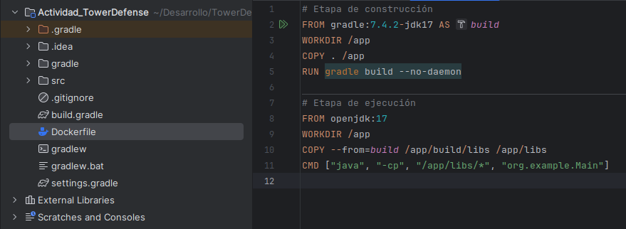

Explicación del docker file
```
#### Etapa de construcción
#Se utiliza la imagen gradle:7.4.2-jdk17 para compilar la aplicación
#AS build etiqueta la etapa de construcción como build. 

FROM gradle:7.4.2-jdk17 AS build

# Establece el directorio de trabajo en /app

WORKDIR /app

# Copia todo el contenido del directorio actual al directorio de trabajo /app en el contenedor

COPY . /app

# Ejecuta el comando gradle build para compilar la aplicación

# Para la construcción de imágenes docker, este suele ser un proceso único, por lo que se desactiva el daemon

RUN gradle build --no-daemon

#### Etapa de ejecución
FROM openjdk:17
WORKDIR /app

# Copia los archivos necesarios desde la etapa "build" (en la ruta /app/build/libs) a la imagen actual. 

COPY --from=build /app/build/libs /app/libs

# Define el comando que se ejecutará cuando se inicie el contenedor.
# java -> Ejecuta la aplicación
# -cp -> Especifica el classpath (Lista de directorios que necesita una aplicación Java para ejecutarse)
# /app/libs/* -> Indica que todos los archivos dentro de ese directorio se incluyen en el classpath
# org.example.Main -> Especifica el punto de entrada a la aplicación

CMD ["java", "-cp", "/app/libs/*", "org.example.Main"]

```
### Construcción de la imagen docker

Se crea la imagen de nuestro proyecto con el siguiente comando
```
docker build -t tower-defense-game .
```

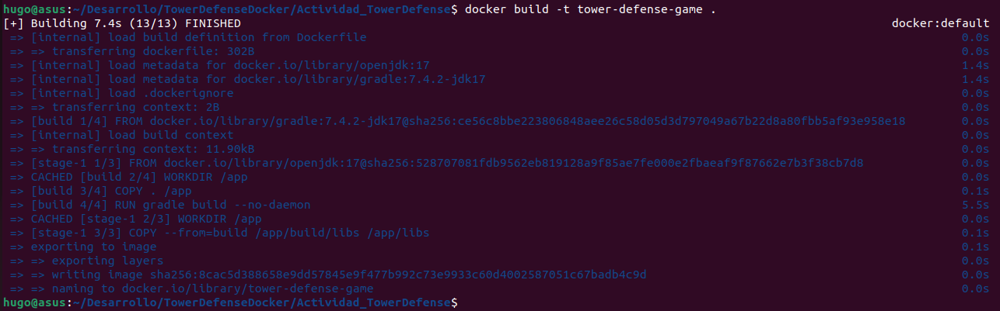

Se listan las imagenes para comprobar la creación
```
docker images
```

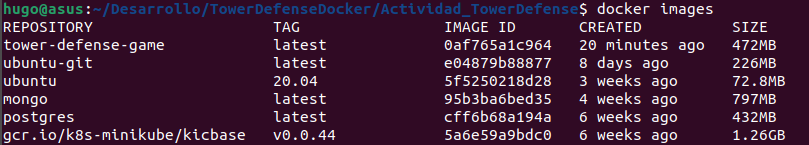

Se observa que la imagen tower-defense-game se creó satisfactoriamente. Ahora se ejecuta el contenedor

```
docker run -it --name tower-defense-container tower-defense-game
```

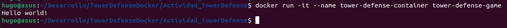

Se observa un mensaje de Hello World porque es el contenido del archivo main.

## EJERCICIO 2: REDES Y VOLÚMENES EN DOCKER

### Configuración de redes y volúmenes en Docker

**Creación de red**

Se crea un red personalizada. Por defecto, Docker crea una red Bridge (Red privada interna que no está disponible fuera del host). También está la posibilidad de crear una red host, que es cuando se puede acceder al contenedor usando la misma ip que la máquina host.

```
docker network create game-network
```

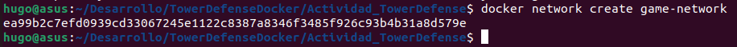

Se ejecutará el mismo contenedor en la red que acabamos de crear. Debido a que es el mismo contenedor, habrá un conflicto porque se usa el mismo nombre.Para eso primero debemos remover el contenedor existente.

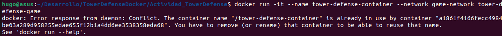


```
#Se detiene el contenedor actual
docker stop tower-defense-container

#Se elimina el contenedor existente
docker rm tower-defense-container
```

Comprobamos que se eliminó el anterior contenedor

```
docker ps -a
```

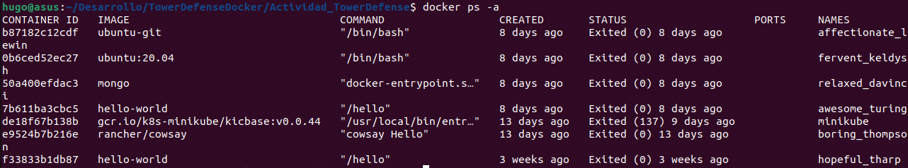

Luego de la eliminación del contenedor inicial, se ejecuta el contenedor en la red.

```
docker run -it --name tower-defense-container --network game-network tower-defense-game
```

Se observa que se muestra el Hello World de la clase main y se listan los contenedores para comprobar que sea ha creado

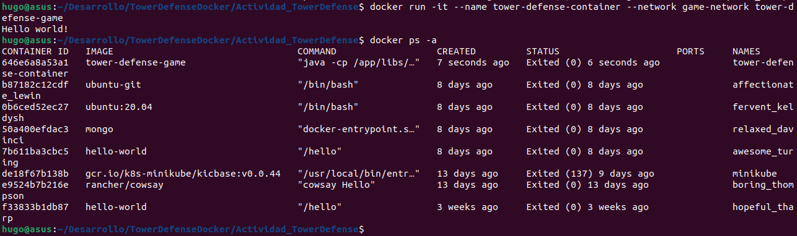

Podemos comprobar que el contenedor se ejecutó en la red game-network con el siguiente comando, especificando el container-id como parámetro

```
docker inspect 646e6a8a53a1
```

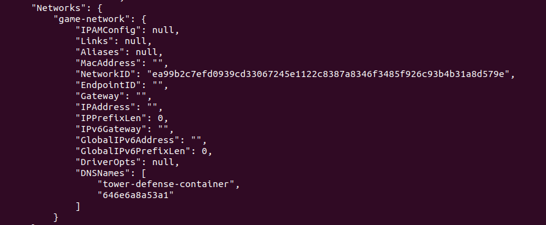

Se observa que el contenedor está sobre nuestra red game-network


**Creación de volumen**

Los volúmenes se crean para la persistencia de datos generados de tal forma que la información quede almacenada incluso cuando se elimina el contenedor. 
Otro tipo de persistencia de datos es mediante el uso de bind mounts, que es donde un directorio de la máquina host se monta en el contenedor. Esto complica la portabilidad de la aplicación.
Por lo tanto, se recomienda usar volúmenes para la persistencia de datos porque ofrece una mayor portabilidad.

A continuación se crea y se monta un volumen

```
# Creación de volumen
docker volume create game-data

#Se monta un volumen en un contenedor con la opción -v
docker run -it --name tower-defense-container --network game-network -v game-data:/app/data tower-defense-game
```

Se elimina el anterior contenedor y se crea otro con el volumen creado

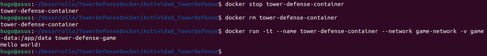

Se inspecciona el contenedor para comprobar que se creó un volumen

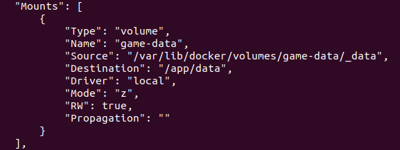

### Interacción con contenedores usando docker exec

El comando docker exec permite ejecutar comandos dentro de un contenedor Docker en ejecución.

Se accede al contenedor en ejecución

```
docker run -it --name tower-defense-container --network game-network -v game-data:/app/data tower-defense-game /bin/bash
```

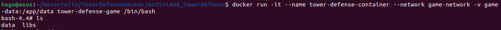


### Implementación con Docker Compose

Docker compose es una herramienta para ejecutar aplicaciones Docker multi-contenedor. Con un archivo YAML, se pueden configurar los servicios, redes y volúmenes necesarios para la aplicación.

Se crea un archivo docker-compose.yml.
En nuestra imagen se usan los componentes creados con anterioridad: redes, volúmenes. Se usa la red bridge network creada y el volumen game-data, el cual almacenará los archivos en la carpeta de trabajo /app/data.

```
version: '3'
services:
  game:
    image: tower-defense-game
    networks:
      - game-network
    volumes:
      - game-data:/app/data
networks:
  game-network:
    driver: bridge
  
volumes:
  game-data:
    driver: local

```

Se inicializan los servicios

```
docker-compose up -d
```
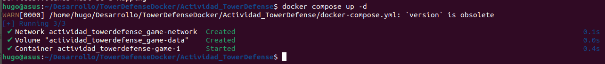


## EJERCICIO 3: ORQUESTACIÓN CON KUBERNETES

**TEORÍA**

Componentes principales de kubernetes
- API server: Gestiona las solicitudes REST de los pods, servicios, etc. 
- Etcd: Es una base de datos distribuida que almacena el estado del clúster así como los datos de configuración. 
- Scheduler: El scheduler se encarga encontrar el mejor nodo para que un pod pueda ejecutarse. 
- Kubelet: Es un agente que se ejecuta en cada nodo worker que sirve para monitorizar los contenedores.

La alta disponibilidad es un concepto referente a que en caso un nodo falle, el sistema seguirá en funcionamiento. Esto se produce gracias a que los nodos proporcionan redundancia en el cluster. 

La escalabilidad en kubernetes se puede lograr al ajustar el número de nodos en función de la demanda de recursos de un cluster. Essto asegura que haya suficientes recursos para ejecutar los pods necesarios.

**PRACTICO**

### Aplicar los archivos de configuración

Se inicia el kubectl

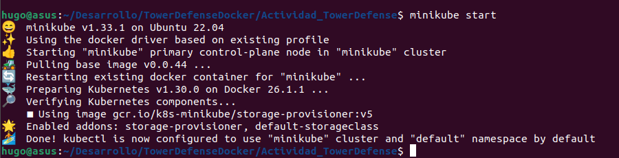

Se crean los archivos deployment.yaml y service.yaml. Se explica el significado de las etiquetas

Deployment.yaml
```
apiVersion: apps/v1 #Especifica la versión de api de kubernetes
kind: Deployment #La clase de objeto que se crea. En este caso es un deployment
metadata:
  name: tower-defense-deployment #Identificador del objeto
spec:
  replicas: 1 #Se despliega una réplica del pod
  selector:
    matchLabels: #Se especifican las etiquetas que deben tener los pods para ser seleccionados por este deploy
      app: tower-defense-game
  template:
    metadata:
      labels: #Etiqueta que se asigna a los pods creados
        app: tower-defense-game
    spec:
      containers: #Lista de contenedores que se ejecutarán en el pod
        - name: tower-defense-game #Nombre del contenedor dentro del pod
          image: tower-defense-game #Imagen que se utiliza
          ports:
            - containerPort: 8080 #El contenedor expondrá el puerto 8080 para que se pueda acceder a la aplicación
```
Service.yaml
```
apiVersion: v1 #Especifica la versión de la api de kubernetes
kind: Service #Especifica el tipo de objeto que se crea, en este caso es un service
metadata:
  name: tower-defense-service
spec:
  selector:
    app: tower-defense-game
  ports:
    - protocol: TCP
      port: 80
      targetPort: 8080
  type: LoadBalancer #Define el tipo de servicio. Es un balanceador de carga
```

Se aplican los archivos de configuración.

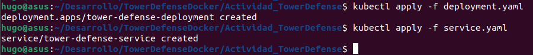

Se listan los pods creados y se verifica el estado de despliegue.

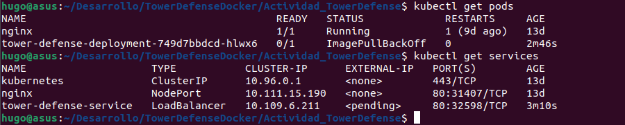

## EJERCICIO 4: PRUEBAS UNITARIAS Y DE INTEGRACIÓN CON MOCKITO 

**TEORIA**

- Mocks: Son objetos falsos con un comportamiento predefifinido (Trabajan en base a expectativas). Se utilizan para simular respuestas de dependencias externas o de otras partes del sistema que no están directamente bajo prueba. 
- Stubs: Brindan respuestas preprogramadas a las llamadas realizadas durante la prueba. Sirve para garantizar la ruta lógica que se desea probar.
- Fakes: Son implementaciones simplificadas de componentes que tienen funcionalidades limitadas diseñadas solo para hacer viables las pruebas. 

**PRACTICA**

Se escriben las pruebas unitarias para las clases. Para estas pruebas se usará mockito para simular las dependencias. 

Se explica el test del método placeTower de la clase TowerDefenseGame.

```
public class TowerDefenseGameTest {
    @Mock
    private Map mockMap;
    @Mock
    private Player mockPlayer;
    @InjectMocks
    private TowerDefenseGame game;
    @BeforeEach
    public void setUp() {
        MockitoAnnotations.openMocks(this);
    }
    @Test
    public void testPlaceTower() {
        //Se crea un mock de la clase Tower
        Tower mockTower = mock(Tower.class);
        //Se ejecuta el método
        game.placeTower(mockTower, 2, 2);
        //Se comprueba que el mock ha sido llamado al momento de ejecutar el método
        verify(mockMap).placeTower(mockTower, 2, 2);
    }
}
```
Se prueba con mocks el método PlaceTower de la clase TowerDefenseGame, debido a que tiene una dependencia con la clase Tower. 

## EJERCICIO 5: PRUEBAS DE MUTACIÓN


**TEORICO**

Las pruebas de mutación sirven para comprobar la robutez de nuestras pruebas. Los mutantes son pequeños errores en código hechos a propósito con el objetivo de que las pruebas fallen. 

La cobertura de mutación es un concepto que mide la efectividad de un conjunto de pruebas en matar a los mutantes, es decir, detectar los cambios inducidos en el código.

**PRACTICO**

Se configura el build.gradle para que se pueda usar pitest con el objetivo de realizar pruebas mutantes

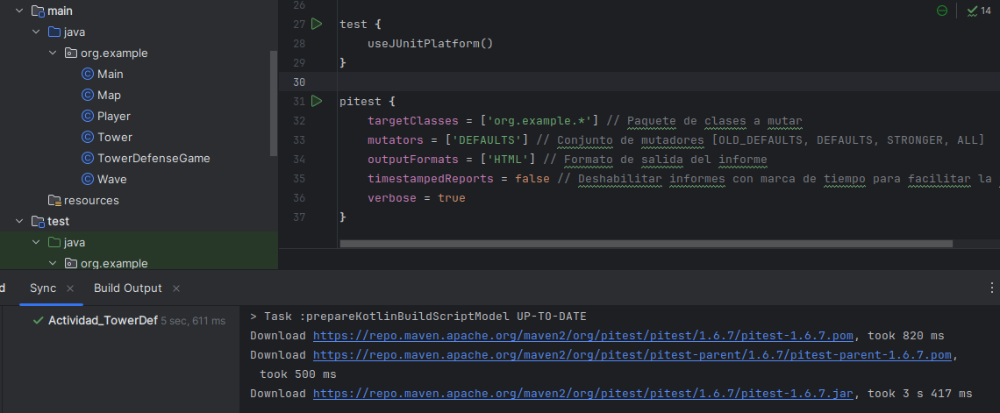

Pero cuando se trata de ejecutar el pitest, se genera un error

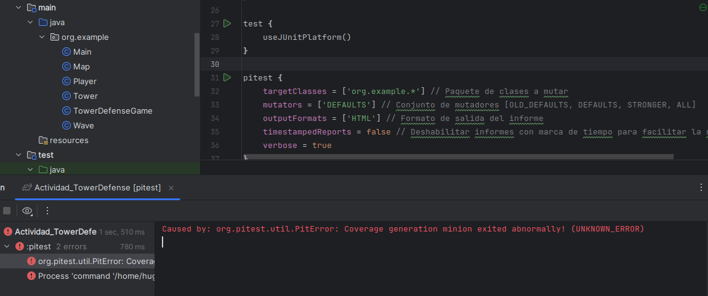

## EJERCICIO 6: DISEÑO POR CONTRATO

**TEORIA**

El diseño por contrato ofrece una mayor claridad para la comprensión del código, pues define lo que cada método espera y garantiza.

- Precondiciones: Condiciones que se deben cumplir antes de la ejecución de un método
- Postcondiciones: Lo que el método garantiza como resultados
- Invariantes: Condiciones que deben cumplirse antes y después de la ejecución de un método.

**PRACTICA**

Se establece un contrato para el método constructor de Tower.
Se establece la precondición de que los símbolos ingresados deben ser C o L, debido a que estos caracteres representan a las torres del juego (Cannon o Laser). Como invariante, se establece que se debe de ingresar un caracter alfanumérico como parámetro.

```
public Tower(char symbol) {
        // Precondición: Los símbolos deben ser C o L, para representar Cannon Tower o Laser Tower
        if (symbol != 'C' && symbol != 'L') {
            throw new IllegalArgumentException("Torre no disponible");
        }
        this.symbol = symbol;
        assert Character.isLetter(symbol) : "Se debe ingresar un caracter";
    }
```

Se realizan las pruebas de dicho contrato

```
@Test
    void testConstructor(){
        //Se cumple la precondición
        assertDoesNotThrow(() -> new Tower('L'));
        assertDoesNotThrow(() -> new Tower('C'));

        //No se cumple la precondición
        assertThrows(IllegalArgumentException.class, () -> new Tower('A'));
        assertThrows(IllegalArgumentException.class, () -> new Tower('1'));
        assertThrows(IllegalArgumentException.class, () -> new Tower('@'));
    }
```
