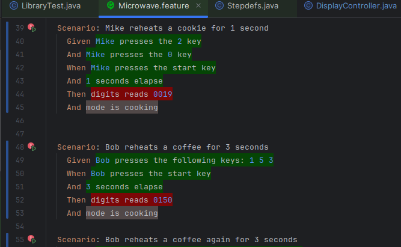
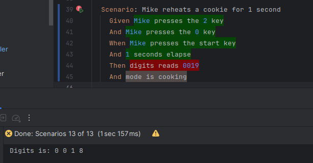
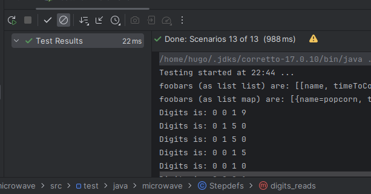
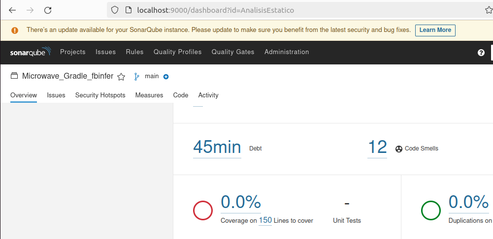
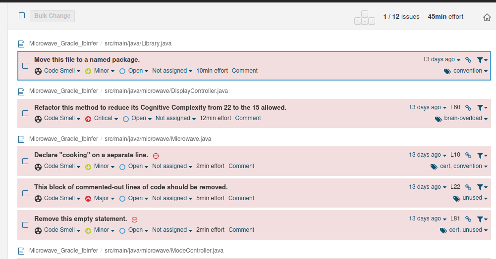
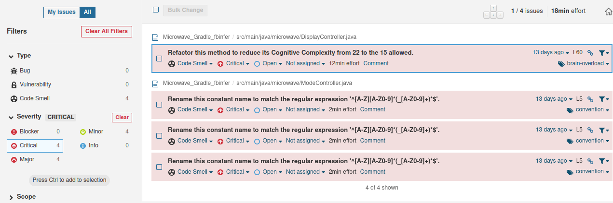
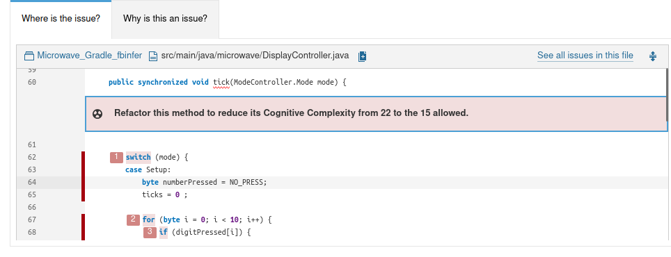
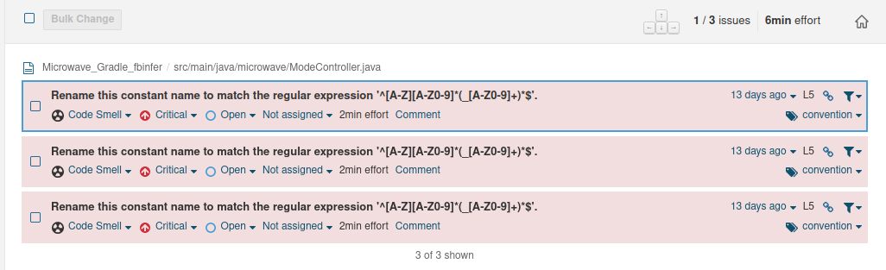
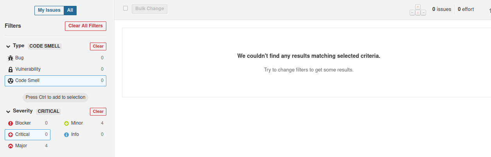

# Hugo Rivas Galindo

## Análisis estático de pruebas

Se realiza el análisis estático de las pruebas para posteriormente refactorizar usando SonarQ.

Primero hagamos que el código pase las pruebas.

Observamos que algunas pruebas fallan.



Nos centramos en explicar la primera prueba que falla:



La prueba espera que se lea 0019, pues se inicio con 20 segundos y solo ha pasado un segundo. Sin embargo, nuestro código indica que se lee 0018, lo cual es un error.

Cuando se analiza la prueba de seconds_elapse, se ve que se maneja incorrectamente el valor de la cantidad de ticks. Se corrige dicho problema asegurándonos que solo habrá 20 ticks cada segundo trascurrido. Se modifica el valor del límite en el bucle for.

```
    @When("^(\\d+) seconds elapse$")
    public void seconds_elapse(int time) throws Throwable {
        // System.out.println("" + time + " seconds elapse.");
        for (int i = 0; i < time*microwave.getTickRateInHz(); i++) {
        	microwave.tick(); 
        }
        // printStatus();
    }
```

Una vez realizado dicho cambio, se verifica que todas las pruebas se cumplen




## Análisis estático con SonarQ


Se realiza el análisis estático de código con SonarQ. Se genera el reporte para visualizar los cambios.





Se observan 12 olores de código. En la presente actividad de buscará reducir dicha cantidad.

Se inicia observando los errores críticos:



Observamos que el primer error se produce en el método Tick



Se buscará refactorizar el código para reducir su complejidad. Agregamos una función para cada opción del método Tick en DisplayController

```
public synchronized void tick(ModeController.Mode mode) {

        //Se realizan funciones para cada caso con el objetivo de facilitar la comprensión del código
		switch (mode) {
		case Setup:
			tickSetUp();
			break;
		case Suspended: /* do nothing - wait for user */
			break;
		case Cooking:
			ticks++;
			tickCooking();
			break;
		}
		clearDigitPressed();
	}
```

Luego de hacer dicha refactorización, se verifican los olores de código que quedan



Se observa que se disminuyó la cantidad de olores de código críticos.
Los olores de código restantes son por una declaración en las constantes, las cuales deben de seguir un patrón regex establecido para facilitar la comprensión.

En nuestro caso, se debe de reemplazar

```
public enum Mode {Cooking, Suspended, Setup};
```
por
```
public enum Mode {COOKING, SUSPENDED, SETUP};
```

Una vez realizado el cambio en todo el código, confirmamos que ya no hayan más olores de código críticos




Y efectivamente, ya no hay más olores de código críticos

