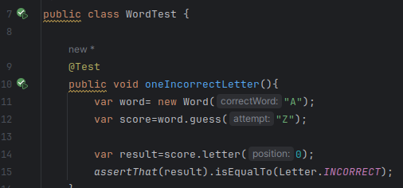

# Actividad: TDD1

## APLICACION WORDZ
Se inicia creando una clase de prueba unitaria llamada WordTest


Se escribe una prueba que arroje la puntuación de una sola letra que sea incorrecta.

```
    @Test
    public void oneIncorrectLetter(){
        new Word("A");
    }
```

Cuando se crea este test, nos ayudamos del IDE para que se cree el constructor en nuestra clase Word. Modificamos el nombre del parámetro del contructor de Word.

```
    public Word(String correctWord) {
        //TODO
    }
```

Se vuelve a la prueba. Se captura el objeto creado como una variable local.
Se piensa en una forma de pasar una suposición a la clase de Word y devolver una puntucación. Para esto se usará un método llamado guess(). 

```
    @Test
    public void oneIncorrectLetter(){
        var word= new Word("A");
        word.guess("Z");
    }
```

Se trata de obtener una puntuación basado en esa suposición. Para esto se usa una variable score.
Se piensa en un enfoque de diseño para saber qué devolver en el code de producción
Se devolverá solo el hecho de que la letra es correcta, incorrecta o no presente.

Las 3 decisiones de diseño realizadas en este código:
- Admitir un número variable de letras en una palabra
- Representar la puntucación mediante una enumeración simple: INCORRECT, PART_CORRECT o CORRECT
- Acceder a cada puntaje por su posición en la palabra, basado en cero.

### ESTAS DECISIONES RESPALDAN EL PRINCIPIO KISS. ¿POR QUÉ?
EL principio KISS (Keep It Simple, Stupid) implica la simplicidad en el diseño. Trasladando dicha premisa en nuestro diseño, se observa que cumple con dicho principio porque se usan solo 3 decisiones de diseño, las suficientes para cumplir con las requisitos solicitados.

### CUMPLE EL PRINCIPIO YAGNI
El principio YAGNI (You aren't gonna need it) se utiliza para evitar agregar funcionalidades. Es mejor esperar a que una funcionalidad sea realmente necesaria antes de implementarlas. En nuestro caso, la decisión de admitir un número variable de letras no viola el principio, debido a que no es especulativo y realmente se usará en el futuro cercano.

Dicho esto, se escribe el code de prueba

```
    @Test
    public void oneIncorrectLetter(){
        var word= new Word("A");
        var score=word.guess("Z");
        
        var result=score.letter(0);
        assertThat(result).isEqualTo(Letter.INCORRECT);
    }
```

La prueba falla porque no se han implementado las funcionalidades. Se agrega code a la clase Word para que pase.


```
public class Word {

    public Word(String correctWord) {
        //TODO
    }

    public Score guess(String attempt) {
        Score score=new Score();
        return score;
    }
}

```
La clase Word, tal y como se menciona en la prueba, posee un constructor y un método guess, el cual retorna un objeto score, el cual se ha implementado para saber el puntaje en cada posición de la letra.

```
public class Score {
    public Letter letter(int position) {
        return Letter.INCORRECT;
    }
}
```

Además, el método letter retorna un Letter, el cual, como se ha planteado en nuestro diseño, es un enum cuyos valores son INCORRECT, PART_CORRECT, CORRECT

```
public enum Letter {
    INCORRECT, PART_CORRECT, CORRECT
}
```

### Test explicado

Lo que el código de prueba hace es crear un objeto Word inicializándolo con A (todavía sin implementar).
Luego llama al método guess con el parámetro z. Esto significa que tratará de adivinar si "z" pertenece a la palabra
Este método retorna un objeto de tipo score, el que nos servirá para saber si la letra pasada como argumento pertenece a la palabra a adivinar.

```
var word= new Word("A");
var score=word.guess("Z");
```

La clase score tiene un método letter que sirve para saber el valor de la letra en determinadad posicion. Dichos valores pueden ser INCORRECT, CORRECT o PARTIAL_CORRECT. En el test, lo que se realiza es definir el valor de la primera letra de la palabra A. Debido a que es un test, inicialmente todos los valores retornados por el método letter son iguales a Letter.INCORRECT.

```
var result=score.letter(0);
```

Por último se comprueba que el valor de result sea igual a INCORRECT. 

```
assertThat(result).isEqualTo(Letter.INCORRECT);
```


Dadas estas implementaciones de código, el test pasará




